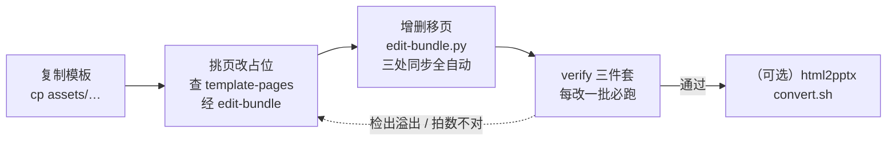
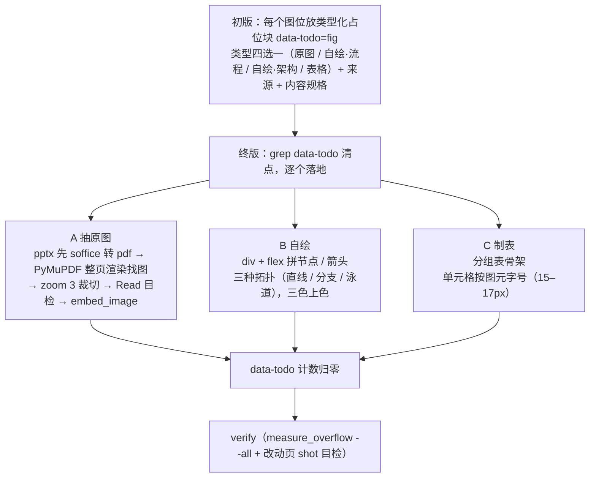
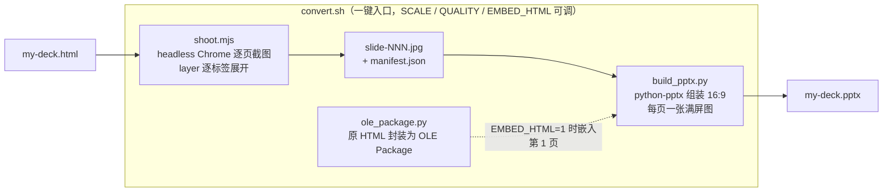
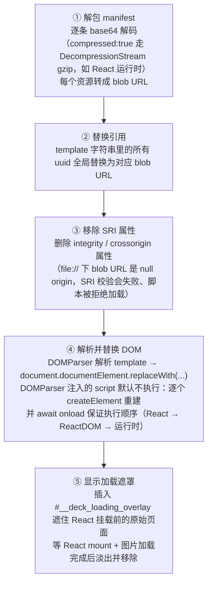
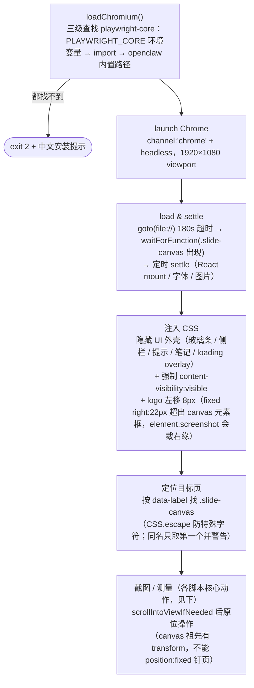
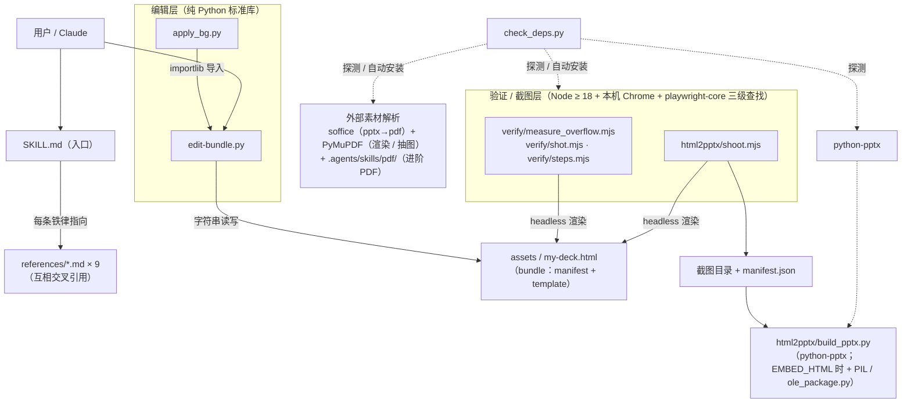

# huawei-deck · 设计原则、工作流与代码架构梳理

> 本文是对本 skill 的系统性梳理：它按什么原则设计、用户与 Claude 按什么流程协作、代码分几层各干什么。
> 与 `docs/design/` 的关系：`design-spec.md` / `implementation-plan.md` 是**构建时**的规格与计划（记录「当初怎么做出来的」）；本文描述**现状**（现在的结构是什么、为什么这样设计）。改动仓库时若行为与本文不符，以 `SKILL.md` 与 `references/` 为准并回来同步本文。

---

## 1. 这是什么

huawei-deck 是一个 **Claude Code skill**，不是普通应用代码库。它交付的能力是：从三套华为红品牌模板出发，做出 1920×1080、离线可拷走的**单文件 HTML 演示（网页 PPT）**，并可一键导出 PPTX。

交付物四块：

| 组成 | 内容 | 角色 |
|---|---|---|
| `SKILL.md` | 触发描述 + 5 步快速上手 + 9 条设计铁律 + 文件导航 | skill 入口，Claude 触发后最先读取的文件 |
| `assets/` | 三套模板 deck（授课 34 页 / 技术分享 36 页 / 汇报 41 页，各 ~12MB）+ 华为官方素材库 `huawei-refs/` | 起点资产：复制后再改，绝不直接改模板 |
| `references/` | 9 份使用文档（流程 / 页型索引 / 设计系统 / 动画 / 片段 / 编辑 / 配图 / 品牌 / 官方风格） | 按需加载的知识库，SKILL.md 每条铁律指向对应 reference |
| `scripts/` | edit-bundle.py（编辑）、verify 三件套（验证）、html2pptx（导出）、apply_bg.py（品牌图替换）、check_deps.py（依赖检查） | 工具链：编辑、验证、导出均由脚本完成结构同步与检查 |

一个关键的产品决策（见 `docs/design/design-spec.md`）：模板不是「最小空壳」也不是「生成器」，而是**页型画廊**——从一份 77 页真实课件**做减法**产出。每一页既是可复制的版式，占位文案本身又在讲解「这一栏该怎么写」，即「**画廊即文档**」；另保留 10 页真实课件成品作对照。

---

## 2. 设计原则

### 2.1 产品层

1. **单文件、真离线**。React 运行时、双字体（Noto Sans SC 400–700 + JetBrains Mono）、全部图片以 base64 内联进一个 HTML；拷走一个文件即可放映，断网、`file://` 直开均可。代价是文件 ~12MB、不能用编辑器直改——这是整套工具链存在的根因（见 §4.1）。
2. **画廊即文档**。占位文案 = 用法说明（例：h3 占位写「一句话说清本页主张」），浏览器滚一遍模板就等于读完排版手册；`references/template-pages.md` 只做逐页索引与「怎么改」。
3. **场景三分，同一工具链**。授课 / 技术分享 / 汇报三套模板平等并列，共用设计系统与全部脚本；差异只在页型集合与基调（叙事骨架、页数节奏、动画量、语言风格——见 `workflow.md` 场景适配表）。
4. **品牌可替换，不做通用主题系统**。华为品牌元素（背景画 / 黑板底图 / 人像 / logo / 口号 / 红色系）全部登记为**可替换点**，配有脚本和文档；但不抽象成主题配置——保持模板可直接照抄的具体性。
5. **模板只读，副本工作**。所有编辑都发生在 `cp assets/xxx.html my-deck.html` 之后的副本上。

### 2.2 视觉设计系统（`design-system.md` / `huawei-style.md`）

- **三色体系**：品牌红 `#b5333b`（强调 / 真警示）+ 灰蓝 `#566472`（对照 / 次要）+ 中性灰阶。铁律「去花花绿绿」：外部素材搬入先按三色重新上色；红只给真警示与本页重点。深色页参照官方公式「黑底 + 白字 + 金强调 + 红点缀」。
- **双字体分工**：中文一律 Noto Sans SC（**绝不只挂 JetBrains Mono**——它无中文字形，会回退细体）；数字 / 英文 / 代码 / mono 小标签用 JetBrains Mono。
- **一套字号刻度 + 21px 散文地板**：正文区只用 `{13,15,17,19,21,24,27,30}`；「给听众读的散文」最小 21px，图元（表格单元格、轴标签、框图内文字）豁免。判别法：`font-size < 21` 且带 `line-height` 的是散文。
- **四段页结构**：eyebrow（18px mono 小标签）→ h3 大标题（46px）→ 可选导语（21px）→ 主体（`flex:1; min-height:0`，版式不塌的关键）。
- **1080 硬约束**：section 是 `overflow:hidden`，超高**无声裁切**——所以「改完必跑 measure_overflow」是铁律而非建议。
- **文案原则**：标题即观点且点名技术（「基于 X 实现 Y」句式，全部标题连读 = 论证链）；不写套话广告词；页面上绝不写「点击查看」类操作提示。

### 2.3 动画原则（`animation.md`）

- **只靠讲者手动推进，绝不自动循环**——动画是讲课节奏的控制器，不是炫技。SMIL 装饰动效是唯一例外（循环但不占节拍）。
- 三机制分工：**build**（逐拍揭示，`data-step` + 点击计数 level）、**layer**（同 key 同组按钮/面板互斥切换）、**SMIL**（SVG 连续运动，随页激活/冻结）。build 与 layer 共享同一 level，可串成混合链。
- **拍数公式**：总拍数 = 页内最大 `data-step` + 2（进页空场 1 拍 + 讲完翻页 1 拍）。此规则在 deck 运行时与 `steps.mjs` 各实现一份，**改一处必须同步另一处**。
- 设计方法「先排拍后编号」：先列讲稿节拍表（一个知识节拍归同一拍），再翻译成连续的 data-step。

### 2.4 协作流程原则（`workflow.md`）

- **设计先于搭页**：从零做 deck 必走七阶段流程，三个「讨论」阶段是**硬闸门**——用户没确认不进下一阶段。用户催「直接做」时，把五问压成带默认值的一轮快答，加速形式、不豁免闸门。
- **初版占位、终版落地**：初版配图一律放类型化占位块（`data-todo="fig"` + 类型 + 来源 + 规格），结构定了才抠图、配动画——避免精修变沉没成本。
- **计划落盘**：大纲与逐页规划写进伴生文件 `<deck名>.plan.md`，不留在对话里（换会话即丢）。
- **验证先于交付**：每改一批跑 verify 三件套；溢出裁切是无声的，「不跑 verify 就给用户」列在常见错误表里。

### 2.5 工程原则（贯穿所有脚本）

1. **编辑必经 edit-bundle.py**。deck 的 HTML 藏在一行 JSON 字符串里，编码只有一条正确路径（§4.2）；编辑器 / sed / Edit 工具直改几乎必坏文件。
2. **结构三处同步自动化**。增删移页要同时改 slide DOM / `nav[]` / `chapters[].start` 三处，`insert_page` / `delete_page` / `move_page` 已封装这三处的同步，调用方不手工修改其中任何一处。
3. **统一退出码契约**：所有可执行脚本一致——`0` 通过 / `1` 检出业务问题 / `2` 工具或参数错误，可直接接 CI。
4. **`data-label` 是唯一定位手段**。shot / steps / measure_overflow / edit-bundle 全靠它找页；同名 label 是全工具链的已知弱点（多数工具只取第一个，见 `editing-guide.md` §4）。
5. **危险操作先预览、写盘要原子、落盘后复核**。`apply_bg.py` 默认只打印摘要（`--yes` 才落盘），写盘走「临时文件 + `os.replace`」，之后从盘上重读复核（旧 key 零残留、引用数一致）再跑 `eb.verify`。
6. **缺依赖时给出可操作提示**。playwright-core 三级查找（`PLAYWRIGHT_CORE` 环境变量 → 直接 import → openclaw 内置路径），四处实现（三个 verify 脚本 + shoot.mjs）顺序一致，check_deps.py 的探测也用同一顺序；缺依赖时打印**具体的中文安装命令**，而不是原始报错堆栈。
7. **全中文**。文档、注释、报错信息均为中文，新增内容保持中文。

---

## 3. 工作流

### 3.1 总流程：七阶段协作（从零做一份 deck）


- 阶段 1 问清五件事（听众 / 场合时长 / 目标 / 素材 / 品牌与交付），按**场景适配表**定基调。
- 阶段 4 的逐页规划表每页一行：`页序 | data-label | 页型 | 核心观点(一句话) | 排版逻辑 | 配图(类型+规格) | 拍数`。核心观点写不成一句话就拆页，两页同一句就合页。
- 阶段 6 精修顺序固定：配图落地 → 动画节拍 → 品牌替换 → 全量验证 → （可选）导 PPTX。
- 汇报场景若 PPTX 是硬要求，**阶段 4 初版就先试导一次**，转换问题在结构讨论前暴露。
- 阶段 7 只接受精修级改动；结构性返工回阶段 5 重新走闸门。

### 3.2 机械操作：5 步循环（改一份已有 deck 时直接用）



### 3.3 配图工作流（`artwork.md`）

总原则「字不如表，表不如图」，分工：素材原图给证据 / 自绘图讲机制 / 表格管对比枚举。



素材多于 3 篇时并行派 agent 抽图，每个 agent 给足路径 / 目标图描述 / 输出名 / 三步方法。

### 3.4 验证工作流（verify 三件套）

| 脚本 | 干什么 | 判定 |
|---|---|---|
| `measure_overflow.mjs <deck> --all` | 全页测 section 级溢出（Y/X 像素）+ 内层 `overflow:hidden` 裁切 | 溢出 >0 → exit 1；内层裁切只报告，逐条目检 |
| `shot.mjs <deck> <label> out.jpg` | 单页 1920×1080 截图（build 全显），供目检 | label 不存在 → exit 1 并列出全部可用 label |
| `steps.mjs <deck> <label> outdir/` | 模拟放映引擎逐拍截图 step-NN.jpg，逐拍打印新出现元素 | 对着讲稿核对每拍内容 |

外加结构验证 `python3 scripts/edit-bundle.py my-deck.html`（= `eb.verify`）：打印 slide-fit / section / nav 数量与 chapters 起点，nav 编号不连续直接 assert 失败。

### 3.5 PPTX 导出（html2pptx）



工具不解析打包结构——**渲染什么截什么**，改完 deck 直接重跑。已知限制：靠 React 内部 state 的自制交互页无法程序化展开，只截默认态。

### 3.6 品牌替换（`branding.md`）

四类图（bg / board / people / logo）走 `apply_bg.py`（预览 → `--yes`）；口号与品牌色走 edit-bundle 文本 / 色值映射替换（每个色值打印替换处数，出现 0 处即停下检查）；换色后注意警示红与品牌红同值的语义检查。

### 3.7 环境体检

动手前 `python3 scripts/check_deps.py`：探测 10 项依赖（pdf skill、pypdf、pdfplumber、Node≥18、playwright-core、Chrome、python-pptx、pymupdf、soffice、可选 reportlab），能自动装的（pip/npm/npx）先打印命令再装并复检，装不了的给安装提示；`--check-only` 只报告。

---

## 4. 代码架构

### 4.1 单文件 bundle 格式与浏览器端 loader

deck 文件本体约 220 行，由页面骨架、两行超长 JSON 和 loader 脚本组成：

```
<!DOCTYPE html>
<head>   骨架样式 + loading 动画（牛顿摆）+ noscript 提示
<body>
  <div id="__bundler_thumbnail">      # 解包期间的占位画面
  <script>  ← bundler loader（见下）
  <script type="__bundler/manifest">  # 下一行 = 一行 JSON dict: {uuid: {mime, compressed, data(base64)}}
  <script type="__bundler/template">  # 下一行 = 一行 JSON 字符串: 整份 deck HTML
```

**template 字符串包含整份 deck 的全部内容**：每页 `<section data-label=…>`、导航数组 `nav[]`、章节起点 `chapters[]`、目录页数据 `TOC[]` / `builders[]`、内联的 React/ReactDOM UMD、运行时脚本、按 data-label 精确匹配挂背景的 `<style id="tpl-bg-950">`。

loader 在 `DOMContentLoaded` 后执行五步：



这套结构决定了两条工程铁律：**图片的增删走 manifest**（`embed_image` 追加条目；`apply_bg.py` 替换后删除旧条目，避免 manifest 残留无引用的数据），**HTML 改动走 template 字符串替换**。

### 4.2 edit-bundle.py：唯一的安全编辑通道

按行读文件（`load`/`save`），靠标记行定位那两行 JSON（`_tpl_idx`/`_man_idx`），全部操作是**纯字符串查找与替换**——不引入 HTML parser，读出再写回不会改动任何未触及的内容。

```
读写      load / save / get_template / set_template(→dump_template)
资源      embed_image（追加 manifest）/ get_resource（解码某 uuid）/ inline_react（离线修复）
结构      insert_page / delete_page / move_page（三处同步）+ bump_chapters（跨章移动后手工修正）
内部      _slide_bounds（按 data-label 定位整块 slide-fit）/ _nav_entries / _write_nav / _bump_after_page
辅助      grid（矩阵表 HTML 生成）
验证      verify（数量一致 + nav 连续断言 + 打印 chapters）
```

**编码不变量**（改脚本必须保持，`dump_template` 内置断言）：

```python
raw = json.dumps(s, ensure_ascii=False).replace('</', '<\\u002F')
assert '\n' not in raw and '</' not in raw and json.loads(raw) == s
```

只转义 `</`（防字符串里的 `</script>` 提前闭合文档），CJK 与 URL 里的普通 `/` 不动。

**三处同步的记账逻辑**：页所属章 = `max(start ≤ 该页 nav 索引)`。插页时**先**用 before 页的原索引定章再动 DOM/nav（插入后索引 +1 会撞下一章 start）；删页后该页所在章之后各章 start −1；`move_page` 只保证同章内安全，跨章需手工 `bump_chapters`。

### 4.3 verify 三件套 + shoot.mjs：四个脚本的公共执行流程

四个 .mjs 共用同一套模式：



差异在核心动作：

- **measure_overflow**：`.build` 强显后测 `sect.scrollHeight - clientHeight`（section 级，>0 判失败）+ 遍历全部元素找 `overflow:hidden` 且 scroll>client 的内层裁切（只报告）。`--all` 按 canvas 遍历，是同名 label 唯一各测各的模式。
- **shot**：`.build` 强显，单页 element.screenshot。
- **steps**：在页面里实现了一份与 deck 运行时相同的放映引擎规则——对 level 从 0 到 max+1 逐拍：build 按 `data-step < level` toggle `data-shown`；layer 每组取「data-step < level 中最大者，否则组内第一个按钮」toggle `data-active`；每拍截图并打印新出现元素摘要。**此实现与 deck 运行时的引擎规则一一对应，改任一侧必须同步另一侧。**
- **shoot（html2pptx）**：不按拍数截图，而是做 **layer 标签展开**——探测每页的标签组（按钮须有配对面板才算），先把所有组切到第一个标签、截一张全默认态，再逐组逐标签各截一张（截某组时其余组停在第一个标签；`gi>0 && ki==0` 跳过，避免全默认态重复），按顺序写 `manifest.json`。34 页模板由此展开为 55 张。

### 4.4 apply_bg.py：品牌图替换流程

替换点的定位是**运行时解析**而非硬编码 key（bg/board/people 从 `<style id="tpl-bg-950">` 对应规则的 `url()` 读当前 key；logo 从 `alt="HUAWEI"` 或 `data-brand-logo` 的 img 读 src），所以换过一次后仍可再换。执行六步：新图入 manifest → 全部引用替换（计数校验）→ `set_template` 回填 → 删旧 manifest 条目 → 原子写盘（tmp + `os.replace`）→ 盘上复核 + `eb.verify`。

### 4.5 依赖关系图



### 4.6 文档架构与一致性维护

`SKILL.md` 是唯一入口：description 负责触发，正文给 5 步 + 9 铁律，**每条铁律指向一个 reference**。references 分工不重叠：

| 层 | 文件 | 管什么 |
|---|---|---|
| 流程 | workflow.md | 七阶段 + 场景适配 + 常见错误表 |
| 选型 | template-pages.md | 三套模板逐页索引（共用页型只在授课节写全，变体指回，避免三处维护） |
| 视觉 | design-system.md / huawei-style.md | 本模板硬规 / 官方风格参照（冲突以前者为准） |
| 制作 | animation.md / page-snippets.md / artwork.md | 动画机制 / 可粘贴骨架 / 配图工作流 |
| 工程 | editing-guide.md / branding.md | bundle 结构与 edit-bundle / 品牌替换 |

**改动时的同步清单**（来自 CLAUDE.md）：

- 改脚本行为 / 命令用法 → 同步 `SKILL.md`、`README.md` 与相关 reference；
- 改模板页数（34/36/41）→ 同步 SKILL.md、README、template-pages.md、workflow.md 中的全部提法；
- 改动画引擎规则 → deck 运行时与 `steps.mjs` 双侧同步；
- 改 edit-bundle 编码/记账逻辑 → 保持 §4.2 四条不变量，并同步 editing-guide.md。

---

## 5. 关键不变量速查

| # | 不变量 | 破坏后果 |
|---|---|---|
| 1 | template 编码只走 `dump_template()`（只转义 `</`，回填断言往返相等） | `</script>` 提前闭合，整个文件打不开 |
| 2 | 增删移页三处同步（DOM / nav[] / chapters[].start），nav `i:` 连续 | 导航乱、某页掉出章节；`eb.verify` assert 失败 |
| 3 | `data-idx` 必须是数字 | 整页灰屏 / 加载死循环 |
| 4 | `data-label` 全 deck 唯一 | 全部工具只认第一个同名页，编辑与验证错位 |
| 5 | 动画引擎规则运行时与 steps.mjs 双份一致；总拍数 = max(data-step)+2 | 逐拍验证与真实放映不符 |
| 6 | 每页内容 ≤1080 高（section overflow:hidden） | 无声裁切，讲到才发现 |
| 7 | 中文字体必含 Noto Sans SC；正文散文 ≥21px | 中文回退细体 / 投影看不清 |
| 8 | 不删内联 React / 字体（误删用 `eb.inline_react` 修复） | 断网环境整页起不来 |
| 9 | 退出码契约 0/1/2 全脚本一致 | CI / 上层判断失灵 |
| 10 | manifest 条目与 template 引用一一对应（嵌图走 embed_image，换图走 apply_bg） | manifest 残留无引用的数据白占体积，或 template 引用了不存在的条目导致图片加载失败 |
