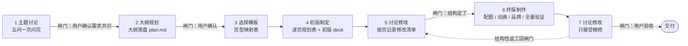
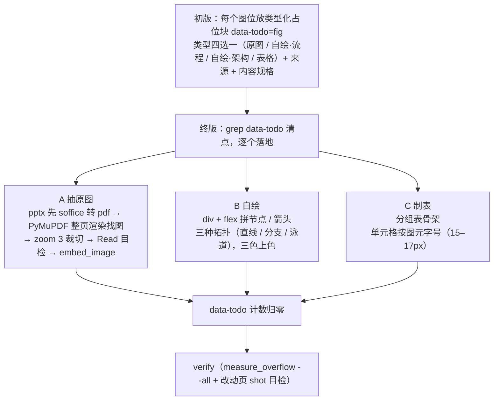
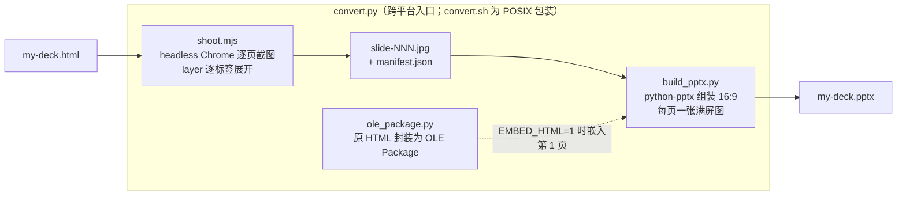
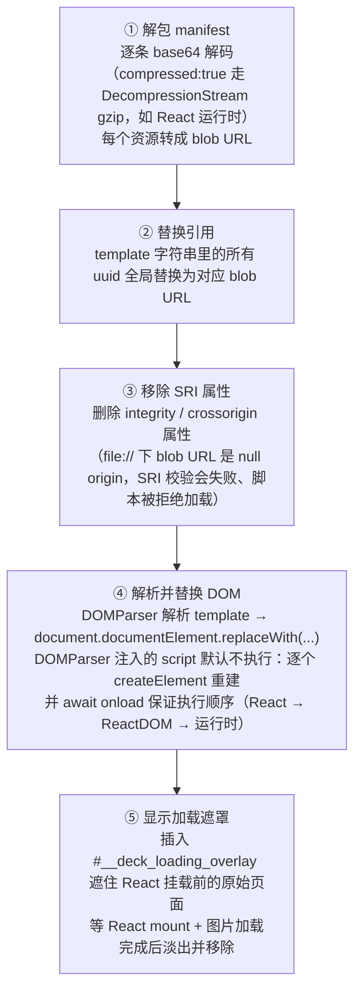
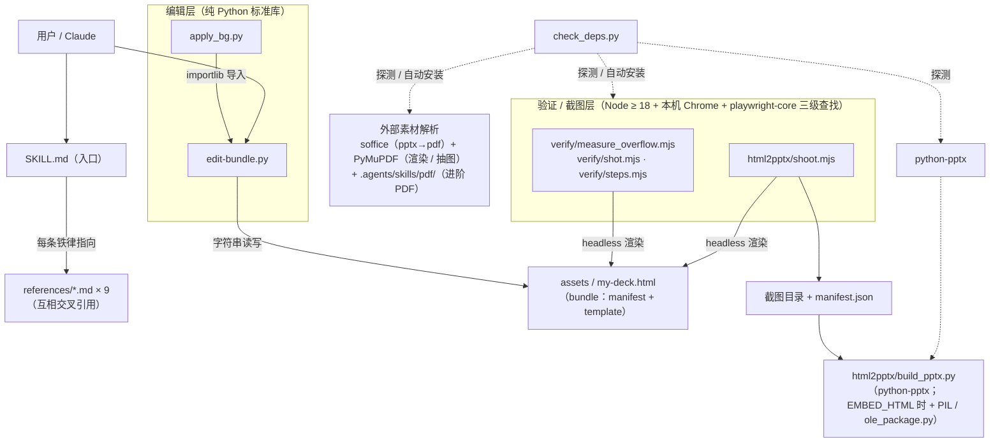
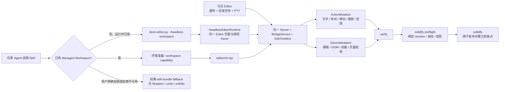

# huawei-deck · 设计原则、工作流与代码架构梳理

> 本文是对本 skill 的系统性梳理：它按什么原则设计、用户与 Agent 按什么流程协作、代码分几层各干什么。
> 与 `docs/design/` 的关系：`design-spec.md` / `implementation-plan.md` 是**构建时**的规格与计划（记录「当初怎么做出来的」）；本文描述**现状**（现在的结构是什么、为什么这样设计）。改动仓库时若行为与本文不符，以 `SKILL.md` 与 `references/` 为准并回来同步本文。

---

## 1. 这是什么

huawei-deck 是一个符合 `SKILL.md` 目录约定的 **Agent Skill**，不是普通应用代码库。它交付的能力是：从三套华为红品牌模板出发，做出 1920×1080、离线可拷走的**单文件 HTML 演示（网页 PPT）**，并可一键导出 PPTX。

交付物四块：

| 组成 | 内容 | 角色 |
|---|---|---|
| `SKILL.md` | 触发描述 + 5 步快速上手 + 16 条设计铁律 + 文件导航 | skill 入口，Agent 触发后最先读取的文件 |
| `assets/` | 三套模板 deck（授课 34 页 / 技术分享 37 页 / 汇报 46 页，各 ~12MB）+ 华为官方素材库 `huawei-refs/` | 起点资产：复制后再改，绝不直接改模板 |
| `references/` | 9 份使用文档（流程 / 页型索引 / 设计系统 / 动画 / 片段 / 编辑 / 配图 / 品牌 / 官方风格） | 按需加载的知识库，SKILL.md 每条铁律指向对应 reference |
| `scripts/` | install.py（Skill 注册）、check_deps.py（Profile 诊断）、edit-bundle.py（编辑）、deck-editor.py + editor/（新建编排与后期微调）、verify 三件套（验证）、html2pptx（导出）、apply_bg.py（品牌图替换） | 工具链：安装、诊断、新建、编辑、微调、验证、导出均由脚本完成状态闸门、结构同步与检查 |

一个关键的产品决策（见 `docs/design/design-spec.md`）：模板不是「最小空壳」也不是「生成器」，而是**页型画廊**——从一份 77 页真实课件**做减法**产出。每一页既是可复制的版式，占位文案本身又在讲解「这一栏该怎么写」，即「**画廊即文档**」；另保留 10 页真实课件成品作对照。

---

## 2. 设计原则

### 2.1 产品层

1. **单文件、真离线**。React 运行时、双字体（Noto Sans SC 400–700 + JetBrains Mono）、全部图片以 base64 内联进一个 HTML；拷走一个文件即可放映，断网、`file://` 直开均可。代价是文件 ~12MB、不能用编辑器直改——这是整套工具链存在的根因（见 §4.1）。
2. **画廊即文档**。占位文案 = 用法说明（例：h3 占位写「一句话说清本页主张」），浏览器滚一遍模板就等于读完排版手册；`references/template-pages.md` 只做逐页索引与「怎么改」。
3. **场景三分，同一工具链，页型受控共享**。授课 / 技术分享 / 汇报三套模板平等并列且不物理合并，共用设计系统与全部脚本；场景外壳保留各自门面与基调，目录层允许把经过兼容性审核的静态内容页借入另一外壳（叙事骨架、页数节奏、动画量、语言风格见 `workflow.md` 场景适配表）。
4. **品牌可替换，不做通用主题系统**。华为品牌元素（背景画 / 黑板底图 / 人像 / logo / 口号 / 红色系）全部登记为**可替换点**，配有脚本和文档；但不抽象成主题配置——保持模板可直接照抄的具体性。
5. **模板只读，副本工作**。所有编辑都发生在 `cp assets/xxx.html my-deck.html` 之后的副本上。
6. **内容缩放与浏览器 UI 解耦**。`Ctrl/Cmd + 滚轮` / `+/-` 改 slide canvas 的用户倍率，刷新从 `deck-template-zoom-v1` 恢复；非 100% 时 navbar 液态展开四角百分比复位控件，点击右上角任一模式按钮也复位。工具条固定；滚动态以当前页为锚点同帧校正滚动位置，避免跳页与闪烁。

### 2.2 视觉设计系统（`design-system.md` / `huawei-style.md`）

- **三色体系**：品牌红 `#b5333b`（强调 / 真警示）+ 灰蓝 `#566472`（对照 / 次要）+ 中性灰阶。铁律「去花花绿绿」：外部素材搬入先按三色重新上色；红只给真警示与本页重点。深色页参照官方公式「黑底 + 白字 + 金强调 + 红点缀」。
- **双字体分工**：中文一律 Noto Sans SC（**绝不只挂 JetBrains Mono**——它无中文字形，会回退细体）；数字 / 英文 / 代码 / mono 小标签用 JetBrains Mono。
- **一套字号刻度 + 21px 散文地板**：正文区只用 `{13,15,17,19,21,24,27,30}`；「给听众读的散文」最小 21px，图元（表格单元格、轴标签、框图内文字）豁免。判别法：`font-size < 21` 且带 `line-height` 的是散文。
- **四段页结构**：eyebrow（18px mono 小标签）→ h3 大标题（46px）→ 可选导语（21px）→ 主体（`flex:1; min-height:0`，版式不塌的关键）。
- **1080 硬约束**：section 是 `overflow:hidden`，超高**无声裁切**——所以「改完必跑 measure_overflow」是铁律而非建议。
- **文案原则**：标题即观点且点名技术（「基于 X 实现 Y」句式，全部标题连读 = 论证链）；不写套话广告词；页面上绝不写「点击查看」类操作提示。

### 2.3 动画原则（`animation.md`）

- **只靠讲者手动推进，绝不自动循环**——动画是讲课节奏的控制器，不是炫技。SMIL 装饰动效是唯一例外（循环但不占节拍）。
- 三机制分工：**build**（逐拍揭示，`data-step` + 点击计数 level）、**layer**（同 key 同组按钮/面板互斥切换）、**SMIL**（SVG 连续运动，随页激活/冻结）。build 与 layer 共享同一 level，可串成混合链。目录、标签页、方案和阶段视图等页内多画面全部复用固定 DOM 的 layer 协议；切换只改 `data-active`，不得另造状态机或整组重绘 DOM。
- **拍数公式**：总拍数 = 页内最大 `data-step` + 2（进页空场 1 拍 + 讲完翻页 1 拍）。此规则在 deck 运行时与 `steps.mjs` 各实现一份，**改一处必须同步另一处**。
- 设计方法「先排拍后编号」：先列讲稿节拍表（一个知识节拍归同一拍），再翻译成连续的 data-step。

### 2.4 协作流程原则（`workflow.md`）

- **设计先于搭页**：从零做 deck 必走七阶段流程，三个「讨论」阶段是**硬闸门**——用户没确认不进下一阶段。用户催「直接做」时，把五问压成带默认值的一轮快答，加速形式、不豁免闸门。
- **初版占位、终版落地**：初版配图一律放类型化占位块（`data-todo="fig"` + 类型 + 来源 + 规格），结构定了才抠图、配动画——避免精修变沉没成本。
- **计划落盘**：大纲与逐页规划写进伴生文件 `<deck名>.plan.md`，不留在对话里（换会话即丢）。
- **验证先于交付**：每改一批跑 verify 三件套；溢出裁切是无声的，「不跑 verify 就给用户」列在常见错误表里。

### 2.5 工程原则（贯穿所有脚本）

1. **编辑必经 edit-bundle.py**。deck 的 HTML 藏在一行 JSON 字符串里，编码只有一条正确路径（§4.2）；编辑器 / sed / Edit 工具直改几乎必坏文件。
2. **结构三处同步自动化**。增删移页要同时改 slide DOM / `nav[]` / `chapters[].start` 三处，`insert_page` / `delete_page` / `move_page` 已封装这三处的同步，调用方不手工修改其中任何一处。
3. **统一退出码契约**：所有可执行脚本一致——`0` 通过 / `1` 检出业务问题 / `2` 工具或参数错误，可直接接 CI。
4. **页面身份分层**。Managed Editor 使用持久且全局唯一的 `data-page-id` 作为稳定页面身份，页序、标题或 `data-label` 变化不影响既有 action；shot / steps / measure_overflow / edit-bundle 仍以 `data-label` 作为工具侧页名，因此这些传统脚本要求 label 唯一，多数在同名时只取第一个（见 `editing-guide.md` §4）。
5. **危险操作先预览、写盘要原子、落盘后复核**。`apply_bg.py` 默认只打印摘要（`--yes` 才落盘），写盘走「临时文件 + `os.replace`」，之后从盘上重读复核（旧 key 零残留、引用数一致）再跑 `eb.verify`。
6. **缺依赖时给出可操作提示**。playwright-core 三级查找（`PLAYWRIGHT_CORE` 环境变量 → 直接 import → openclaw 内置路径），四处实现（三个 verify 脚本 + shoot.mjs）顺序一致，check_deps.py 的探测也用同一顺序；缺依赖时打印**具体的中文安装命令**，而不是原始报错堆栈。
7. **全中文**。文档、注释、报错信息均为中文，新增内容保持中文。

---

## 3. 工作流

### 3.1 总流程：七阶段协作（从零做一份 deck）



- 阶段 1 问清五件事（听众 / 场合时长 / 目标 / 素材 / 品牌与交付），按**场景适配表**定基调。
- 阶段 4 的逐页规划表每页一行：`页序 | data-label | 页型 | 核心观点(一句话) | 排版逻辑 | 配图(类型+规格) | 拍数`。核心观点写不成一句话就拆页，两页同一句就合页。
- 阶段 6 精修顺序固定：配图落地 → 动画节拍 → 品牌替换 → 全量验证 → （可选）导 PPTX。
- 汇报场景若 PPTX 是硬要求，**阶段 4 初版就先试导一次**，转换问题在结构讨论前暴露。
- 阶段 7 只接受精修级改动；结构性返工回阶段 5 重新走闸门。

### 3.2 机械操作：5 步循环（改一份已有 deck 时直接用）


### 3.3 配图工作流（`artwork.md`）

总原则「字不如表，表不如图」，分工：素材原图给证据 / 自绘图讲机制 / 表格管对比枚举。



素材多于 3 篇时并行派 agent 抽图，每个 agent 给足路径 / 目标图描述 / 输出名 / 三步方法。

### 3.4 验证工作流（verify 三件套）

| 脚本 | 干什么 | 判定 |
|---|---|---|
| `measure_overflow.mjs <deck> --all` | 全页测 section 级溢出（Y/X 像素）+ 内层 `overflow:hidden` 裁切 | 溢出 >0 → exit 1；内层裁切只报告，逐条目检 |
| `shot.mjs <deck> <label> out.jpg` | 单页 1920×1080 截图（build 全显），供目检 | label 不存在 → exit 1 并列出全部可用 label |
| `steps.mjs <deck> <label> outdir/` | 模拟放映引擎逐拍截图 step-NN.jpg，逐拍打印新出现元素 | 对着讲稿核对每拍内容 |

外加结构验证 `python3 scripts/edit-bundle.py my-deck.html`（= `eb.verify`）：打印 slide-fit / section / nav 数量与 chapters 起点，nav 编号不连续直接 assert 失败。

### 3.5 PPTX 导出（html2pptx）



工具不解析打包结构——**渲染什么截什么**，改完 deck 直接重跑。已知限制：靠 React 内部 state 的自制交互页无法程序化展开，只截默认态。

### 3.6 品牌替换（`branding.md`）

四类图（bg / board / people / logo）走 `apply_bg.py`（预览 → `--yes`）；口号与品牌色走 edit-bundle 文本 / 色值映射替换（每个色值打印替换处数，出现 0 处即停下检查）；换色后注意警示红与品牌红同值的语义检查。

### 3.7 环境体检

动手前运行 macOS / Linux 的 `python3 scripts/check_deps.py --profile editor-core --check-only` 或 Windows 的 `py -3 scripts\check_deps.py --profile editor-core --check-only`。`EnvironmentManager` 的外部 Interface 投影为 `editor-core`、`verify`、`pptx-export`、`materials` 和兼容用的 `full`：每个依赖只在相关 Profile 内决定退出码，LibreOffice 缺失不能把 Editor Core 判为失败。`--repair` 修复 pip/npm/npx 项并复检，Node、Chrome、Agent CLI、soffice 等返回人工操作提示；`--json` 是 Editor 诊断页与自动化共用的结构化 Interface。

### 3.8 后期可视化微调工作流

`TARGET_AMBIGUOUS` 会把关联任务置为 `needs-confirmation`。drawer 必须显示“目标定位不唯一”的原因、支持 `prefers-reduced-motion` 的间歇醒目提醒和“补充说明”入口，不得提供没有后端确认语义的假按钮；`PATCH /api/tasks/<TASK_ID>` 保存补充说明后把任务恢复为 `pending`。

若撤销 / 重做快捷键到达时初始 `sessionRefreshPromise` 或后续权威快照仍在进行，parent 最多保留一个 `pendingHistoryShortcut`，待刷新成功后重新走候选与 busy 校验再执行；事务进行中的重复按键仍拒绝，加载失败则清空待执行意图并提示。临时 `R` 快捷键由 parent 与 frame 共用的 `isRegionShortcutKey()` 按物理 `KeyR` 识别，因此中文输入法组合态把 `key` 报为 `Process` 时仍生效；直接文字编辑和其他真实输入控件继续保留输入语义。

新建 deck 由桌面工作台的 CreationDraft 文件状态机编排。创建页左侧只投影“需求已收敛 / 大纲已形成 / 页面已规划 / Deck 已出现”四个只读里程碑，节点不可点击；前三段没有表单、章节卡片、页面卡片或确认按钮，用户只通过右侧真实 PTY 对话。`draft.json` 是完整状态的权威记录，`brief.json`、`outline.json`、`page-plan.json` 与 `deck-ready.json` 是耐久回执；浏览器只从 Draft 与这些文件派生进度，绝不解析终端文本。合法 Deck 出现前 PTY 占据主区域；模板副本首次成为合法 staging Deck 后，中间画布才展开，`CreationManagedDeck` 同时复用 `server.mjs` 启动临时 Managed Workspace。创建页嵌入完整 Editor Runtime 的纯画布模式，因此结构制作、ActionMutation / SourceMutation、working watcher、诊断、revision、自动刷新和固化与已有 Deck 共用同一条底层路径。实际 bundle 结构制作、批量重构和增删移页仍由右侧 PTY 中的 Agent 经 `scripts/edit-bundle.py` 修改托管工作副本；已有元素细节可经 Editor CLI action 提交。`generation-ready` 先 flush 并固化回 staging，再执行验证和不覆盖发布；随后关闭 staging Editor，并立即用最终 Deck 启动标准 Managed Workspace。创建页嵌入该最终运行时，点击“进入微调编辑器”时通过 `takePublishedEditor()` 转移运行时所有权，页面跳转不再调用第二次 `startServer()`。因此新建页与修改页从最终 Deck 发布起共享同一个 working Deck、WebSocket、revision、编辑时间线和 PTY。`creation-handoff-context.mjs` 是 Creation→Editing 的唯一交接 Interface：它在最终 Editor session 中原子写入 `creation-context.json`，集中保存来源 Draft ID、已确认 brief / outline / pagePlan、发布 plan、素材与诊断目录；短期 capability 和 Editor token 不进入持久文件。同一 PTY 只接收一次带新 Editor CLI 地址的阶段切换提示，不重复加载 Skill；Editor 重开、旧会话失效后新建会话以及后续 Agent 批次都从同一清单恢复关键上下文：

```bash
python3 scripts/deck-editor.py <deck.html>
python3 scripts/deck-editor.py Deck-Projects/renzhi/renzhi-deck.html
```

浏览器提供预览、编辑、区域标记三种一级模式；`edit` 在 frame 内统一路由文字、移动和缩放，旧 `text` / `move` / `resize` 消息会规范化为 `edit`，但不再作为界面工具出现。文字目标内部投影文本光标，首次 pointerdown 即建立直接编辑态但不阻止浏览器默认事件，使单击放置光标、按住拖动形成原生选区；红色选框用四条 frame-owned 透明命中带承接移动，只有边缘显示抓取光标并移动元素，右下控制点继续缩放；移动与缩放超过 7 个屏幕像素才更新预览，避免单击和双击误提交动作。parent 与 frame 都监听无修饰键 `R`：仅在持久模式为编辑、且焦点不在输入控件或直接文字编辑中时，按下会把有效模式临时投影为区域标记，松开恢复编辑；恢复消息显式保留已创建的区域标注输入框。区域拉框后在旁侧输入说明，任务可跨页进入 Agent 任务 drawer；页码 badge 只投影 pending / processing / failed / needs-confirmation 状态，completed 任务默认收进闭合分组。未固化的非末尾 Agent 任务可通过追加补偿修改撤回，补偿本身再由顶栏按顺序撤销 / 重做；固化后完成项保留供查看但移除撤回入口。待处理、失败和待确认任务可经 `PATCH /api/tasks/<TASK_ID>` 修改说明，或经 `DELETE` 二次确认删除，Agent run 活跃时服务端统一拒绝，已完成任务需先撤回。任务删除先提交权威 session，再清理截图与附件；清理失败只留下可对账孤儿，不会恢复任务或制造悬空引用。文字编辑始终复用单击后出现的红色选框，框内普通文字和局部格式片段共享同一个独立布局盒编辑范围。frame 的文字单击同时建立直接编辑态和整个独立布局盒的红色选框；即使落点位于局部格式 wrapper，局部格式也不会拆成独立编辑框，唯一 `contenteditable` 仍挂在整个红框文字盒。进入编辑时记录原始 HTML 和全部 childNodes 文本路径，退出时先恢复原 DOM；若结构稳定，只为实际变化的文本节点生成最多 32 层的规范 `textPath` 动作，从而保留未改 `strong` / `span` 与 `<br>`，整段替换造成结构变化时才退化为 element 级纯文本动作；全选删除的空字符串仍是有效动作，不会当成取消。action compiler 的状态键包含 `textPath`，但 locator 仍跨片段和动作类型复用同一元素的最早安全指纹。运行时局部格式 wrapper 可因同范围样式覆盖或撤销而拆装；旧 `textPath` 无法直达文本节点时，patch runtime 使用动作的 `before` 在同一文字盒内唯一定位并按绝对字符范围替换，零匹配返回 `TARGET_NOT_FOUND`，多匹配返回 `TARGET_AMBIGUOUS`。首次按下文字时进入编辑，浏览器默认事件负责放置折叠光标和拖选，blur 或 `Cmd/Ctrl+Enter` 统一提交动作。移动命中则沿祖先寻找最近的 positioned 或 block / flex / grid 等独立布局盒，不依赖 class，同时排除 section / stage / canvas 等结构容器。图片内文字、SVG、链接和交互组件仍 fail closed。外部 Codex / Claude Code / Agent 不是内置聊天机器人；drawer 不承载对话，但“交给 Agent”会经固定 schema 的 `POST /api/agent-runs` 立即触发当前批次。Agent 通过 CLI / HTTP 读取 session / tasks、用 `locate-text` 或 editor capability 定位文字、以 `POST /api/actions` 提交细节修改，并经统一 group API 撤销 / 重做；`POST /api/write-deck` 只建立检查点，真实发布必须先调用 `POST /api/solidify-preflight`，再用一次性预检令牌调用 `POST /api/solidify-deck`。observer WebSocket 使用 `/events`，仅订阅服务事件；唯一 editor capability WebSocket 只在 parent 与服务之间传递 frame 事务、文字定位和 ACK，不对外提交动作。

受控 Agent HTTP 明确包含 `GET /api/session`、`GET /api/tasks`、`POST /api/actions`、`POST /api/groups/<GROUP_ID>/undo`、`POST /api/groups/<GROUP_ID>/redo` 与检查点 `POST /api/write-deck`；正式发布先经 `POST /api/solidify-preflight` 取得绑定 revision、文件指纹、诊断和动作投影均匹配的一次性令牌，再调用唯一写入入口 `POST /api/solidify-deck`。可见 Editor 由浏览器用户确认，无窗口 Skill 仅按用户明确的完成、保存或正式写入要求调用。

文字格式采用“持续编辑会话 + 绝对字符范围”模型。frame 在 inspector 或浮动工具条提交样式前保存 selectionId、文字盒 locator 与 `{start,end}`；局部样式包装改变 DOM 后，按新文本节点重新构造浏览器 Range 并把焦点交还 `contenteditable`。`font-family`、`font-style`、`text-decoration-line` 等字符属性允许局部范围；`text-align`、项目符号与 `line-height` 投影到整个文字盒。CSS `display: table-cell` 参与独立布局盒命中，因此单元格产生 `TD` locator，而不会上提成整张 `TABLE`。Inspector 只维护一份字段 DOM，通过 `data-inspector-dock` 切换两种信息架构：右侧是“文字 / 段落 / 外观 / 更多”互斥手风琴，并把对象摘要、分类滚动区与恢复操作分成固定三行；终端展开后的顶部布局把字体、字号和 `B/I/U` 保持为单行常驻，把其余分类投影为互斥浮层抽屉。切换停靠方向时重新选择默认展开组；顶部抽屉的外部点击与 `Escape` 只关闭当前临时层，其中捕获阶段的 Escape 优先于终端收起。两种布局都保证正文控件不产生横向滚动。含嵌套文字运行段的整框选择也生成完整字符范围，避免外层元素样式被内部 inline style 覆盖；其属性快照遍历全部文字节点并向 parent 提供 mixedProperties。直接编辑退出时，`suspendTarget()` 的恢复函数同步执行当前时间线动作投影，原 HTML 恢复与权威格式回放之间不再暴露可交互空窗。patch runtime 在插入局部 wrapper 后立即 `normalize()`，frame 与 runtime 的文字遍历均跳过零长度节点；这些不可见边界不会污染 mixed 状态或绝对字符偏移。`text-decoration-line` 虽不继承，但样式快照沿文字祖先链识别实际绘制的下划线。混合格式快照遍历选区相交的全部可见文字节点；统一格式按相邻同值运行段拆分动作，使每段 `before` 仍是单一可逆值。action compiler 再按目标与属性对范围执行后写覆盖、残段切分和相邻同值合并，输出互不重叠的最终运行段。人工连续控件提交可附带只在本地 UI 使用的 `coalesceKey`；BridgeService 仅在 3 秒内、同 key 且仍为时间线末尾修改时把新 canonical 动作追加到原条目，revision 仍逐次增加，undo / redo 按条目完整逆放 / 重放。parent 收到重复 `deck-ready` 时按 page key、再按页码对页序按钮做原位协调，先维持当前页 `aria-current`，再异步请求 frame 切页，避免整列替换产生无高亮帧。

页面栏与 Inspector 的开合 affordance 由 `data-pill-arrow` 统一：控件固定为 30px 圆形白底，方向由 `data-pill-arrow-direction=left|right|up|down` 投影，状态切换只旋转 `.pill-nav-arrow-icon`。PillNav 仍运行圆形 fill 动画，但方向按钮隐藏 hover label clone，避免箭头在上下翻页副本与状态旋转之间出现重影或反向瞬态。

顶栏的“撤销 / 重做”只移动编辑时间线的唯一历史游标，覆盖人工文字、移动、缩放、Agent 动作和结构修改；新修改会截断游标之后的旧重做分支。parent 与 frame 分别监听键盘并通过受限 `history-shortcut` 消息汇合到同一 `changeHistory`：`Cmd/Ctrl+Z` 撤销，`Cmd/Ctrl+Shift+Z` 重做，Windows 兼容 `Ctrl+Y`；输入框、`role=textbox` 与 `contenteditable` 保留浏览器原生撤销。任务行撤回非末尾 Agent ActionMutation 时，不会停用旧条目，而是计算当下状态的反事实差异并追加补偿修改；补偿无法保持后续修改或涉及 SourceMutation 时返回冲突。区域任务可选择文件（支持多选和连续追加）或粘贴图片，粘贴图片会转为 PNG；每个任务最多 8 个附件，单个文件最大 25 MiB。浏览器无法取得原文件绝对路径，服务会把副本复制到 sidecar 会话的 `attachments/`。只有任务 payload 的序列化出口会派生路径：`GET /api/tasks`、`GET /api/tasks/<TASK_ID>`、`POST /api/tasks` 响应中的 `task`、`task-created` / `task-updated` 等事件或动作响应中的 `task`，以及 CLI `tasks` / `task`；这些出口返回副本绝对 path，供外部 Agent 读取。`GET /api/session` 与磁盘 `session.json` 只含 sidecar 相对 `relativePath`，不保存、也不返回附件绝对路径。附件不进入最终 deck，并随 sidecar 生命周期管理，也不属于 Deck 动作的撤销 / 重做范围。

Editor 启动后真实 source deck 只读，预览读取 sidecar 托管工作副本。`.huawei-deck-editor/` 自动保存会话、任务、快照、ActionMutation、SourceMutation、诊断、工作版本与备份；它不进入最终交付 deck，并由仓库 `.gitignore` 忽略提交。session v2 以 `timeline.entries + timeline.cursor` 为权威，`groups / redo` 仅是兼容旧界面与旧客户端的投影视图；旧版带 active 空洞的历史在启动时线性化，无法证明有效的 redo 进入迁移归档。工作台不绑定 `Cmd/Ctrl+S`。用户二次确认“固化修改”后，浏览器先调用 `POST /api/solidify-preflight` 校验 revision、文件绑定、双指纹、页面目标、诊断和动作投影，再携带 60 秒内一次性令牌调用 `POST /api/solidify-deck` 原子发布真实 Deck。成功后创建固化检查点、归档旧时间线并从空时间线继续；连续固化不丢上一轮内容，也不追加脚本块。浏览器标签页的 `×` 会直接关闭，不触发 Chrome 通用离开提醒；网页无法用自定义弹窗接管标签页关闭。要离开编辑器，应点击品牌区右侧、页面左上角独立的“退出编辑”；右侧工作区导航继续保留“初始页”按钮，二者不能互相替换。有未固化历史或 Agent 正在运行时，“退出编辑”会直接打开页面内未固化任务清单，按最新修改倒序列出游标前仍生效条目关联任务的页码与说明，并汇总未绑定任务的直接编辑 / 结构修改与游标后的重做历史；操作项为“继续编辑”“暂不固化，退出”“固化并退出”。“固化并退出”仍走同一预检与安全写入闸门；未固化历史与工作副本保留到下次打开。`POST /api/write-deck` 只检查并保存会话检查点。冲突或验证失败拒绝覆盖。

当前退出交互以“退出编辑器”为唯一文案：初始页、流程页和各编辑页面的品牌区右侧保持同一位置，文字右侧使用品牌红线性的门框与向右退出箭头，不带独立底框。退出通过受令牌保护的 `/api/shutdown` 显式关闭启动器、全部编辑运行时与 Agent 终端，而不是返回初始页。退出弹窗覆盖游标前全部生效条目，按 `taskId` 分组；任务默认只显示任务说明与下拉箭头，首次展开时才生成页码、条目数和具体 action / source 修改类型。`taskId:null` 的直接编辑 / 结构修改与游标后的重做历史独立显示。

后期 iframe 动作层不直接增删页、调整页序或重构复杂动画；这些结构修改由真实 PTY 中的 Agent 经 `scripts/edit-bundle.py` 修改托管工作副本，绝不直接写真实 Deck。工作台不另造聊天协议。Agent 动作受 token、revision、locator 与事务校验。session 可重开；`RECOVERY_REQUIRED` 会让未决恢复状态阻断继续写回，外部文件变化必须重载，或另存副本。

写回后运行 `python3 scripts/edit-bundle.py <deck.html>`（`eb.verify`）、`measure_overflow.mjs` 和改动页 `shot.mjs`；只有修改动画页才运行 `steps.mjs`。`shot.mjs` / 动画页的 `steps.mjs` 固定按 1920×1080 逻辑画布截图；无动画页执行 `steps.mjs` 只打印“此页无动画”并退出 0，不生成逐拍截图。

---

区域标记模式下按住 `R` 会临时进入预览，松开后恢复区域标记，输入控件不触发。区域弹窗的“继续添加任务”只持久化当前任务；“直接提交任务”在持久化成功后收集全部 `pending` / `failed` 任务并启动同一 Agent run，启动失败不回滚已创建的任务。frame 在拉框时捕获当前页的 layer、`data-active` / `data-shown`、ARIA、details 和表单选择等交互状态，作为受限 `pageState` 随任务持久化；定位任务时在同一 `pageKey` 内先恢复状态再绘制区域高亮。历史 `data-mod` 目录仅留兼容读取，新模板不再生成。frame 同时监听主 `.stage` 的活动页与滚动收敛状态，通过 `active-page-changed` 让 parent 页序跟随 Deck 内导航；同一 frame 的页清单未变时，同页内容重绘只更新诊断，不再向 frame 回发 `show-page`，缩略图 clone 不参与页面身份。

从红框边缘点选整个元素后，parent 与 frame 只在非输入焦点下接收无修饰 `Delete` / `Backspace`。parent 用带 `selectionId` 的受限消息补齐 iframe 未获键盘焦点的场景，frame 复核当前选中对象后提交可撤销的 `hide` ActionMutation；文字内部有光标时保留浏览器原生删除。

## 4. 代码架构

任务删除权限以 canonical history 为边界：上文“已完成任务需先撤销”只适用于仍有 `groupId` 的任务；已固化任务可删除记录，删除不会改变 Deck 中已经固化的修改。删除仍先提交权威 session，再清理任务的局部截图与附件。

### 4.1 单文件 bundle 格式与浏览器端 loader

deck 文件本体约 220 行，由页面骨架、两行超长 JSON 和 loader 脚本组成：

```
<!DOCTYPE html>
<head>   骨架样式 + loading 动画（牛顿摆）+ noscript 提示
<body>
  <div id="__bundler_thumbnail">      # 解包期间的占位画面
  <script>  ← bundler loader（见下）
  <script type="__bundler/manifest">  # 下一行 = 一行 JSON dict: {uuid: {mime, compressed, data(base64)}}
  <script type="__bundler/template">  # 下一行 = 一行 JSON 字符串: 整份 deck HTML
```

**template 字符串包含整份 deck 的全部内容**：每页 `<section data-label=…>`、导航数组 `nav[]`、章节起点 `chapters[]`、目录页数据 `TOC[]` / `builders[]`、内联的 React/ReactDOM UMD、运行时脚本、按 data-label 精确匹配挂背景的 `<style id="tpl-bg-950">`。

loader 在 `DOMContentLoaded` 后执行五步：



这套结构决定了两条工程铁律：**图片的增删走 manifest**（`embed_image` 追加条目；`apply_bg.py` 替换后删除旧条目，避免 manifest 残留无引用的数据），**HTML 改动走 template 字符串替换**。

### 4.2 edit-bundle.py：唯一的安全编辑通道

按行读文件（`load`/`save`），靠标记行定位那两行 JSON（`_tpl_idx`/`_man_idx`），全部操作是**纯字符串查找与替换**——不引入 HTML parser，读出再写回不会改动任何未触及的内容。

```
读写      load / save / get_template / set_template(→dump_template)
资源      embed_image（追加 manifest）/ get_resource（解码某 uuid）/ inline_react（离线修复）
结构      insert_page / delete_page / move_page（三处同步）+ bump_chapters（跨章移动后手工修正）
内部      _slide_bounds（按 data-label 定位整块 slide-fit）/ _nav_entries / _write_nav / _bump_after_page
辅助      grid（矩阵表 HTML 生成）
验证      verify（数量一致 + nav 连续 + pageId 完整唯一断言 + 打印 chapters）
```

**编码不变量**（改脚本必须保持，`dump_template` 内置断言）：

```python
raw = json.dumps(s, ensure_ascii=False).replace('</', '<\\u002F')
assert '\n' not in raw and '</' not in raw and json.loads(raw) == s
```

只转义 `</`（防字符串里的 `</script>` 提前闭合文档），CJK 与 URL 里的普通 `/` 不动。

**三处同步的记账逻辑**：页所属章 = `max(start ≤ 该页 nav 索引)`。插页时**先**用 before 页的原索引定章再动 DOM/nav（插入后索引 +1 会撞下一章 start）；删页后该页所在章之后各章 start −1；`move_page` 只保证同章内安全，跨章需手工 `bump_chapters`。

### 4.3 verify 三件套 + shoot.mjs：四个脚本的公共执行流程

四个 .mjs 共用同一套模式：


差异在核心动作：

- **measure_overflow**：`.build` 强显后测 `sect.scrollHeight - clientHeight`（section 级，>0 判失败）+ 遍历全部元素找 `overflow:hidden` 且 scroll>client 的内层裁切（只报告）。`--all` 按 canvas 遍历，是同名 label 唯一各测各的模式。
- **shot**：`.build` 强显，单页 element.screenshot。
- **steps**：在页面里实现了一份与 deck 运行时相同的放映引擎规则——对 level 从 0 到 max+1 逐拍：build 按 `data-step < level` toggle `data-shown`；layer 每组取「data-step < level 中最大者，否则组内第一个按钮」toggle `data-active`；每拍截图并打印新出现元素摘要。**此实现与 deck 运行时的引擎规则一一对应，改任一侧必须同步另一侧。**
- **shoot（html2pptx）**：不按拍数截图，而是做 **layer 标签展开**——探测每页的标签组（按钮须有配对面板才算），先把所有组切到第一个标签、截一张全默认态，再逐组逐标签各截一张（截某组时其余组停在第一个标签；`gi>0 && ki==0` 跳过，避免全默认态重复），按顺序写 `manifest.json`。34 页模板由此展开为 55 张。

### 4.4 apply_bg.py：品牌图替换流程

替换点的定位是**运行时解析**而非硬编码 key（bg/board/people 从 `<style id="tpl-bg-950">` 对应规则的 `url()` 读当前 key；logo 从 `alt="HUAWEI"` 或 `data-brand-logo` 的 img 读 src），所以换过一次后仍可再换。执行六步：新图入 manifest → 全部引用替换（计数校验）→ `set_template` 回填 → 删旧 manifest 条目 → 原子写盘（tmp + `os.replace`）→ 盘上复核 + `eb.verify`。

### 4.5 依赖关系图



### 4.6 后期编辑器组件与运行时契约



可见 Editor 和无窗口 workspace 只在交互外壳上不同：前者让用户看画布并使用内嵌终端，后者由后台 Chrome 承载相同的 frame bridge。Mutation、revision、诊断、撤销 / 重做和固化没有第二套实现。

统一工作台的启动 seam 是 `scripts/deck-editor.py`：macOS 的 `Huawei Deck 编辑器.app` 与 Windows 的 `Huawei Deck 编辑器.cmd` 都是薄桌面 adapter，Python 启动器是统一命令 adapter。macOS 用户双击 `Huawei Deck 编辑器.app`、Windows 用户双击 `Huawei Deck 编辑器.cmd` 后，先进入本地工作台启动页。首页以“新建 Deck / 修改 Deck（打开已有 Deck）”两张工作卡展示可继续任务；`work-history-store.mjs` 是启动页唯一的历史 Interface，只保存 `projectRoot + draftId` 或 `deckPath` 指针，权威状态仍在 Draft 和 Deck sidecar 中。点击历史项直接重新获取锁、恢复工作状态并以持久 conversation ID 启动同一 Agent 会话；卡片右下角小加号才进入新任务流程。Creation Draft 锁记录 token、PID 与心跳时间；窗口事件 WebSocket 全部断开且超过重连宽限期时，App Server 自动关闭并释放锁，崩溃遗留的过期租约可由新服务接管。新建 Deck 先确认 Agent 项目目录；打开已有 Deck 通过系统文件选择器添加一份 HTML。两条流程的路径候选都可反复更改；在创建 Draft 或打开 Editor 前，“返回”会同时废弃前端与服务端候选，回到 idle，因而可安全切换入口。只有创建 Draft、恢复任务或打开 Editor 才会锁定当前工作对象并结束启动态。命令式入口完整保留：`python3 scripts/deck-editor.py <deck.html>`。

平台图标仍属于薄 adapter：macOS 在 App bundle 的 `Info.plist` 登记内置 `.icns`；Windows `.cmd` 无法原生携带图标，因此首次启动调用 `scripts/create_windows_launcher_shortcut.ps1`，在仓库根目录生成引用 `.ico` 的本机 `.lnk`。`.lnk` 使用当前仓库绝对路径并被 Git 忽略，仓库迁移后通过删除旧快捷方式、再次运行 `.cmd` 重建，不改变统一 Python 启动 seam。

安装与首启不塞进 launcher。`scripts/install.py` 的 `InstallationManager` 通过 `inspect → plan → apply` 小 Interface 隐藏 host 路径、POSIX symlink、Windows junction、安装状态和所有权复核；Codex 标准注册目标是 `~/.agents/skills/huawei-deck`，冲突目标停止，同源但无记录的目标进入 `adoption-required` 并要求 `--adopt-existing` 明确确认，卸载只移除记录且仍指向当前仓库的注册项，批量卸载失败会恢复已删除链接与原状态记录。`scripts/editor/environment-doctor.mjs` 只把 `check_deps.py --json` 与 `install.py --json` 适配为 App Server 的 `/api/diagnostics` 和显式 repair / adoption 路径。首页顶栏的“开始使用 / 帮助 / 安装与诊断”由 `support-center.mjs` 呈现；帮助正文来自 `docs/user-guide/` 的只读 Markdown catalog，示例流程复制模板到用户选择的新目录后复用正常的打开 Deck 状态机，不另建示例专用 Editor。

无路径时，Python 只启动 `app-server.mjs`；它以随机 token 保护 loopback 导入页，按钮请求只能触发本机选择器，浏览器不能提交任意文件路径。选择成功后，它在同一 Node 进程启动现有 `server.mjs` 并跳转到编辑工作台。有路径时则绕过导入页，直接进入 `server.mjs`，因此 Skill 生成第一版后仍可直接带路径打开。编辑服务启动时一次性读取并固定 index、frame bridge、协议、runtime 与全部前端资产；运行中磁盘代码变化不会形成“新前端 + 旧服务”混合版本，开发代码更新后必须重启编辑服务。带路径的 Python 入口自动捕获 `CODEX_THREAD_ID`，macOS App 参数也可显式传 `--agent-thread-id`；该启动值只是 Deck-Agent 连接模块的高优先级输入，解析后会写入 Deck sidecar。以后独立导入同一份 Deck 时即使没有启动参数，也会恢复持久化连接。两条路径共享 deck 校验、依赖探测、编辑服务、Agent 调度、bundle adapter、BridgeService 与写回闸门；桌面 adapter 仅增加一次性导入、原生错误提示、缺失 Node 模块自动安装和浏览器关闭后的延迟退出。

Windows 的项目路径模型显式分离 `projectRoot` 与 `terminalCwd`：前者是 workspace/identity 的可信路径，后者只能是 CMD 支持的本地或映射盘符别名。候选盘符必须经 `realpath` 或相同 `dev/ino` 证明指向同一目录；既不写死 Parallels 的 `Y:`，也不信任同名目录。已有 workspace 只持久化 UNC 时，可从当前机器现有映射盘反查同 identity 别名；无法找到时以 `WINDOWS_UNC_TERMINAL_CWD` 拒绝，绝不允许 Agent 在 `C:\Windows` 中继续运行。Windows sidecar helper 在系统调用边界把普通盘符 / UNC 转为 extended-length path，解决深层 Draft staging 的 MAX_PATH 问题；转换前后的目录 identity 仍逐次复核，registry 不持久化 `\\?\` 前缀。

Node → Python 是单一 UTF-8 进程协议边界。`python-utf8.mjs` 为全部 Editor Python 子进程覆盖 `PYTHONUTF8=1`、`PYTHONIOENCODING=utf-8` 与 Windows `windowsHide`，调用方再以 UTF-8 解析 stdout / stderr；覆盖范围包括长驻 sidecar、附件 writer、DeckFactory 校验、WorkingDeck adapter 与最终 bundle writer。该约束同时保护结构化 JSON 数据和失败诊断，不能只在某个脚本内部修 stdin，也不得继承 Windows 控制台 GBK/ACP 或为辅助进程创建额外控制台窗口。

桌面入口的默认 provider 是 `auto`：Python 启动器按当前系统真实 executable 选择 Codex、Claude Code 或 OpenCode，并把结果显式传给唯一 App Server。Windows 优先 native `.exe`，兼容 npm `.cmd` / `.bat` shim；只有 Claude Code 的测试机不会错误落到 Codex。Claude 的 Windows 输入有两层闸门：先只以 Ink 空 `❯` 输入行与反色光标确认 ready，启动 banner、历史恢复和 PTY 存活都不算；每次 Enter 后清空扫描窗口并重新等待下一个提示符。再使用 bracketed paste，正文按 UTF-8 字节拆成不超过 512 B 的分块并以 30ms 间隔写入，关闭 paste 后再按总字节数等待 3–6 秒并独立发送 Enter。输入态闸门避免恢复长会话时前几个 512 B 分块被启动画面吞掉，字节闸门则给只保留单次大块写入末尾的 ConPTY / Ink 组合留出余量。PTY 退出 / 切换会取消当前分块链并等待 `onExit` 回收 native handle，避免正文缺头缺尾、回车被吞和旧输入串入新会话。

macOS App 的主可执行文件只做短时派发：经 `nohup` 启动 Python 后立即退出，编辑服务独立持有生命周期。不能让 shell 型 App 主进程随编辑服务长期存活，否则 LaunchServices 会把它当成单实例应用；第二次双击无法向非 Cocoa 进程投递 reopen 事件并返回 `-600`。真正的工作台单实例由 Python 启动 seam 负责：它以 `O_EXCL` 原子认领权限为 0600 的临时登记文件，记录 owner PID、service PID 与带随机令牌的 loopback URL；重复派发不会再打开第二个工作台页面，而是先核对进程与页面健康状态。已有实例在线时，macOS 用参数化 AppleScript 先按精确 URL、再按“Huawei Deck”标题定位 Chrome / Safari 标签页并将对应窗口前置；脚本明确返回未找到时，启动器先向旧 service 发送 `SIGTERM`、等待 owner 释放登记，再原子认领并启动加载当前固定资源快照的新 App Server。Automation 权限或 osascript 异常时保守复用已有 URL，避免不确定状态下误关仍在工作的页面。只有 owner 已消失、浏览器标签明确不存在或登记确实陈旧时才接管。健康请求使用无代理 opener，不能继承 macOS 系统代理，否则 `127.0.0.1` 超时会被误判并重新制造一套 App Server。App 必须保留在 skill 根目录，若被单独移动则以原生对话框明确提示，而不是静默退出。

Windows `.cmd` 遵守同一短时派发契约：它用 `--detach-windows` 启动带 `CREATE_NO_WINDOW | CREATE_NEW_PROCESS_GROUP` 的标准 Python 子进程后立即退出；常驻 App Server、Node/Python helper、系统选择器和依赖安装路径统一隐藏控制台。App Server 通过带随机令牌的 `GET /api/launcher-status` 只向桌面启动器公开 `{state, activePageCount, everConnected}` 页面租约摘要。重复启动若发现活动租约，只尽力通过隐藏 PowerShell UI Automation 选择 Chrome / Edge / Firefox 中的 Huawei Deck 标签并前置窗口，激活失败也不打开第二页；发现曾连接但现为零租约时，先短暂复查页面跳转竞态，再结束旧 service 并原子重启。服务尚在启动且从未连入页面时，第二次派发保持静默；超出启动窗口仍从未连入时才补开同一个 URL。

页面租约的活性由 `launcher-lease-client.mjs` 与 App Server 的 `/launcher-lease` WebSocket 共同维护，而不是只相信一次 HTTP 登记。`pagehide` beacon 是正常关闭的快速路径；浏览器进程崩溃或被强制结束时，loopback socket 断开，服务等待 5 秒给 App → Editor 导航或短暂重连接管，仍无连接才执行统一 `close()`。HTTP 登记后还有 15 秒握手上限，覆盖脚本载入前崩溃。`close()` 依次终止 Creation/Editing runtime、Agent PTY、活动 writer、WebSocket/HTTP、binding coordinator 与 sidecar helper；macOS 与 Windows 共用该 Node 生命周期，不依赖 `.app` shell 或 `.cmd` 窗口存活。

后期编辑器由 browser parent 和 preview frame 两层组成：parent 的 `public/editor.mjs` 管模式、页列表、task drawer、session 拉取与外部事件；frame 中注入 `frame-bridge.mjs` 和 `runtime/patch-runtime.js`，负责坐标换算、locator、区域快照、直接操作与 tentative DOM 变更。两层通过同源 `postMessage` 协作，frame 不获得通用文件系统能力。编辑选框与缩放手柄使用视口坐标绘制，因此 frame 在捕获阶段监听任意滚动容器并按动画帧重新读取目标矩形，不能只在拖动或动作回执后刷新。Editor UI 从离线模板复用 Noto Sans SC 400–700 子集并以 `Huawei Deck UI` 统一加载；parent、frame 浮层和自绘原生控件都以它为首选字体，不依赖 macOS 的 PingFang SC 或 Windows 的 Microsoft YaHei 回退。

核心组件职责如下：

| 组件 | 职责 |
|---|---|
| `Huawei Deck 编辑器.app` / `Huawei Deck 编辑器.cmd` / `deck-editor.py` | macOS、Windows 桌面入口与统一命令入口；无路径进入一次性网页导入，有路径直接接收 deck |
| `app-server.mjs` | loopback 导入页与 idle → choosing → selected 状态机；成功后关闭自身并启动既有编辑服务 |
| `WorkCatalog` | `work-catalog.json` schema v2 的唯一读写边界；用稳定 `workId` / `deckId` 管理创建与编辑工作项、独立显示名称、隐藏记录和文件绑定缓存，并幂等吸收旧历史 |
| `DeckBindingCoordinator` | 源文件身份、父目录 watcher、有界可信根搜索、自动 / 手动重新绑定和固化闸门的深模块；调用者只读取带 revision 的 binding snapshot，不自行组合路径、stat、hash 与 watcher |
| `deck-quality-contract.mjs` | 所有 Deck 工作原样复用的单一质量契约入口；不接受新建 / 修改 phase 分支，统一 Skill / 核心 references 加载要求，以及标题、字号、密度、卡片和语言约束 |
| `TemplateCatalog` | 解码三套模板 bundle 并自动枚举全部实际页面；合并稳定语义 ID、视觉家族、密度、节奏角色、来源与兼容性元数据。`pageTypes` 表示当前外壳原生页，`availablePageTypes` 再加入允许借入的共享页；页面规划同时校验固定角色、排版 / 配图依据和版式轮换 |
| `DeckFactory` + `deck_factory.py` | 复制 staging、写入逐页真实模板来源、封面 / 感谢页结构锁、plan、页面规划契约与目录契约；`import-page` 只从目录白名单导入整页并合并其引用的 manifest 资源。发布前逐页核对 PagePlan 的页数、顺序、页型、来源、pageId、chapterId 与 label，再执行目录动画 / bundle / overflow 闸门和不覆盖发布 |
| `creation-managed-deck.mjs` | 新建流程对 Managed Workspace 的深接口；负责打开临时 Editor、等待画布与诊断就绪、发布前 flush / 固化，以及不关闭共享 PTY 的运行时释放 |
| observer WebSocket | 普通 token 客户端连接 `/events`，只订阅 revision、task、action、undo / redo 与冲突广播，不能发送动作命令 |
| editor capability WebSocket | 同一 `/events` 端点上额外携带 `editorToken`；只允许一个 editor client，服务用它下发 frame 事务 / 诊断命令并接收 ACK |
| `BridgeService` | mutation queue 串行化任务、动作、undo / redo、补偿、固化预检和写回；执行页面事务与 durable session 的两阶段收敛 |
| `EditTimeline` + `PatchJournal` adapter | 维护不可变顺序条目与唯一历史游标，校验连续性，生成非末尾 Agent ActionMutation 的补偿修改；`PatchJournal` 只保留旧 group API 的兼容表面 |
| `action-canonicalizer.mjs` | 把颜色、长度和结构化 action 值规范为可比较语义，供历史连续性与补偿安全检查使用，不改变实际写入值 |
| `SessionStore` | session revision、编辑时间线、固化检查点 / 归档、幂等命令账本、跨页任务、PNG 快照路径与 diagnostics 的 durable 边界 |
| `WorkingDeckStore` | 真实 Deck 的只读镜像、持久 pageId 迁移、内容寻址工作版本、结构变更检查点与固化发布候选 |
| `WorkspaceStore` | 持有已确认的项目根目录与活动终端 provider；独立持久化 `agent-workspace.json` 与 `workspaceRevision`，不增加 Deck revision |
| `HeadlessEditorRuntime` + workspace capability | 无可见窗口时启动同一 Editor 页面与受控 frame，写出权限为 0600 的短期 capability；不复制 Mutation、诊断或固化实现 |
| `agent-provider-registry.mjs` | 窗口化 Agent Host 的单一 provider 注册表；统一服务端、启动页和终端 UI 的 Codex / Claude Code / OpenCode 标识、标签与固定命令 |
| `AgentTerminalSession` | 在项目根目录管理唯一真实 PTY、ANSI 输出回放、原始输入、resize、三个注册 provider 与固定 bypass 命令，并在目录信任交互解除前阻止自动 Prompt |
| `AgentRunCoordinator` | 冻结一次点击的任务 ID，限制单批并发，管理 queued / running / succeeded / failed；默认把任务 Prompt 写入当前 `AgentTerminalSession` |
| persistent dirfd helper / Windows path helper | Python JSONL 长驻 sidecar 进程；macOS/Linux 绑定目录 fd，Windows 绑定真实路径与 dev/ino 身份并拒绝 symlink/junction/reparse point；两者都执行同目录原子持久化，并负责真实 Deck 的备份、transaction 与原子发布 |
| bundle adapter | Python `bundle_adapter.py`；只在可信临时副本上调用 `scripts/edit-bundle.py`，构造离线补丁块并做 bundle verify |
| diagnostics / watch / write gate | frame 诊断 1920×1080 溢出，watch 监测外部 deck 指纹，write gate 聚合 online、fingerprint、overflow 与 bundle 校验 |

其中 sidecar helper 负责真实 Deck 的备份、transaction 与原子发布；浏览器与 Node 服务都不能绕过这条可信写回边界直接覆盖源文件。

`AgentTerminalSession.input()` 会区分独立 `ESC`（单字节 `\x1b`）与方向键等多字节控制序列。独立 Esc 先原样写入 PTY，再向当前 `AgentRunCoordinator` 发布 interrupt；协调器 abort 当前 run 并广播 cancelled，但不关闭长期 PTY，任务状态也不改成 completed。这样 CLI 已回到提示符时，任务抽屉同步解除 activeRun 并允许重新提交。

状态模型可以概括为两条汇入同一编辑时间线的链：元素修改由 browser canonical action 形成 `ActionMutation`；模板、DOM 与页序修改由工作副本前后 SHA-256 形成 `SourceMutation`。session registry 绑定稳定 sessionId，revision 守住并发前提，mutation queue 串行化两类变更，唯一历史游标决定生效投影，authoritative reload 用“当前工作副本 + 游标前 actions”重建浏览器状态；transaction record 只在用户固化发布真实 Deck 时出现。

#### Agent 批处理与 provider seam

窗口化 Editor 是 Skill 的可选增强，不是使用前提；Skill 核心也不绑定某个 Agent 品牌。任何能读取 `SKILL.md` 并执行本地命令的 Agent 都可复用活动 Managed Workspace；没有可见 Editor 时，由 `deck-editor.py --headless-workspace` 启动同一个 Server、BridgeService、preview frame 和 EditTimeline，只把浏览器 UI 换成后台 Chrome。它在首行返回 `url`、普通 token、`workingDeckPath` 与权限为 0600 的 `workspace-capability.json` 路径。Agent 通过环境变量或 capability 调用统一 CLI，完成后按用户意图执行 `verify` 与 `solidify`。只有用户明确拒绝后台运行时或运行依赖确实不可用，才允许经典 `edit-bundle.py` 直改真实 Deck；该 fallback 没有 Mutation、撤销历史和固化，不能静默冒充受控模式。

浏览器点击“交给 Agent”时只向 `POST /api/agent-runs` 发送 `expectedRevision` 和仍为 pending / failed 的任务 ID。服务端校验 revision、任务存在性与单批互斥后立即返回 run snapshot；后续状态通过 `GET /api/agent-runs/current` 和 observer WebSocket 的 `agent-run-updated` 广播。浏览器不能指定 executable、命令参数或 Prompt，因此该入口不是任意命令执行器。点击之后新建的任务不属于已冻结批次。

导入器先按 git 根、`AGENTS.md` / `SKILL.md` 标记和 Deck 父目录的顺序识别项目根目录，并在进入编辑器前让用户可见确认。默认流程没有手动会话绑定：Editor 启动新编辑任务时，立即为注册 provider 创建可恢复 CLI 会话，再由交互式 PTY 接管。Codex 从首个可见 turn 的 `thread.started` 发现真实 conversation ID；Claude Code 使用预分配 `--session-id` / `--resume`；OpenCode 以本轮唯一标识从 `opencode session list --format json` 发现真实 session，恢复时使用 `--session`。Codex 或 Claude Code 的 resume 子进程若从可见输出明确命中“会话 ID 不存在”，退出回调才以 `newConversation:true` 重启并持久化替代 ID；工作副本和待办不变，其他失败保持原绑定并向用户显示。首个 Prompt 对当前 `huawei-deck` Skill 只初始化一次，打开抽屉不会再创建第二个进程。项目根、活动 provider 与会话标识由独立 `workspaceRevision` 管理，不增加 Deck revision，也不进入编辑时间线或固化历史。旧 `session.json.agentConnection` 只读迁移，默认路径不再写它。

Agent 执行只有一条产品路径：`AgentTerminalSession` 统一管理 PTY 生命周期、输出缓冲、输入、resize、provider 白名单和重启；`AgentRunCoordinator` 只负责把冻结任务批次写入该终端并核对任务是否真正完成。旧 provider adapters、会话扫描 catalog、手动 connection API 与结构化 Agent runtime 已删除。Editor URL 与 token 经环境变量传递，Agent 修改 Deck 仍只能走受控 CLI / HTTP action 协议。

右上角投影真实 PTY 运行态，编辑服务启动后即在后台创建新的 CLI 会话；点击后从右侧推出唯一的 Agent 交互终端，不会再启动第二个进程。终端抽屉与属性面板同高，默认宽度为视口的三分之一；左边界可拖动，向左加宽时通过同一 grid 压缩中间画布。打开状态通过 shell 数据属性把任务面板向内避让。产品不再维护结构化对话视图或消息提交 API。`/agent-terminal` 是独立的受保护 WebSocket：只接受当前 editor capability，传输 ANSI 输出、原始键盘输入、终端尺寸和固定枚举的启动 / 重启命令。浏览器只能选择注册表中的 Codex、Claude Code 与 OpenCode；服务端分别固定 `codex --dangerously-bypass-approvals-and-sandbox`、`claude --dangerously-skip-permissions` 与 `opencode`，拒绝浏览器提供 executable、参数或环境变量，也不会在 provider 不存在或未登录时静默切到 Codex。同一编辑服务内刷新只重连现存 PTY；“新会话”才终止并重启 CLI。进程状态 `running` 只表示 PTY 存活，不等于 CLI 可接收任务：ANSI 归一化后的目录信任提示会投影为 `interactionRequired: {kind: "directory-trust"}`，会话保留初始 Prompt、开放用户键盘输入，并让编辑页和新建页自动展开或重新展开右侧终端；前端关闭加载遮罩，显示“等待确认”与脉冲提醒。用户完成选择且正常输入屏出现后才清除交互状态；Codex 0.148 还必须越过初始化期间提前出现的草稿框并看到模型与工作目录完整状态栏，Claude Code 必须看到 Ink 的空 `❯` 输入行与光标，OpenCode 必须看到 `Ask anything` placeholder 与可见光标。`waitUntilReady()` 与 Agent 批次共用这些 provider 闸门。普通人工交互与 Agent 任务提示都写入同一 PTY；程序化任务提示使用 bracketed paste。Windows 下三者的正文统一按 UTF-8 字节拆成不超过 512 B 的 PTY 写入并逐块节流，正文结束符独立写入后才开始 Enter 等待；Claude Code 使用 3–6 秒，Windows Codex / OpenCode 使用 1–4 秒，其他平台使用 120ms。发送 Enter 时 `promptSubmission` 进入 `awaiting-confirmation`；只有 CLI 输出活动区重绘或处理中信号才转为 `submitted`，1.5 秒无回执自动重试一次，仍无回执则转为 `failed` 并提示手动提交。`AgentRunCoordinator`、新建工作区和创建交接都等待这份提交回执，而不是把 PTY `write()` 当成成功；成功后重新等待下一个真实输入提示符。重启会取消尚未完成的整条提交链。终端是 Editor 的实时交互视图，但任务完成、Deck action、撤销与固化仍以 sidecar 为权威。

只有目录信任解除并且 provider 的正常输入框真正出现后，初始化 Prompt 或 Agent 任务才会粘贴和提交；前面的 banner、loading 状态与草稿框始终保持 pending。

Editor 不提供高级设置或“连接已有会话”，也不暴露历史 catalog、connection、session scan 或结构化 runtime API。旧 `session.json.agentConnection` 只在 `agent-workspace.json` 尚未建立时静默迁移一次，随后由专用会话模型接管；它不能改变 Deck revision。Agent 进程退出后，调度器仍复核冻结批次；仍有 pending / failed 任务就保留供重试，不能以进程退出码零伪装成功。

Windows / Linux 的无修饰 `Ctrl+V` 由 xterm 自定义键盘边界放回浏览器原生 paste 事件，只向 PTY 交付一次剪贴板文字，不发送会被 Codex 解释为图片粘贴的 `0x16`；有文字选区时，`Ctrl+C` 也放回浏览器复制且不向 PTY 发送 `0x03`，没有选区时仍发送终端中断。macOS 继续使用原生 `Cmd+C` / `Cmd+V` 路径。

#### 两类修改事务

1. 外部 Agent 经 `POST /api/actions`，或 parent 经同一 HTTP 路由，带 `expectedRevision` 与 locator 提交 action。任何会改变 revision 的请求在读取该前提后，必须先穿过工作副本检查点：若 Agent 已经写盘但文件通知尚未登记，服务先写入 `SourceMutation` 并增加 revision，再以 `REVISION_CONFLICT` 拒绝旧请求；文件系统通知不作为 mutation 的提交顺序。
2. `BridgeService` 通过唯一 editor capability WebSocket 把事务命令发给 parent，再转交 preview frame；frame 定位目标并做 tentative 应用，返回逐字段完整的 canonical action 与 ACK。该 capability 不对外暴露动作提交能力。
3. `EditTimeline` 把动作组追加为带 entryId / sequence / epoch / 投影摘要的候选条目，`SessionStore` durable 落盘并增加 revision；成功后才向 frame 发 commit。`PatchJournal` 只把旧 group 调用适配到该时间线。持久化失败则发 rollback，DOM 与 runtime 基线恢复。
4. commit ACK 丢失时以 durable session 为准同步；重连或 iframe-only reload 都用 authoritative compiled 集合重放。undo / redo 也走同一队列和完整集合，而不是只发送单条反向动作。

终端自由对话修改已有文字时，CLI `locate-text` 通过唯一 editor capability 在当前真实 DOM 中返回文字节点 locator；`replace-text` 只在候选和出现次数均唯一时构造 `setText` 并回到上述 action 事务。多处同名不猜测。

模板升级、复杂 DOM / 动画重构和整页增删排序不进入 action runtime。Agent 只能修改 sidecar 的 `working/deck.html`，监视器通过可信 helper 读取文件，校验 bundle、唯一 `data-page-id` 和 slide / section / nav 同步，再归档前后版本并写入 `SourceMutation`。插页生成新 ID、移页保留 ID、删页移除目标 ID。结构撤销 / 重做恢复内容寻址版本并重载 iframe；顺序不合法返回 `SOURCE_HISTORY_ORDER`。SourceMutation 后重放旧 action 只对编译器明确标记的旧动作开放 rebase，并同时核对几何位置、忽略 inline style 的语义指纹，以及当前值是否仍等于该动作的 `before` 或 `after`；Agent 已改同一属性、替换了语义元素或改变文字范围时一律 fail-closed，不能让旧人工动作静默覆盖新源码。唯一例外是固化重放明确返回 `PAGE_NOT_FOUND` / `TARGET_NOT_FOUND`，且失败动作确实位于后续 SourceMutation 之前：发布器先恢复工作副本，只剔除该条已被源码删除的旧动作，再从头验证全部补丁；最终 session 基线必须采用实际通过验证的补丁列表。可见工作台、重连恢复与固化后的离线补丁使用同一重放契约；其他重放失败必须发布可观察冲突并在全局历史提示中显示，不能用空 `catch` 隐藏分叉。

Agent 结构修改必须先执行 `begin-source-edit`（区域任务使用 `begin-source-task`）取得 `sourceEditId` 与预留 revision，成功后才能写工作副本，写盘完成必须执行 `commit-source-edit`；失败执行 `cancel-source-edit` 回滚。`BridgeService` 把 begin / action / undo / redo / solidify 放进同一 mutation queue，活动事务对其他修改返回 `SOURCE_EDIT_ACTIVE`。源码事务与 revision 一并持久化；服务重开后 `WorkingDeckStore` 保留开始前基线，只允许同一 `sourceEditId` 继续 commit 提交或 cancel 取消，不把磁盘候选误认成已提交基线。监视器只兼容旧客户端在事务外直接写入，不再决定提交顺序。

`data-editor-id` 是可编辑元素的持久元素身份。Agent 移动或调整层级时必须保留既有 `data-editor-id`；新增元素会在 SourceMutation 之前由工作副本归一化补齐。格式错误或重复的身份必须安全停止。`data-editor-id` 只定位元素，不放宽 `before` / `after` 与文字范围校验；Agent 改写同一属性或改变字符偏移时仍然冲突关闭。旧 action 没有该身份时继续使用保守的路径、几何与语义锚点，不猜测迁移目标。

#### sidecar、恢复与持久化

`.huawei-deck-editor/` 根下的 `sessions.json` 是 session registry；每个注册 session 包含 `session.json`、`working/deck.html`、`working/versions/<sha256>.html`、`snapshots/`、`backups/`、`transactions/`、`write-errors/`、正式附件目录 `attachments/` 与上传暂存目录 `attachments/.staging/`。真实 Deck 会话内只读；预览读取工作副本，结构历史从内容寻址版本恢复。目录不进入最终交付 deck；仓库 `.gitignore` 忽略提交它。helper 启动后持有根目录锁，所有实际读取与写入都相对已绑定 dirfd 完成，并拒绝符号链接替换、未注册 session 和不可信 record。`attachments/` 与 `attachments/.staging/` 的 dirfd 在恢复校验后绑定，并与 helper 生命周期一致；服务关闭时先收敛附件 writer，再释放附件 dirfd 和核心 dirfd。

工作项目录与 Session 目录分工明确：`work-catalog.json` 保存稳定 Work Item / Deck 身份和当前 FileBinding 缓存，Session registry 保存工作副本、编辑历史与成功固化检查点。源 HTML 在 Editor 外改名后，同一平台文件见证唯一命中时只更新 binding 与 watcher，Session 目录不搬迁；无法唯一确认时工作副本照常保存，但 binding 进入 `needs-rebind` / `conflict` 并持续阻断固化。若原子发布成功后 FileBinding 缓存写回遗漏，活动 runtime 先调用自身 Coordinator 重新检查文件再补写；冷启动只在 Session `deckId`、当前 source fingerprint 与最近 checkpoint 三者严格一致时重新捕获 FileWitness。没有检查点、指纹不同或 Session 已有冲突时绝不恢复。启动页与 Editor 都通过系统文件选择器重新绑定，浏览器不能提交任意本地路径。

关闭再启动同一 deck 时，registry 与文件指纹选择唯一可恢复 session。若发现 durable transaction，服务按磁盘 fingerprint、session fingerprint 与备份三方收敛；无法证明唯一安全结果时进入 `RECOVERY_REQUIRED` 只读状态，阻断动作和继续写回，要求重启恢复。外部 deck 变化记录为 `DECK_CHANGED`，只能重载新基线或另存副本，不会猜测覆盖。

#### 写回顺序与失败原子性

真实 Deck 发布只接受明确固化意图：可见 Editor 由浏览器用户二次确认，无窗口 Skill 仅按用户明确的完成、保存或正式写入要求调用；`POST /api/write-deck` 只建立检查点，不发布文件。正式发布必须先调用 `POST /api/solidify-preflight`，再把一次性预检令牌交给 `POST /api/solidify-deck`，并使用以下固定顺序：

1. mutation queue 先强制登记已经写盘的工作副本变化，再检查 revision、editor online、页面目标和诊断 ready；旧 revision 在任何固化副作用前返回 `REVISION_CONFLICT`；
2. 预检读取真实 Deck 与 working Deck fingerprint，与 session 双基线比较，并让 frame 针对修改页返回 diagnostics；新增 section overflow 或 nested clip 以 `NEW_OVERFLOW` 阻断；
3. 预检签发 60 秒内、仅可消费一次的令牌，绑定 revision、binding revision、双 fingerprint 与最终动作投影摘要；任何一项变化都以 `SOLIDIFY_PREFLIGHT_STALE` 要求重新预检；
4. 在 working Deck 中用最终 action 快照替换唯一补丁块，执行 `eb.verify` 与 browser patch replay；
5. helper 为当前绑定的真实 Deck 建立内容寻址备份，把 working 候选写成同目录独占临时文件，再次核对文件见证与双指纹并 durable 写入 transaction record；
6. POSIX 用 `renameatx_np(RENAME_SWAP)` / `renameat2(RENAME_EXCHANGE)`，Windows 用 `ReplaceFileW` 对“当前仍存在的同一文件条目”原子发布；外部改名抢先发生时发布明确失败，绝不按旧路径新建文件。成功后刷新 FileWitness，持久化新的 binding revision、双 fingerprint / diagnostics，最后删除 transaction；同时建立固化检查点、把旧时间线移入归档、清除完成任务的可撤回关联，增加 revision，并让离线补丁执行后调用 `adoptActiveAsBaseline()`。

若替换前失败，正式 deck 字节不变；替换后 session 持久化失败会尝试从可信备份恢复。恢复或 transaction 清理无法安全完成时进入 `RECOVERY_REQUIRED`，保留诊断和备份，绝不静默声称成功。

#### 信任边界

网络边界从 loopback 开始：服务拒绝非回环监听，HTTP 用 token（query / Bearer / SameSite cookie）授权并校验浏览器 Origin，editor WebSocket 和 Agent PTY WebSocket 还需独立 capability token；文件边界由路径规范化和 dirfd / `O_NOFOLLOW` 绑定，版本边界由真实 / working 双 fingerprint、revision、pageId、locator 与 transaction 校验。服务没有任意路径读写 API。外部 Agent 常用受控接口包括 session / status、tasks、文字定位（`GET /api/text-locations`）、actions、undo / redo、检查点（`POST /api/write-deck`）和 observer events；永久固化统一使用 `POST /api/solidify-deck`，并要求来自可见 Editor 的用户确认或无窗口 Skill 中用户明确的正式写入意图。Agent 任务调度使用固定 schema 的 `POST /api/agent-runs` 与 `GET /api/agent-runs/current`，实时终端使用 `/agent-terminal`。唯一 editor capability WebSocket 只为 frame 事务、文字定位与 ACK 服务。

目标 locator 找不到返回 `TARGET_NOT_FOUND`，不能唯一匹配返回 `TARGET_AMBIGUOUS`；frame 未就绪返回 `EDITOR_OFFLINE`。所有错误都保留稳定 code 与恢复提示，浏览器 tentative 状态和 durable session 不会分叉。

### 4.7 文档架构与一致性维护

`SKILL.md` 是唯一入口：description 负责触发，正文给 5 步 + 16 条铁律，**每条铁律指向一个 reference**。references 分工不重叠：

| 层 | 文件 | 管什么 |
|---|---|---|
| 流程 | workflow.md | 七阶段 + 场景适配 + 常见错误表 |
| 选型 | template-pages.md | 三套模板逐页索引（共用页型只在授课节写全，变体指回，避免三处维护） |
| 视觉 | design-system.md / huawei-style.md | 本模板硬规 / 官方风格参照（冲突以前者为准） |
| 制作 | animation.md / page-snippets.md / artwork.md | 动画机制 / 可粘贴骨架 / 配图工作流 |
| 工程 | editing-guide.md / branding.md | bundle 结构与 edit-bundle / 品牌替换 |

**改动时的同步清单**（来自 CLAUDE.md）：

- 改脚本行为 / 命令用法 → 同步 `SKILL.md`、`README.md` 与相关 reference；
- 改模板页数（34/37/46）→ 同步 SKILL.md、README、template-pages.md、workflow.md 中的全部提法；
- 改动画引擎规则 → deck 运行时与 `steps.mjs` 双侧同步；
- 改缩放 / ResizeObserver / bundle error sink → 三套模板运行时同步，并验证滚动态锚点、连续缩放无闪烁、其他运行错误仍可见；
- 改 edit-bundle 编码/记账逻辑 → 保持 §4.2 四条不变量，并同步 editing-guide.md。

---

## 5. 关键不变量速查

| # | 不变量 | 破坏后果 |
|---|---|---|
| 1 | template 编码只走 `dump_template()`（只转义 `</`，回填断言往返相等） | `</script>` 提前闭合，整个文件打不开 |
| 2 | 增删移页三处同步（DOM / nav[] / chapters[].start），nav `i:` 连续 | 导航乱、某页掉出章节；`eb.verify` assert 失败 |
| 3 | `data-idx` 必须是数字 | 整页灰屏 / 加载死循环 |
| 4 | 每个页面都有格式合法、全局唯一且跨文案/页序变化保持稳定的 `data-page-id`；插页生成新 ID，移页保留 ID，删页按 ID 定位 | Managed Editor locator 漂移，既有 action 可能命中错误页面或无法重放 |
| 5 | verify / shot / steps / edit-bundle 使用的 `data-label` 全 deck 唯一 | 传统工具多数只认第一个同名页，验证或结构编辑错位 |
| 6 | 动画引擎规则运行时与 steps.mjs 双份一致；总拍数 = max(data-step)+2 | 逐拍验证与真实放映不符 |
| 7 | 每页内容 ≤1080 高（section overflow:hidden） | 无声裁切，讲到才发现 |
| 8 | 中文字体必含 Noto Sans SC；正文散文 ≥21px | 中文回退细体 / 投影看不清 |
| 9 | 不删内联 React / 字体（误删用 `eb.inline_react` 修复） | 断网环境整页起不来 |
| 10 | 退出码契约 0/1/2 全脚本一致 | CI / 上层判断失灵 |
| 11 | manifest 条目与 template 引用一一对应（嵌图走 embed_image，换图走 apply_bg） | manifest 残留无引用的数据白占体积，或 template 引用了不存在的条目导致图片加载失败 |
| 12 | 三套模板缩放运行时一致；倍率持久化、四角复位控件、模式按钮复位规则一致；ResizeObserver 不同步写布局，滚动态缩放同帧锁定当前页 | 缩放告警、倍率丢失、模式切换尺寸错误、自动适配抵消、跳页或闪烁 |
