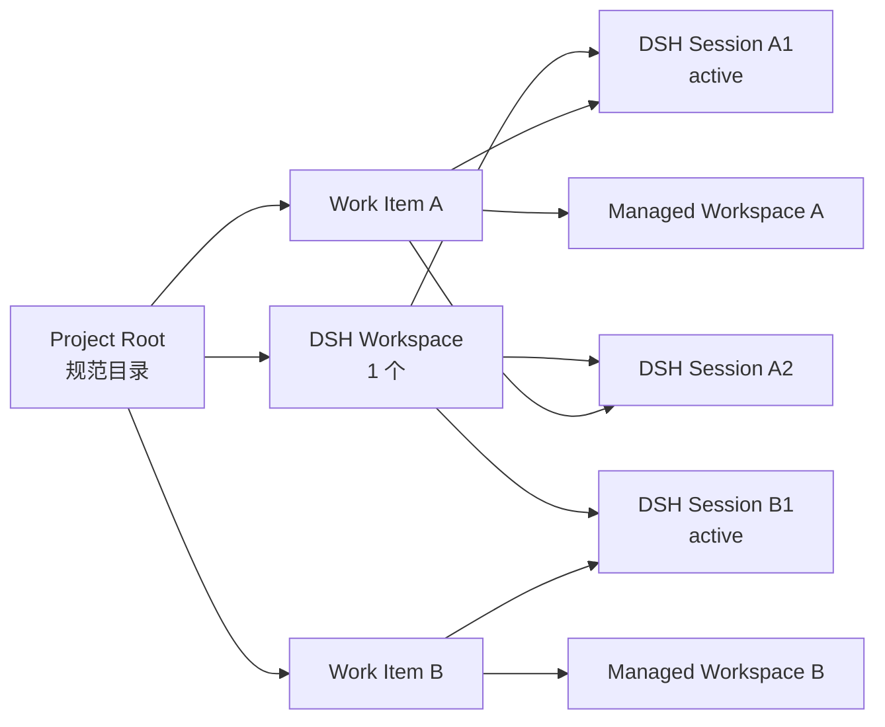

# AICO-PPT × DSH 工作项、工作区与会话管理设计

> 状态：Fresh Session 主链路已实施；Fork 与丢失会话修复入口留待下一阶段
> 日期：2026-09-03
> 范围：DSH 正式窗口壳中的新建 Deck、修改 Deck、工作项切换、DSH 工作区与多会话管理，以及跨会话常驻 Editor

## 0. 结论

本方案以 `workId` 作为 Editor 与 DSH 之间唯一稳定的任务锚点，并固定以下关系：

1. 一个规范 `projectRoot` 对应一个 DSH Workspace；多个 Deck 工作项可以复用它。
2. 一个 Work Item 对应一个可恢复的 Editor Managed Workspace，并可以关联多个 DSH Session。
3. 一个 Work Item 同时只有一个 Active Work Session；一个 DSH Session 最多关联一个 Work Item。
4. 会话关联只能由明确入口携带 `workId` 建立，不能根据当前目录、当前页面、会话标题或 `/aico-ppt` 文本推断。
5. DSH 左侧“新会话”是唯一入口：每个有可用任务的复杂插件只占一行带专属标签的一级入口，右侧子菜单列出其确切任务；AICO-PPT 只要 WorkCatalog 中存在 Deck 就保持该入口，当前关联项目或最近项目作为默认首项，普通会话保留在页脚。
6. Editor 切换工作项时自动打开对应的 Active Work Session；DSH 点击关联会话时自动切到对应的 Editor 工作项。
7. 点击普通 DSH 会话不改变 Editor 工作项，但会收起 AICO-PPT Workbench；重新点击关联会话时恢复相应任务。
8. AICO-PPT Workbench 在关联 DSH Session 之间必须复用同一挂载实例；重复选中事件不得再次打开或重建 Editor iframe。

创建工作项发布出 Deck 后直接转为编辑工作项，保留同一个 `workId`、DSH 会话关联和项目根，不再创建一条重复的编辑记录。

## 1. 当前实现与问题

### 1.1 已有能力

AICO-PPT 已经具备：

- `WorkCatalog`，为创建和编辑记录分配稳定 `workId`；
- Creation Draft 的显式 `projectRoot`；
- 已有 Deck 的 `projectRoot` 恢复与确认逻辑；
- Editor Managed Workspace、工作副本、时间线、固化和恢复；
- DSH iframe 消息桥，把 Editor 请求发送给当前原生会话。

DSH 已经具备：

- `workspaces.create({ path })`：按规范目录幂等创建或解析 Workspace；
- `sessions.create({ workspaceId, cwd, sessionId })`：在指定 Workspace 创建 Session，并支持预分配身份；
- `sessions.open(sessionId)`：切换当前 Session；
- `sessions.fork({ sessionId })`：从已有 Session 分叉；
- Workspace 对 Session 的持久归组。

因此缺失的不是底层创建能力，而是 Work Item、DSH Workspace、DSH Session 和 Editor 导航之间的协调层。

### 1.2 当前关联错误

当前 DSH Client Adapter 在 `workbench.view` 的当前 Session scope 中解析 `conversation.send()`。Editor 发出请求时，插件把它直接发送到“此刻左侧选中的会话”。这会造成：

- Deck 工作项没有持久 Session 身份；
- 用户临时切到普通会话后，Deck 请求可能进入错误会话；
- 同一 Deck 无法可靠维护多个会话和一个明确的活动会话；
- 无法从 Session 反向定位 Work Item；
- 创建或修改 Deck 时不能可靠确保 Session 运行在正确目录。

### 1.3 当前 Editor 重载的确定原因

当前通用 `workbench.view` 被声明为 `session-maybe` scope。DSH 的该 scope 有意规定：第一次从空白状态接入 Session 时保留挂载；之后只要 Session ID 改变，就重新挂载视图，避免普通会话局部状态泄漏。

AICO-PPT 的 `AicoPptWorkbench` 在这个视图内直接持有 iframe。因此 DSH Session 切换会依次发生：

```text
Session ID 改变
  → session-maybe incarnation 改变
  → AicoPptWorkbench 卸载
  → iframe 被销毁
  → AicoPptWorkbench 重新挂载
  → iframe 重新加载 Editor
```

这不是 Editor 主动刷新，而是 DSH workbench scope 与 AICO-PPT“跨会话工具”定位不匹配。

## 2. 统一领域模型

| 对象 | 稳定身份 | 权威归属 | 说明 |
|---|---|---|---|
| Work Item | `workId` | AICO-PPT `WorkCatalog` | 用户看到的一条创建或编辑工作记录 |
| Deck | `deckId` | AICO-PPT `WorkCatalog` | 逻辑文档身份，不等于文件路径 |
| Project Root | 规范绝对路径 | Work Item | Agent 执行与素材组织的项目目录 |
| DSH Workspace | `workspaceId` | DSH | 对规范项目目录的持久登记与 Session 归组 |
| DSH Session | `sessionId` | DSH | 原生对话和 Agent 上下文 |
| Managed Workspace | Editor capability / session identity | AICO-PPT Editor | 工作副本、编辑时间线与固化事务 |
| Feedback Task | `taskId` | Editor Session Store | 一条页面修改要求，不是 Work Item |

这里有三个不同的“工作空间”，必须始终分开：

- `projectRoot` 是文件系统目录；
- DSH Workspace 是对该目录的会话归组；
- Editor Managed Workspace 是围绕一份 Deck 工作副本的编辑事务。

`workId` 才是三者之间的业务连接点。不得把 `taskId` 用作 Deck 工作项身份，因为 `taskId` 已经属于 Feedback Task 和旧 Creation Draft 兼容字段。

## 3. 关系与不变量



必须由代码强制以下不变量：

1. `projectRoot` 在进入创建或修改工作流前已经规范化并可验证。
2. 当前 DSH Workspace 的规范路径必须等于 Work Item 的 `projectRoot`。
3. 同一路径的 Workspace 通过 DSH 幂等创建接口复用，不能按 Deck 重复创建。
4. 一个 `sessionId` 在整个 WorkCatalog 中最多出现一次。
5. `activeSessionId` 必须属于当前 Work Item 的可用 Session Link。
6. Session Link 只由带明确 `workId` 的动作创建。
7. Session 标题只用于展示，绝不能作为关联身份。
8. Feedback Task 提交时固定 `assignedSessionId`；后续页面或会话切换不迁移在途任务。
9. 创建工作项转为编辑工作项时保留 `workId` 和全部 Session Link。
10. Deck 文件改名、移动或重新绑定不改变 `workId`、`deckId` 或 Session Link。
11. 恢复工作项、切换项目或点击已关联会话只激活身份，不得自动向 Agent 发送任何 Prompt。

## 4. 项目目录与 DSH Workspace 策略

### 4.1 新建 Deck

新建 Deck 在创建 Work Item 前先使用系统目录选择器选择 `projectRoot`。流程为：

```text
选择项目目录
  → 规范化并验证 projectRoot
  → 创建 Creation Work Item
  → 按 projectRoot 幂等解析或创建 DSH Workspace
  → 创建该 Work Item 的首个 DSH Session
  → 建立 Session Link 并设为 active
  → 在该 Session 中开始需求对话
```

用户取消目录选择时不创建 Work Item、Workspace 或 Session。

### 4.2 修改已有 Deck

修改已有 Deck 先选源文件，再按下列优先级确定 `projectRoot`：

1. 已存在 Work Item：使用持久化的 `projectRoot`，正常恢复不再询问。
2. 从 Creation Work Item 发布进入编辑：继承创建阶段的 `projectRoot`。
3. 首次导入已有 Deck：Editor 提议可解释的项目根；如果来源不唯一或与 Deck 目录不一致，必须让用户确认或重新选择。

确定项目根之后再按规范路径解析或创建 DSH Workspace。选择 HTML 文件不等于选择项目根；源文件可以位于项目根的子目录中。

### 4.3 项目根变化

用户显式更换项目根时：

- 保留旧 Session Link 作为历史关联；
- 旧会话不得继续成为 Active Work Session；
- 清空活动指针；
- 为新项目根解析或创建新的 DSH Workspace；
- 创建新的关联 Session 后才能继续提交 Deck 请求。

不得把旧 Session 强行移动到 cwd 不一致的新 Workspace。

## 5. 如何判断“普通新会话”还是“Deck 新会话”

系统不判断，也不猜测；发起入口直接表达用户意图。

| 发起入口 | 结果 | 是否携带 `workId` |
|---|---|---|
| DSH 左侧“新会话”→“新建普通会话” | 普通 DSH Session | 否 |
| DSH 左侧“新会话”→`AICO-PPT`→选择默认 Deck | Fresh Work Session | 是 |
| DSH 左侧“新会话”→`AICO-PPT`→选择其他 Deck | 按需打开并导航后创建 Fresh Work Session | 是 |
| DSH Workspace 行上的“新会话” | 普通 DSH Session | 否 |
| Editor 会话菜单“从当前会话分叉” | Forked Work Session | 是 |
| 已关联 DSH 会话的上下文菜单“为此 Deck 新建会话” | Fresh Work Session | 从当前 `sessionId` 反查 |
| 普通会话中输入 `/aico-ppt` | 仍是普通会话 | 否 |

只有用户在统一入口中选择某个确切 Deck，或在普通会话中明确执行“创建 Deck 工作项”“打开 Deck 并建立工作项”或“关联当前会话”时，系统才可以建立 Link。仅输入技能名可能只是咨询、学习或一次性操作，不能自动关联。任务型插件向 DSH 注册一行专属标签，并发布默认目标优先的确切上下文数组以及各自的不透明过期校验 key；项目目录独立于插件 workbench 生命周期，只要仍有可用任务就保持入口。选择 Deck 时按需打开 workbench，跨任务时先导航到目标任务，目标页发布相同 key 后才创建。执行前 DSH 与插件两侧都再次校验该 key，避免菜单打开后任务变化造成错绑。其他复杂插件可以复用同一 `ctx.sessionStarts` 注册机制，无需再增加第二个“新会话”按钮。

### 5.1 Fresh 与 Fork

“为此 Deck 新建会话”默认创建 Fresh Session：

- 不复制整段聊天记录；
- 首条可见指令以 `/aico-ppt` 开头，明确加载同一份 Skill；
- 注入 Work Item 的结构化上下文；
- 包含 `workId`、`projectRoot`、`deckId` / `draftId`、Managed Workspace capability 和当前阶段；
- 复用同一份 AICO-PPT 质量契约初始化指令。

“从当前会话分叉”调用 DSH 原生 fork：

- 保留截至分叉点的对话上下文；
- 子 Session 关联同一 `workId`；
- 只有显式选择该动作时使用。

不会因为提交一批 Feedback Task 就创建新 Session。

## 6. Editor 交互设计

### 6.1 任务会话选择器

创建页和修改页在顶栏工作区导航右侧使用同一个紧凑会话选择器，不在 Creation 左侧里程碑栏重复放置另一套控件。修改页同时在导航与会话选择器之间显示当前 Deck HTML 文件名，完整 Deck 路径放在悬停说明中：

```text
当前 Deck：产品汇报.html    当前会话：产品汇报 · 修改 2  ▼
```

- 点击名称：列出这个 Work Item 关联的可用 Session；
- 菜单项“从当前会话分叉”：创建 Forked Session；
- 菜单项“在 DSH 中打开”：只切换左侧会话，不重启 Editor Runtime；
- 没有可用 Session 时显示“尚未创建任务会话”，并提示从 DSH 左侧“新会话”创建。

两种任务页的会话控件位置、尺寸、状态点和标题加载必须一致；它只负责展示和切换关联会话，不再创建会话。会话列表展示 DSH 持久标题；新建和旧标题补写尚未完成时先展示由 Work Item 生成的中文标题，不能把内部 `sessionId` 当成稳定用户文案。

会话创建完成且 Link 已持久化后，才把它设为 Active Work Session。创建失败时保留原活动会话。

### 6.2 当前 DSH 会话与 Editor 工作项不一致

用户从关联会话切到普通会话时：

- Work Item 和 Managed Workspace 保持不变；
- AICO-PPT Workbench 自动收起，不把隐藏画布冒充普通会话的操作目标；
- 重新选择任一关联会话时，Workbench 打开并恢复该会话对应的 Work Item；
- 普通会话不能从已收起的 Editor 提交“交给 Agent”。

切换前已经排队但尚未提交的 Feedback Task 继续保留，不得因普通会话成为当前会话而自动发送；用户重新进入关联会话后才能继续提交。

### 6.3 创建阶段转编辑阶段

Deck 发布后，页面外壳从 Creation 切到 Editing，但以下对象保持不变：

- `workId`；
- `projectRoot`；
- DSH Workspace；
- Session Links 与 `activeSessionId`；
- 当前 DSH 对话。

WorkCatalog 只把同一条记录从 `kind: creation` 提升为 `kind: editing`，赋予 `deckId` 和 File Binding，不新增重复卡片。

## 7. 双向切换规则

### 7.1 从 Editor 切换 Work Item

用户点击另一个 Work Item 时：

1. Editor 激活或恢复该 Work Item 的 Managed Workspace；
2. 校验其 Active Work Session；
3. 调用 `sessions.open(activeSessionId)`；
4. 保持 AICO-PPT Workbench iframe 挂载；
5. 在同一 iframe 内切换 Editor 任务页或 Runtime URL。

跨 Runtime 的内部恢复仍由启动器负责，但路由文档必须在服务端响应首屏前进入
`workspaceNavigationState=pending`：恢复期间只显示中性切换状态，不能先绘制“今天从哪里开始”的初始页；
目标 Creation 页面就绪后原位显示，目标 Editing Runtime 就绪后直接接管当前 iframe。

如果没有可用会话，Editor 仍可打开任务，但在提交 Agent 请求前要求创建任务会话。

### 7.2 从 DSH 点击关联 Session

DSH Client 观察当前 `sessionId`，通过反向索引解析 `workId`：

1. 找到 Link 时，把这个 Session 设为对应 Work Item 的 Active Work Session；
2. 通知 Editor 激活该 Work Item；
3. Editor 复用已经存在的 Managed Workspace，必要时才恢复 Runtime；
4. 不重建外层 AICO-PPT iframe。

同一 Work Item 的不同 Session 之间切换，只更新 Active Work Session，不重复打开 Deck 文件。

DSH 当前会话已经等于目标 Active Work Session 时，Editor 恢复和项目切换必须跳过重复的 `open-session`。启动阶段收到当前会话重放且 URL 已明确携带同一 `workId` 时，也只更新本页状态，不得再次导航自身。

### 7.3 从 DSH 点击普通 Session

没有反向 Link 时：

- 不改变 Editor 当前 Work Item；
- 不改变任何 Work Item 的 `activeSessionId`；
- 只在当前活动视图是 AICO-PPT 时收起 Workbench，不关闭其他插件视图；
- 不向任何关联 Session 或 Agent 追加消息。

用户显式点击 Editor 的“初始页”时，首批 DSH 当前会话通知属于启动快照，不得把页面立即拉回刚离开的任务；保持首页后，用户下一次真正选择另一个关联 Session 才恢复自动导航。

### 7.4 在途任务

每个 Execution Batch 在提交时记录 `assignedSessionId`。无论用户随后切到其他 Work Item、其他关联 Session 或普通 Session：

- 已提交批次继续由原 Session 结算；
- 新批次使用当时的 Active Work Session；
- 不允许静默迁移、重复提交或由另一 Session 认领。

## 8. WorkCatalog 数据模型

WorkCatalog 从 schema v2 升级到下一版本，并让创建、编辑两类 Work Item 共用 DSH Binding：

```ts
type DshSessionLink = {
  operationId: string
  sessionId: string
  workspaceId: string
  origin: 'fresh' | 'fork' | 'adopted'
  state: 'available' | 'historical' | 'missing' | 'archived'
  createdAt: string
}

type DshBinding = {
  revision: number
  workspaceId: string | null
  activeSessionId: string | null
  sessions: DshSessionLink[]
  pendingOperation: {
    operationId: string
    workspaceId: string
    sessionId: string
    origin: 'fresh' | 'fork' | 'adopted'
    sourceSessionId: string | null
    startedAt: string
  } | null
}

type WorkItem = {
  workId: string
  projectRoot: string
  dshBinding: DshBinding
  // 现有 creation / editing 字段
}
```

WorkCatalog 提供由 `sessionId` 到 `workId` 的唯一反向查询；索引可以从持久 Work Item 投影生成，但写入时必须检查跨工作项重复。

旧 schema 迁移时 `dshBinding` 初始化为空，不根据旧 provider、项目目录或最近会话补猜关联。用户第一次恢复旧工作项时通过明确动作创建新任务会话。

## 9. 协调模块与 DSH Bridge

新增深模块 `DeckTaskCoordinator`。Editor 页面、创建流程、修改流程和 DSH 选择事件都只调用它的窄 Interface：

```ts
interface DeckTaskCoordinator {
  activate(input: { workItem: WorkItem; sessionId?: string }): Promise<WorkContext>
  createSession(input: {
    workItem: WorkItem
    mode: 'fresh' | 'fork'
    sourceSessionId?: string
  }): Promise<WorkContext>
  send(sessionId: string, prompt: string): Promise<void>
  resolveBySession(sessionId: string): Promise<{ workItem: WorkItem | null }>
}
```

该模块隐藏：

- Workspace 按路径解析和创建；
- Session ID 预分配、创建、fork、open 与 send；
- WorkCatalog revision 与反向唯一性；
- 创建工作项向编辑工作项的提升；
- 跨 Editor Server 与 DSH Client 的消息往返；
- 部分失败恢复和幂等重试。

DSH 原生能力只能在浏览器 Client Context 中调用，因此使用一个窄的 `DshWorkBridge` Adapter。AICO-PPT iframe 发送带 `requestId` 的结构化命令，DSH Client 执行后返回结构化结果：

```text
ensure-workspace(path)
create-session(workspaceId, preallocatedSessionId, title)
fork-session(sourceSessionId)
open-session(sessionId, optionalTitleForLegacyBackfill)
send-to-session(sessionId, prompt)
current-session()
```

Bridge 只是运输 Adapter，不拥有 Work Item 状态。WorkCatalog 和操作日志仍由 Editor Server 持久化。

## 10. 跨会话常驻 Workbench

不能通过给 iframe 缓存 URL 或保存滚动位置掩盖重载；必须修正 scope。

DSH `ui-workbench` 增加根 scope 的持久视图槽位，例如：

```text
workbench.persistent-view   scope: root
workbench.view              scope: session-maybe
```

- 会话专属详情面板继续使用现有 `workbench.view`；
- AICO-PPT 注册到 `workbench.persistent-view`；
- `WorkbenchRoot` 按活动 target 渲染对应槽位；
- AICO-PPT iframe 的 React key 只跟 workbench target / plugin incarnation 有关，不跟 `sessionId` 有关；
- 插件从根级 `sessions.list` 观察当前 Session，向已存在 iframe 发送 `current-session-changed`；
- 发送消息时按显式目标 `sessionId` 动态解析 `conversation`，不再把 `sendTask` 永久绑定到挂载时的当前会话。

关联 Session 之间切换不得卸载 iframe；选择普通 Session 等价于明确收起 AICO-PPT Workbench，可以卸载 iframe，但不能删除 Work Item 或 Managed Workspace。

## 11. 可靠性与恢复

Workspace 和 Session 属于 DSH，Work Item 属于 Editor，无法依赖单个数据库事务。`DeckTaskCoordinator` 使用可恢复操作日志：

```text
首次幂等 ensure Workspace 并持久化 workspaceId；已有绑定直接复用
  → 记录 pending operation 与预分配 sessionId
  → 幂等 create Session，并在尚无持久标题时写入中文任务标题
  → 持久化 Session Link
  → 清除 pending
  → 立即选中 Session，并在后台连接 history window、补写标题
  → 发送初始化上下文
```

关键规则：

1. Session ID 在调用 DSH 前预分配，超时重试继续使用同一 ID。
2. Workspace 已创建、Session 创建失败：保留 Workspace，重试 Session。
3. Session 已创建、Link 写入失败：pending operation 在恢复时补写 Link，不再创建第二个 Session。
4. Link 已写入、open 失败：保留 Link 和原 `activeSessionId`，允许重新打开。
5. DSH Workspace 登记被删除但目录仍存在：按 `projectRoot` 重新 ensure，并更新当前 Workspace ID。
6. Session 不存在：标记 Link 为 `missing`；若它是 active，则清空活动指针并要求新建或选择其他会话。
7. Editor Runtime 不可用：Work Item 与 Session Link 仍可恢复，不能删除 DSH Session。
8. 所有写入携带 `expectedBindingRevision`，冲突时刷新快照后由用户动作重试。
9. Work Item 已持久化 `workspaceId` 时，“为此 Deck 新建会话”不得再次调用 `ensure-workspace`；它直接使用已绑定 Workspace，避免把重复远端 RPC 变成新建 Session 的前置故障点。
10. 任务 Session 的标题格式为“创建 Deck：任务名”或“修改 Deck：任务名”，同一 Work Item 的后续会话追加“会话 2/3”序号，并按 UTF-8 截断任务名以保持完整序号且不超过 DSH 的 80 字节上限；pending 重试和旧 Link 激活只能补齐空标题，不得覆盖用户或 DSH 已经存在的持久标题。
11. `open-session` 先完成 DSH 当前 Session 选中并立即返回；history window 的长连接和空标题补写均在后台进行，任一操作等待或失败都不能阻塞 Editor 导航。
12. 新 Session 的中文标题在 DSH 持久写完成前使用乐观展示值；空标题或精确等于自身 `sessionId` 的系统占位标题允许后台补写，其他非空标题一律视为用户或 DSH 的权威值。任务会话选择器不等待补写，也不依赖 Session 仍在 DSH 普通可见列表中；缺少列表行时立即用 Work Item 生成同一格式的中文展示标题。补写失败只记录诊断，不回滚已经完成的 Session Link。
13. iframe 在 Bridge 运输监听器安装后发送一次 `aico-ppt:dsh-ready`，首个业务订阅安装且尚未收到当前 Session 时再发送一次；父 workbench 必须强制重放当前 Session。同时用低频本地 snapshot 比对兜底漏发通知，只在摘要变化时发送。
14. 显式返回首页、当前目标已经选中和任务 URL 已携带同一 `workId` 都是导航幂等边界，不能因为启动重放触发自导航或重复 open。
15. Deck 页内标题、目录或 layer 的结构重绘不得重放整页定位；Frame Bridge 必须显式标记 canvas 引用是否真的变化，Editor 只在节点替换时恢复页面锚点，避免把用户滚动位置吸回页首。
16. DSH 启动页与修改 Editor 使用不同的随机本地端口。启动页必须在跨端口跳转前，以自身已知 Origin 向父 workbench 注册目标 Editor 的精确 Origin；父级随后只接受同一 iframe、启动页 Origin 或已注册本地 Origin 的消息，不能用“任意 localhost”替代注册协议。
17. 只有明确创建 Fresh Work Session 的用户动作才可以发送一次初始上下文；Session 激活、页面恢复、双向导航和 ready 重放均为无消息副作用操作。
    Fresh Session 的初始上下文必须以 `/aico-ppt` 开头；Creation 首次创建与显式新建附加会话使用同一规则。
18. DSH Workspace 的 `archivedSessionIds` 是归档权威源。归档 Link 必须持久化为 `archived`、立即退出任务会话选择器和反向导航；若它是 active，则清空活动指针。`describe-sessions` 暂时缺少列表行只表示尚未恢复，不能据此归档或删除 Link。

跨 iframe 消息必须校验 `event.source`、Origin、Editor capability、命令白名单和 `requestId`，不得接受任意路径或任意会话操作。

## 12. 分阶段实施

### 阶段 A：先修复跨会话重载（已完成）

- DSH 增加 root-scope persistent workbench slot；
- AICO-PPT 改用 persistent slot；
- Session 变化只更新轻量 current-session 状态；
- 增加 iframe mount-count 回归测试。

这一阶段不改变 WorkCatalog 和 Agent 路由，先消除最明显的体验与状态丢失风险。

### 阶段 B：持久关联与协调模块（已完成）

- WorkCatalog schema 增加 DSH Binding 与反向唯一性；
- 实现 `DeckTaskCoordinator` 和可恢复操作日志；
- 扩展 DSH Client 注入 `workspaces`，实现结构化 `DshWorkBridge`；
- 把 Agent 请求从“当前会话”改为“Work Item 的 assigned Session”。

### 阶段 C：创建与修改入口（已完成）

- 新建 Deck：选项目根、ensure Workspace、创建首个任务 Session；
- 修改 Deck：解析或确认项目根、ensure Workspace、创建首个任务 Session；
- Creation → Editing 保留同一个 `workId` 和会话关联；
- 旧工作项首次恢复提供显式创建任务会话入口。

### 阶段 D：多会话与双向导航（主链路已完成）

- Editor 任务会话选择器和 Fresh 已完成；显式 Fork 菜单留待下一阶段，因为 DSH 原生 fork 当前不接受预分配子 Session ID，必须先补可恢复身份协议；
- 创建页和修改页已统一在顶栏展示同形态的多会话选择器；
- Editor Work Item → DSH Active Session 自动切换；
- DSH linked Session → Editor Work Item 自动切换；
- 普通 Session 收起 AICO-PPT，但不改变 Work Item；
- 根变化的持久模型已完成；Session 丢失与 Workspace 重建的显式修复交互留待下一阶段。

## 13. 验收标准

### 常驻与切换

1. AICO-PPT 打开后连续切换十个已关联 DSH Session，iframe mount count 仍为 1。
2. 切换普通 Session 时 AICO-PPT Workbench 自动收起，Work Item 与 Managed Workspace revision 不变；重新选择关联 Session 后恢复对应任务。
3. 点击关联 Session 时只切换对应 Work Item，不重启已有 Runtime。
4. 关闭并重新打开 AICO-PPT Workbench 时允许重新挂载，并恢复上次 Work Item。

### 新建与修改

5. 取消项目目录选择不留下 Work Item、Workspace 或 Session。
6. 同一项目根下创建两份 Deck，只产生一个 DSH Workspace、两个 Work Item 和至少两个独立关联 Session。
7. 修改已有 Deck 首次确认项目根后，后续恢复不重复询问。
8. Creation 发布为 Editing 后 `workId`、Workspace 与 Active Session 不变，启动页不出现重复记录。

### 会话意图

9. DSH 左侧入口的“新建普通会话”永远没有 Work Session Link；没有任何插件发布可用任务时点击入口直接走该路径。
10. 只要存在可用 Deck，DSH 左侧入口始终显示一行 `AICO-PPT` 标签；无论 Editor 是否打开或当前会话是否关联，用户从其子菜单选择 Deck 后创建的 Session 都必须关联所显示的确切 `workId` 并成为 active。选择其他 Deck 时先打开并导航，目标页发布同一 key 后才创建，key 过期时必须拒绝而不是错绑。
11. Fork 的子 Session 继承同一 `workId`，Fresh Session 不复制聊天历史。
12. 普通会话输入 `/aico-ppt` 不自动建立 Link。

### 可靠性

13. Session 创建成功但 Link 写入中断，恢复后只出现一个 Session。
14. Work Item 切换期间的在途批次仍由原 `assignedSessionId` 结算。
15. 当前普通会话与 Work Item 不一致时，“交给 Agent”不会误发到普通会话。
16. 一个 `sessionId` 尝试关联第二个 Work Item 时明确拒绝。
17. 从修改任务切回创建任务，再通过项目切换往返，两条路径都在有界时间内完成且复用已有 Runtime。
18. 显式返回首页后旧当前会话的 ready 重放不触发回跳；随后点击另一条关联 Session 仍能正常进入对应任务。
19. DSH history window 或标题持久化长期等待时，Session 选择和 Editor 工作项导航仍立即完成。
20. 首次 ready 响应早于业务订阅时，订阅后的第二次握手仍把当前 Session 交付给页面，并把会话状态显示为活动。
21. Deck 页内目录/标题重绘不会改变 `.stage.scrollTop`；真正替换 canvas 后仍恢复同一页并可继续操作。
22. 从启动页进入随机端口的修改 Editor 后，DSH 会话通知和 Editor Bridge 请求仍双向可达；未注册端口、远端 Origin 或错误 `event.source` 均被拒绝。
23. 创建任务首次建立 Session 后，连续通过左侧会话和“切换项目”往返不改变该 Session 的 `send-to-session` 计数，也不在对话队列中产生“继续”命令。
24. 归档当前或非当前关联 Session 后，创建页与修改页选择器均立即移除它；刷新 Editor 后不会复活，点击/恢复归档 Session 也不会再触发 Deck 工作项导航。
25. 已经打开 AICO-PPT 时，重复的同会话选择事件不再次调用 `open`；普通会话只关闭 AICO-PPT，不关闭其他插件的活动视图。
26. 统一“新会话”菜单对每个复杂插件只显示一行专属标签，项目只出现在该行右侧子菜单；关闭 Editor 或切到普通会话后，只要 WorkCatalog 仍有可用 Deck，`AICO-PPT` 行就保持可见。

## 14. 本次不做

- 不让 DSH Workspace 等同于一份 Deck；
- 不按 Feedback Task 或 Execution Batch 创建 Session；
- 不从 cwd、标题、当前 Editor 页面或提示词自动猜测 Link；
- 不在 AICO-PPT 插件中实现第二套对话 UI；
- 不在没有任何插件项目时让普通 DSH“新会话”额外弹窗；
- 不在第一阶段自动合并或删除历史会话。
