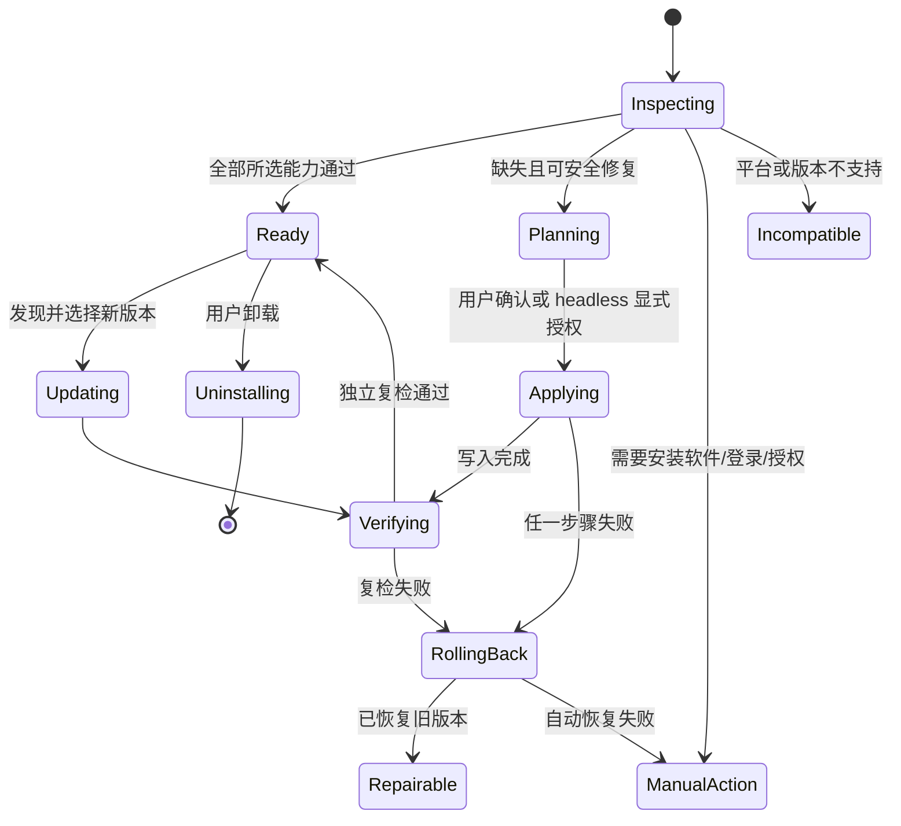
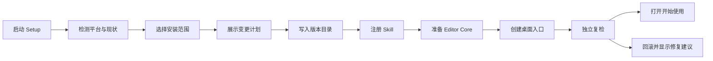

# Huawei Deck 安装、分发与首次使用体验设计

> 状态：设计提案
>
> 日期：2026-08-16
>
> 范围：Skill 注册、Editor 安装与首启、依赖诊断、升级/修复/卸载、用户文档、内置帮助页、使用录屏与发布验收
>
> 不包含：本轮不直接实现安装器，不改变 deck bundle 格式，不重做 Editor 的编辑交互

## 0. 结论

Huawei Deck 不应继续把“克隆仓库 + Bash 软链接 + 首次启动时 npm install”当作面向普通用户的完整安装体验。

目标形态是一个产品、两种交付渠道、三层独立就绪状态：

1. **开发/团队渠道**：从仓库或版本压缩包安装，跨平台安装脚本负责注册 Skill、准备 Editor、创建入口并保存安装状态；适合当前阶段快速落地。
2. **Codex Plugin 渠道**：Plugin 负责 Skill 的发现与更新；Editor 仍作为本机 companion 安装，不能假设 Plugin 能替用户静默安装 Python、Node、原生模块或桌面快捷方式。
3. **三层就绪状态**：
   - `Skill`：Agent 能发现并读取 `SKILL.md`；
   - `Editor Core`：Editor 能启动、选择 Agent、创建或打开工作区；
   - `Feature Packs`：验证、PPTX 导出、外部材料解析等按需启用。

用户最终只需要理解两个主动作：

- “安装 Huawei Deck”：进入可用状态；
- “诊断并修复”：在安装不完整或升级后恢复状态。

Python、Node、Chrome、Playwright、LibreOffice、PyMuPDF 等细节只出现在展开的诊断信息和故障文档中，不作为首页上的认知负担。

Editor 内增加离线可用的“开始使用”与“帮助中心”。首次进入时采用任务清单，不使用强制轮播式新手引导。录屏内容以 3—5 分钟的真实任务为单位，页面同时提供文字步骤、字幕和示例项目；视频不可用时，帮助页仍必须完整可用。

## 1. 设计依据

### 1.1 产品现状

当前仓库已经具备以下能力：

- `SKILL.md` 是 Agent 的主入口，`references/` 承担 Agent 使用过程中的详细知识；
- `scripts/install-skill-links.sh` 可在 macOS/Linux 上把仓库链接到多个 Skill 目录；
- macOS `.app` 和 Windows `.cmd` 可以从仓库根目录启动 Editor；
- `scripts/deck-editor.py` 会检查 Editor 核心依赖，并在可能时执行 `npm install`；
- `scripts/check_deps.py` 可检查或安装整套依赖；
- `references/editing-guide.md` 已覆盖 Editor 的主要操作；
- `docs/showcase/` 有 deck 放映效果素材。

但这些能力目前没有构成一条完整的安装与首次使用路径：

- README 的定位仍偏向单一 Agent，安装命令仅适用于 Bash；
- Windows 有 Editor 启动入口，却没有对等的 Skill 安装入口；
- `check_deps.py` 把 Editor 核心依赖、PPTX 导出和材料解析放在同一张硬性检查表中；
- 首启修复只覆盖 npm 依赖，安装状态没有持久化，也没有版本、升级、回滚和卸载模型；
- Editor 首页没有“帮助”“诊断”“打开示例项目”等入口；
- `references/editing-guide.md` 更适合 Agent 和维护者，不适合首次接触产品的用户；
- 现有 GIF 展示 deck 效果，但不能替代 Editor 安装和使用教程；
- macOS `.app` 当前未签名，不能作为正式外部分发物。

### 1.2 外部约束

OpenAI 当前文档明确区分本地 Skill 与 Plugin 分发：

- 本地 Skill 可以放在仓库的 `.agents/skills` 或用户的 `~/.agents/skills`，并支持符号链接；
- 当 Skill 需要分发给其他用户时，Plugin 是更正式的打包形式；
- Plugin 需要 `.codex-plugin/plugin.json`，可以包含 `skills/`、资源和生命周期 hook。

参考：

- [OpenAI 官方 Skill 文档](https://learn.chatgpt.com/docs/build-skills)
- [OpenAI Plugin 打包文档](https://developers.openai.com/plugins/build/plugins)

因此，`~/.agents/skills/huawei-deck` 应成为 Codex 的标准用户级注册位置；`~/.codex/skills` 与 `~/.claude/skills` 只作为兼容 Adapter，不再被描述为同等标准路径。

## 2. 目标与非目标

### 2.1 目标

1. macOS 与 Windows 都有清晰、对等、可验证的安装路径。
2. 用户能分别知道 Skill、Editor Core 和 Feature Packs 的状态。
3. 安装、再次运行、修复、升级和卸载都是幂等且可回滚的。
4. 安装器不覆盖来源不明的现有 Skill 目录或用户项目。
5. Editor 首启时能在 3 分钟内完成环境检查并打开示例项目。
6. 帮助内容在 Editor 内离线可读，并与网站/README 共用来源。
7. 录屏有固定脚本、示例数据、字幕、版本和更新责任人，而不是临时录制。
8. 无 Editor 环境仍可按照 `SKILL.md` 使用 Huawei Deck 的基础工作流。

### 2.2 非目标

- 不在安装过程中修改任何用户 deck 的 bundle 结构；
- 不自动升级用户已有 deck；deck runtime 升级继续由 `upgrade_deck.py` 显式执行；
- 不在用户未知的情况下安装或登录 Codex、Claude Code、OpenCode；
- 不把所有外部材料处理能力设为 Editor 启动前提；
- 不承诺首个版本就提供完全自包含、零依赖的桌面安装包；
- 不让帮助页面复制一套与 `references/` 相互漂移的业务规则。

## 3. 用户与安装场景

| 用户 | 获取方式 | 核心诉求 | 推荐渠道 |
|---|---|---|---|
| Skill 维护者 | Git 仓库 | 修改即时生效、能运行验证工具 | Developer Link |
| 团队普通用户 | 内部发布页/压缩包 | 少敲命令、稳定升级、可卸载 | Versioned Release |
| Codex 用户 | Plugin 目录 | 一键发现 Skill、统一更新 | Plugin + Editor Companion |
| 只想查看或临时使用的人 | 解压目录 | 不写用户级 Skill 目录 | Portable |
| 自动化环境 | Git/制品 | 无 UI、确定性退出码 | Headless Installer |

不再以“所有人都从 Git 仓库开发目录运行”为默认假设。

## 4. 统一领域模型

### 4.1 Product Installation

一次 Huawei Deck 安装由以下对象组成：

```text
ProductInstallation
├── Distribution
│   ├── channel: developer | release | plugin | portable
│   ├── productVersion
│   ├── installRoot
│   └── integrity
├── SkillRegistration[]
│   ├── host: codex | claude-code | compatible
│   ├── targetPath
│   ├── method: symlink | junction | copy | plugin
│   └── state
├── EditorRuntime
│   ├── launcher
│   ├── runtimeProvider: system | bundled
│   └── state
├── Capability[]
│   ├── id
│   ├── profile
│   ├── state
│   └── remediation
└── InstallRecord
    ├── installId
    ├── installedAt
    ├── previousVersion
    └── ownedPaths[]
```

### 4.2 三层就绪状态

#### Skill

最小条件：

- 注册目录存在；
- 目标能解析到有效 `SKILL.md`；
- Skill 名称为 `huawei-deck`；
- 目标不是断链；
- 如果由安装器管理，注册目标和 `InstallRecord` 一致。

#### Editor Core

最小条件：

- Python 3 可执行当前 launcher；
- Node.js 版本满足要求；
- Editor 所需 npm 模块就绪，原生模块与当前平台/架构匹配；
- 至少有一个可用 Agent CLI；
- Editor 能绑定本机端口并打开启动页。

浏览器截图能力不是“首页能打开”的前提，但会影响验证和导出能力。

#### Feature Packs

建议按实际任务拆分：

| Profile | 用途 | 主要依赖 | 是否阻塞 Editor |
|---|---|---|---|
| `verify` | 截图、溢出、逐拍验证 | Chrome/Chromium、playwright-core | 否 |
| `pptx-export` | HTML 转 PPTX | `verify`、python-pptx | 否 |
| `material-pptx` | PPTX 转图/抽取 | LibreOffice、PyMuPDF | 否 |
| `material-pdf` | PDF 读取与进阶处理 | PDF Skill、pypdf、pdfplumber 等 | 否 |
| `full` | 全能力工作站 | 上述全部 | 否 |

用户选择某项任务时再提示启用对应 Feature Pack。

### 4.3 状态枚举

每个对象使用同一套有限状态，避免脚本、Editor 和文档各自发明文案：

| 状态 | 含义 | UI 主动作 |
|---|---|---|
| `absent` | 未安装或未注册 | 安装 |
| `checking` | 正在检测 | 等待 |
| `ready` | 可直接使用 | 打开/继续 |
| `partial` | 一部分能力可用 | 查看详情 |
| `repairable` | 可由工具安全修复 | 修复 |
| `manual-action-required` | 需要用户安装软件、登录或授权 | 查看步骤 |
| `restart-required` | 注册完成，但 Agent 需要重启发现 | 重启后验证 |
| `incompatible` | 版本或架构不支持 | 查看要求 |
| `corrupt` | 完整性或记录不一致 | 恢复/重装 |
| `update-available` | 当前可用但有新版本 | 更新 |

状态必须来自检测事实，不能只因为某次安装命令返回成功就写成 `ready`。

### 4.4 安装状态机



## 5. 安装渠道设计

### 5.1 Developer Link

适用于维护者和从 Git 仓库工作的团队成员。

macOS/Linux：

```bash
python3 scripts/install.py --channel developer --hosts codex
```

Windows PowerShell：

```powershell
py -3 scripts\install.py --channel developer --hosts codex
```

行为：

- 以当前仓库为 `installRoot`；
- Codex 优先注册到 `~/.agents/skills/huawei-deck`；
- POSIX 使用 symlink，Windows 优先使用不要求复制的目录链接方式；
- 可通过 `--hosts codex,claude-code` 显式增加兼容注册；
- 不复制 `node_modules`，Editor Core 按当前平台准备；
- 再次执行只校验和修复，不产生层层嵌套备份；
- 仓库改动即时生效。

现有 `install-skill-links.sh` 在过渡期保留为薄 Adapter，内部转调统一安装 Interface，并打印弃用提示。

### 5.2 Versioned Release

适用于团队普通用户，是第一个应正式支持的用户渠道。

发布物按平台生成：

```text
huawei-deck-<version>-macos-arm64.zip
huawei-deck-<version>-macos-x64.zip
huawei-deck-<version>-windows-x64.zip
SHA256SUMS
release-manifest.json
```

版本目录建议：

| 平台 | 默认安装根目录 |
|---|---|
| macOS | `~/Library/Application Support/Huawei Deck/versions/<version>/` |
| Windows | `%LOCALAPPDATA%\Huawei Deck\versions\<version>\` |

另有一个受安装器管理的 `current` 指针。升级先写入新版本目录、校验完整性，再原子切换 `current`；旧版本至少保留一个，用于失败回滚。

桌面入口解析 `current/release-manifest.json` 后再启动 Editor，不能依赖“launcher 永远和仓库根目录相邻”这一隐含条件。

### 5.3 Plugin + Editor Companion

Plugin 适合解决“Skill 如何被 Codex 发现和更新”，但与“本机 Editor 如何安装”分开：

```text
huawei-deck plugin
├── .codex-plugin/plugin.json
├── skills/huawei-deck/
│   ├── SKILL.md
│   ├── references/
│   └── skill-required assets/scripts
└── optional plugin metadata

Huawei Deck Editor Companion
├── launcher
├── editor runtime
├── verify/export tools
└── local help catalog
```

Plugin 中的 Skill 在需要 Editor 时调用一个稳定的 companion locator；locator 返回“已安装路径”或结构化的“未安装”结果，并提供安装说明。Skill 不直接猜测 `%LOCALAPPDATA%`、`~/Library` 或仓库路径。

在没有验证 Plugin 生命周期能力之前，不把以下行为纳入 Plugin 承诺：

- 安装系统 Python/Node/Chrome；
- 编译 `node-pty`；
- 写入桌面快捷方式；
- 绕过系统签名、Gatekeeper 或 SmartScreen。

### 5.4 Portable

Portable 模式允许用户解压后直接运行 launcher，不注册用户级 Skill，也不创建桌面入口。

它适合试用和受限设备，但 UI 必须明确显示：

> Editor 可以使用，但 Agent 不会自动发现 Huawei Deck Skill。可在“安装与诊断”中完成注册。

## 6. Release Manifest 与安装记录

### 6.1 `release-manifest.json`

每个发布物根目录必须包含：

```json
{
  "schemaVersion": 1,
  "product": "huawei-deck",
  "productVersion": "0.1.0",
  "channel": "release",
  "platform": "macos-arm64",
  "minimums": {
    "python": "3.10",
    "node": "18"
  },
  "skill": {
    "entry": "SKILL.md",
    "name": "huawei-deck"
  },
  "editor": {
    "launcher": "scripts/deck-editor.py",
    "helpCatalogVersion": "0.1.0"
  },
  "files": [
    {"path": "SKILL.md", "sha256": "..."}
  ]
}
```

Manifest 是安装器、launcher、帮助中心和发布检查共同读取的版本真相。页数、依赖最低版本等高风险重复信息应由构建步骤生成或校验，不再手工散落。

### 6.2 `install-state.json`

安装状态放在平台应用数据目录，不放进用户项目：

| 平台 | 位置 |
|---|---|
| macOS | `~/Library/Application Support/Huawei Deck/install-state.json` |
| Windows | `%LOCALAPPDATA%\Huawei Deck\install-state.json` |

记录示例：

```json
{
  "schemaVersion": 1,
  "installId": "uuid",
  "channel": "release",
  "currentVersion": "0.1.0",
  "installRoot": ".../versions/0.1.0",
  "previousVersion": null,
  "registrations": [
    {
      "host": "codex",
      "targetPath": "~/.agents/skills/huawei-deck",
      "method": "symlink"
    }
  ],
  "ownedPaths": [],
  "installedAt": "2026-08-16T00:00:00Z"
}
```

只持久化所有权和版本事实。Node、Chrome、CLI 是否可用必须实时检测，不能把上次诊断结果当作当前事实。

## 7. Deep Module 与 Interface

### 7.1 `InstallationManager`

`InstallationManager` 是安装、升级、修复和卸载的 Deep Module。它把路径规则、所有权验证、备份、原子切换、回滚、状态记录和跨平台差异隐藏在小 Interface 后面。

```python
inspect(request: InspectRequest) -> InstallationSnapshot
plan(request: InstallRequest) -> InstallationPlan
apply(plan: InstallationPlan) -> InstallationResult
uninstall(request: UninstallRequest) -> UninstallResult
```

Interface 约束：

- `inspect` 只读；
- `plan` 不写文件，必须列出所有将创建、替换、备份和保留的路径；
- `apply` 只接受由同一版本生成且未过期的 plan；
- `apply` 成功后必须再次独立 `inspect`；
- `uninstall` 只删除 `InstallRecord.ownedPaths` 中且当前身份仍匹配的目标；
- 任何失败都返回稳定错误码、用户可读信息、技术详情和可重试性；
- `--json` 输出是自动化 Interface，不解析人类日志。

删除测试：如果移除 `InstallationManager`，调用者就必须重新实现路径解析、链接身份验证、备份、回滚、清单校验和状态迁移；因此该 Module 具有足够 Depth。

### 7.2 `EnvironmentManager`

`EnvironmentManager` 统一替代“Editor launcher 有一套检查、`check_deps.py` 又有一套检查”的重复逻辑。

```python
snapshot(profiles: list[str]) -> EnvironmentSnapshot
repair(capability_ids: list[str], consent: RepairConsent) -> RepairResult
```

它隐藏：

- Python/Node/Agent CLI/浏览器查找顺序；
- Node 版本与原生模块 ABI 判断；
- npm/pip 安装命令与超时；
- `PLAYWRIGHT_CORE` 等环境变量适配；
- 各能力所属 Profile；
- 安全可自动修复与必须人工操作的区分。

现有 `check_deps.py` 变成该 Interface 的 CLI Adapter：

```bash
python3 scripts/check_deps.py --profile editor-core --check-only
python3 scripts/check_deps.py --profile verify --repair
python3 scripts/check_deps.py --profile full --repair
```

兼容期内，无 `--profile` 时保留当前 `full` 行为并打印说明；后续主文档不再推荐无 profile 调用。

### 7.3 Adapter

只有存在真实平台差异时才引入 Adapter：

| Seam | Adapter |
|---|---|
| Skill 注册 | `PosixSymlinkAdapter`、`WindowsJunctionAdapter`、`CopyRegistrationAdapter`、`PluginRegistrationAdapter` |
| 桌面入口 | `MacAppAdapter`、`WindowsShortcutAdapter` |
| 运行时准备 | `SystemRuntimeAdapter`、后续 `BundledRuntimeAdapter` |
| 安装状态 | `MacAppDataStore`、`WindowsLocalAppDataStore` |

不得为单一实现预先创建空壳 Adapter。所有 Adapter 接受已解析路径并返回结构化结果，不能自行读取全局配置或打印决定性结果。

### 7.4 帮助内容不设运行时 Seam

帮助内容在构建时从 Markdown 生成只读 catalog。Editor 只读取 catalog，不同时维护 HTML、JSON 和 Markdown 三套正文。

如果未来真的出现桌面 Editor、网站和 Plugin 三个独立消费者，再抽取 `HelpCatalog` Interface；当前阶段先保持 Locality。

## 8. 安装、修复、升级和卸载流程

### 8.1 首次安装



默认选择：Codex Skill + Editor Core。Feature Packs 不默认全装，用户可以在安装页按任务勾选。

安装过程中每一项都有三种授权级别：

- `read-only`：自动执行；
- `safe-repair`：UI 明示后一次授权，可创建目录、安装项目依赖、创建受控链接；
- `external/manual`：打开官方下载说明，由用户完成系统软件安装或 CLI 登录。

### 8.2 再次运行与修复

安装器可安全反复执行：

- 全部就绪：显示版本与“打开 Editor”；
- Skill 断链：重建链接；
- npm 模块缺失：只修复 Editor Core；
- 外部工具缺失：按 Feature Pack 提示，不把整个产品标红；
- 注册目标被普通目录占用：停止并显示来源，不直接覆盖；
- 安装记录缺失但目标可识别：提供“接管此安装”，并要求明确确认；
- 记录指向不存在版本：尝试切换到最近一个完整版本，否则进入重装。

### 8.3 升级

升级流程：

1. 下载或解压到新的版本目录；
2. 校验 release manifest 和所有文件哈希；
3. 运行安装状态迁移的 dry run；
4. 准备当前平台的 Editor Core；
5. 独立启动健康检查；
6. 原子切换 `current`；
7. 修复仍指向旧目录的受控注册；
8. 保留上一版本用于回滚。

升级不触碰用户项目，不自动升级 deck，也不删除 `.huawei-deck-editor` 会话。

Developer Link 渠道不自动执行 `git pull`。只提示仓库版本变化，把源代码更新留给用户或 Git 工作流。

### 8.4 卸载

卸载默认删除：

- 安装器拥有的 Skill 链接或 junction；
- 桌面/开始菜单入口；
- 版本化 Editor 运行目录；
- 安装记录。

默认保留：

- 用户创建或导入的 deck；
- 工作区与 `.huawei-deck-editor` 会话；
- 用户手工安装的 Python、Node、Chrome、Agent CLI；
- 不属于本安装的 Skill 目录。

“同时清理缓存与会话”必须是单独选项，并在执行前列出精确路径。

## 9. 错误模型

安装器、Editor 设置页和命令行共用稳定错误码：

| 错误码 | 含义 |
|---|---|
| `INSTALL_TARGET_OCCUPIED` | 注册目标被非受控文件或目录占用 |
| `INSTALL_TARGET_UNTRUSTED_LINK` | 链接存在，但指向无法确认的目标 |
| `RUNTIME_MISSING` | 缺少 Python、Node 或所选 Agent |
| `RUNTIME_VERSION_UNSUPPORTED` | 运行时版本不满足最低要求 |
| `NATIVE_MODULE_INCOMPATIBLE` | 原生 Node 模块与平台/架构/ABI 不匹配 |
| `DEPENDENCY_INSTALL_FAILED` | npm/pip 安装失败 |
| `SKILL_RESTART_REQUIRED` | Skill 已注册，需要重启 Agent 发现 |
| `RELEASE_INTEGRITY_FAILED` | 发布物哈希或 manifest 校验失败 |
| `INSTALL_STATE_INVALID` | 安装记录损坏或无法迁移 |
| `INSTALL_ROLLBACK_REQUIRED` | 新版本未通过验证，已进入回滚 |
| `UNINSTALL_TARGET_CHANGED` | 目标在安装后被修改，拒绝删除 |
| `PLUGIN_COMPANION_MISSING` | Skill 存在，但 Editor companion 未安装 |

每个错误必须包含：

```json
{
  "code": "RUNTIME_MISSING",
  "summary": "未找到 Node.js 18 或更高版本",
  "details": "检测过的路径……",
  "remediation": {
    "kind": "manual",
    "label": "查看安装步骤"
  },
  "retryable": true
}
```

日志可复制，但默认脱敏用户名、访问令牌、完整项目正文和 Agent 会话内容。

## 10. Editor 首次使用体验

### 10.1 入口原则

Editor 启动页增加三个稳定入口：

- “开始使用”：首次任务清单和示例项目；
- “帮助”：按任务查找操作说明；
- “安装与诊断”：查看 Skill、Editor Core、Feature Packs 和 Agent 状态。

这些入口在尚未选择项目时也必须可用。发生环境错误时，错误页直接链接到对应诊断项，不让用户回到命令行猜原因。

### 10.2 首启任务清单

首启不用强制全屏轮播。主页面右侧显示可关闭、可恢复的任务清单：

1. 确认 Huawei Deck Skill 已注册；
2. 选择并检查 Agent；
3. 打开示例项目；
4. 让 Agent 修改一处标题；
5. 在预览中检查变化；
6. 了解“撤销”“固化”和“导出”的位置。

清单只记录完成状态，不自动操作用户文件。用户关闭后可从“帮助 → 开始使用”再次打开。

### 10.3 三条首用路径

首页先问用户想完成什么，而不是先讲产品结构：

| 路径 | 用户动作 | 结果 |
|---|---|---|
| 创建一个新 Deck | 选择类型、命名、可选材料 | 进入托管工作区并启动 Agent |
| 修改现有 Deck | 选择 HTML，查看绑定说明 | 打开源文件并进入预览 |
| 先看看怎么用 | 打开示例副本 | 不修改内置模板和示例原件 |

“打开示例项目”必须把只读 fixture 复制到临时或用户选择目录。所有教程都对副本操作，避免教程跑一次后仓库变脏。

### 10.4 安装与诊断页

页面按用户任务分组，而不是按技术栈分组：

```text
基础使用
  ✓ Huawei Deck Skill
  ✓ Editor Core
  ! Agent CLI：已安装，尚未登录

质量验证
  ✓ 浏览器渲染
  ✓ 溢出与逐拍检查

导出与材料
  ○ PPTX 导出（未启用）
  ○ PPTX/PDF 材料解析（未启用）
```

每行包含：状态、用途、一句原因、主动作和“技术详情”折叠区。修复完成后原地复检，不要求用户重启整个 Editor；只有 Agent Skill 发现确实需要重启时才显示 `restart-required`。

### 10.5 帮助中心信息架构

```text
帮助中心
├── 3 分钟开始使用
├── 创建 Deck
├── 修改现有 Deck
├── 预览、区域任务与动画
├── Agent 任务、撤销与固化
├── 验证与导出
├── 快捷键
├── 安装、升级与卸载
└── 故障排查与诊断报告
```

每篇帮助内容统一使用：

1. 适用场景；
2. 预计时间；
3. 前置状态；
4. 文字步骤；
5. 30 秒短片或 3—5 分钟教程；
6. 完成标志；
7. 常见错误与诊断跳转；
8. “让 Agent 帮我执行”示例提示词。

### 10.6 页面线框

启动页保持当前“新建/修改”主任务，但把首次使用和环境状态提升为稳定入口：

```text
┌──────────────────────────────────────────────────────────────────────┐
│ Huawei Deck                                      帮助  安装与诊断  ? │
├──────────────────────────────────────────────────────────────────────┤
│ 想先完成什么？                                      基础使用 2/3     │
│                                                                      │
│ ┌────────────────────┐  ┌────────────────────┐   ✓ Skill 已注册      │
│ │ 创建一个新 Deck    │  │ 修改现有 Deck     │   ✓ Editor Core      │
│ │ 从模板和材料开始   │  │ 打开已有 HTML     │   ! Agent 尚未登录   │
│ └────────────────────┘  └────────────────────┘   [继续设置]         │
│                                                                      │
│ [先看看怎么用：打开示例副本]                       开始使用清单 3/6  │
└──────────────────────────────────────────────────────────────────────┘
```

帮助中心采用“左侧任务导航 + 中间正文 + 右侧完成标志/相关诊断”，避免把正文压进小弹窗：

```text
┌──────────────────────────────────────────────────────────────────────┐
│ ← 返回 Editor    帮助中心                         搜索帮助……         │
├────────────────┬─────────────────────────────────┬───────────────────┤
│ 3 分钟开始使用 │ 修改一个现有 Deck               │ 预计 3 分钟       │
│ 创建 Deck      │                                 │ 前置状态          │
│ 修改现有 Deck  │ [视频海报 / 播放按钮]           │ ✓ Skill           │
│ 预览与任务     │                                 │ ✓ Editor Core     │
│ 验证与导出     │ 1. 选择“修改现有 Deck”……       │                   │
│ 故障排查       │ 2. 选择 HTML……                  │ 完成标志          │
│                │ 3. 向 Agent 描述修改……         │ 页面可预览        │
│                │                                 │ [相关诊断]        │
└────────────────┴─────────────────────────────────┴───────────────────┘
```

窄窗口时右栏下移，任务导航变为抽屉；正文宽度保持可读，不随视频原始分辨率无限拉宽。

### 10.7 上下文帮助

- 顶栏 `?` 打开帮助中心；
- 任务抽屉中的失败状态链接到对应错误码；
- 区域模式首次使用时只显示一次轻量提示；
- 快捷键面板可从帮助中心和 `?` 菜单打开；
- 页面中的帮助链接使用稳定 topic id，不依赖标题文本；
- 如果视频文件缺失，仍显示完整文字、海报和字幕稿，不出现空播放器。

## 11. 文档体系

### 11.1 文档分工

| 文档 | 读者 | 负责内容 | 不负责内容 |
|---|---|---|---|
| `README.md` | 第一次看到仓库的人 | 产品定位、5 分钟快速开始、安装入口 | 完整操作手册 |
| `INSTALL.md` | 安装者/管理员 | 渠道选择、macOS/Windows、修复、升级、卸载 | deck 编辑规则 |
| `SKILL.md` | Agent | 任务路由、铁律、工具调用顺序 | 面向人的逐屏教程 |
| `references/*.md` | Agent/高级用户 | 详细编辑、设计、验证知识 | 发布安装说明 |
| `docs/user-guide/*.md` | Editor 用户 | 按任务组织的使用说明 | Agent 内部约束 |
| `docs/release/*.md` | 维护者 | 打包、签名、发布、回滚 | 普通用户教程 |
| `docs/media/recordings/*` | 录制者/维护者 | 分镜、字幕、fixture、版本 | 产品规则真相 |

### 11.2 建议目录

```text
README.md
INSTALL.md
docs/
├── user-guide/
│   ├── quick-start.md
│   ├── create-deck.md
│   ├── edit-deck.md
│   ├── preview-and-tasks.md
│   ├── verify-and-export.md
│   ├── shortcuts.md
│   └── troubleshooting.md
├── release/
│   ├── packaging.md
│   ├── signing-and-notarization.md
│   └── release-checklist.md
├── media/
│   ├── recordings.json
│   └── recordings/
│       ├── install-macos/
│       ├── install-windows/
│       ├── quick-start/
│       └── edit-existing-deck/
└── design/
```

### 11.3 单一内容来源

`docs/user-guide/` 的 Markdown 是面向人的帮助正文来源。构建脚本生成 Editor 使用的离线 catalog：

```bash
node scripts/help/build-help-catalog.mjs
node scripts/help/verify-help-catalog.mjs
```

生成物包含 topic id、标题、摘要、关键词、正文 HTML、相关错误码、媒体资源和适用版本。生成物可提交或随 release 构建，但不得手工修改。

`references/` 与用户指南允许以链接或摘要互相引用，但不整段复制。涉及 deck 铁律时，用户指南引用对应 reference；涉及安装器行为时，`INSTALL.md` 是面向用户的真相，安装代码和发布测试是可执行真相。

### 11.4 README 首屏结构

README 应重写为：

1. 一句话定位：Huawei Deck 是“Agent Skill + 可选桌面 Editor”；
2. 30 秒效果图/短视频；
3. “我该选哪种安装方式”两张卡：普通用户 / 维护者；
4. macOS 与 Windows 各一条最短命令；
5. “安装后做什么”：重启 Agent、打开 Editor、打开示例；
6. 完整安装、故障排查、开发文档链接。

README 不再以“这是一个 Claude Code skill”开头，也不在首屏同时罗列多个历史 Skill 目录。

## 12. 使用录屏设计

### 12.1 录屏清单

| ID | 标题 | 目标时长 | 用户任务 | 平台 |
|---|---|---:|---|---|
| `install-macos` | 在 macOS 安装 Huawei Deck | 60—90 秒 | 安装、注册、首启、诊断通过 | macOS |
| `install-windows` | 在 Windows 安装 Huawei Deck | 60—90 秒 | 安装、注册、首启、诊断通过 | Windows |
| `quick-start` | 3 分钟创建第一个 Deck | 3—5 分钟 | 从启动页到可预览 deck | 通用 |
| `edit-existing-deck` | 修改一个现有 Deck | 3—5 分钟 | 选择文件、下任务、查看结果 | 通用 |
| `region-task` | 用区域任务精准修改页面 | 2—4 分钟 | 选择区域、生成描述、提交 Agent | 通用 |
| `undo-and-solidify` | 撤销与固化变更 | 2—3 分钟 | 避免快照和源文件理解错误 | 通用 |
| `export-pptx` | 检查并导出 PPTX | 1—2 分钟 | 启用能力、验证、导出 | 通用 |
| `diagnose` | 读懂并修复诊断状态 | 2—3 分钟 | 从错误跳到修复并复检 | macOS/Windows 各片段 |

长视频不承担安装文档职责。安装命令和状态必须能从文字直接复制。

### 12.2 每条录屏的固定结构

1. **结果预告（5 秒）**：展示最终可操作状态；
2. **起点（5—10 秒）**：说明当前平台、版本和前置条件；
3. **真实操作**：不跳过关键确认和错误状态；
4. **完成标志**：明确告诉用户怎样判断成功；
5. **下一步（5 秒）**：只给一个主动作和帮助链接。

### 12.3 画面与可访问性规范

- 16:9，主版本 1920×1080；
- UI 缩放固定，鼠标指针清晰，不靠高速移动吸引注意；
- 所有视频提供 `.vtt` 字幕和 Markdown 字幕稿；
- 无声观看也能理解，不把关键说明只放在旁白；
- 用户名、主目录、令牌、公司内部地址、真实项目和 Agent 会话全部使用 fixture；
- 安装视频必须展示系统安全提示的真实状态，不能用剪辑假装不存在；
- 录制中不输入真实凭证，不自动化登录画面；
- 每次 UI 文案、入口位置或安装流程变化时执行媒体过期检查。

### 12.4 媒体格式与体积

- 主教程：H.264 MP4，必要时附 WebM；
- 帮助页预览：10—20 秒的压缩 WebM 或 animated WebP；
- GIF 只用于无法播放视频的文档表面，不作为长教程主格式；
- Editor 离线包默认只带海报、字幕和关键短片；完整视频可以从 release/CDN 获取并缓存；
- 内网完全离线发行版可额外提供 `media-pack`，不让主安装包永久膨胀。

### 12.5 录屏 Manifest

`docs/media/recordings.json`：

```json
{
  "schemaVersion": 1,
  "recordings": [
    {
      "id": "quick-start",
      "title": "3 分钟创建第一个 Deck",
      "appVersion": "0.1.0",
      "durationSeconds": 240,
      "video": "quick-start/quick-start.mp4",
      "poster": "quick-start/poster.webp",
      "captions": "quick-start/zh-CN.vtt",
      "transcript": "quick-start/transcript.md",
      "fixtureVersion": "1",
      "sha256": "..."
    }
  ]
}
```

帮助 catalog 只按 `id` 引用媒体，不硬编码文件名。

### 12.6 可重复录制

新增 `examples/onboarding/`，包含无敏感信息、版本固定的示例输入。浏览器内可确定复现的操作用 Playwright 脚本准备状态和截图；macOS/Windows 安装界面使用各自原生录屏。

建议目录：

```text
examples/onboarding/
scripts/recording/
├── prepare-fixture.py
├── reset-onboarding-state.py
├── capture-editor.mjs
└── verify-recordings.py
docs/media/recordings/<id>/
├── storyboard.md
├── shot-list.md
├── transcript.md
├── zh-CN.vtt
└── poster.webp
```

录屏前脚本只重置 fixture 和专用测试配置目录，绝不能清理真实用户主目录或工作区。

## 13. 安全、隐私与平台信任

### 13.1 路径所有权

- 替换注册目标前，用 `lstat`/等价能力判断普通目录、文件、symlink、junction 和断链；
- 对已存在目标做规范化路径比较；
- 只有能证明由当前 `installId` 管理时才自动删除或重建；
- 来源不明目标先停止，允许用户选择另一个 host 或手工迁移；
- 备份必须落在明确的安装备份目录，并在 plan 中显示；
- 禁止以用户主目录、磁盘根目录或未解析环境变量作为递归操作目标。

### 13.2 依赖安装

- npm 使用 lockfile 和确定版本；
- 安装前展示实际命令、工作目录和将访问的包源；
- 发布构建生成依赖清单和哈希；
- 运行时不以管理员权限安装用户级依赖；
- 失败日志脱敏后才可复制或上传；
- system runtime 与后续 bundled runtime 的缓存和升级规则明确分开。

### 13.3 macOS 与 Windows 信任

正式外部分发前必须完成：

- macOS：Developer ID 签名、notarization、稳定 bundle id、版本信息；
- Windows：代码签名、明确 Publisher、安装/卸载条目、SmartScreen 验收；
- 两个平台均输出 SHA-256；
- 未签名的开发包必须清楚标为 Developer Preview，不能给普通用户伪装成正式安装包。

## 14. 测试与验收

### 14.1 `InstallationManager` Interface 测试

- 空白用户目录首次安装；
- 再次安装幂等；
- 注册目标为当前受控链接；
- 注册目标为其他链接、断链、普通文件、普通目录；
- 安装到带空格、中文和长路径的位置；
- 中途失败后回滚；
- manifest 哈希失败；
- 旧版 install-state 迁移；
- 升级切换失败后恢复旧版本；
- 卸载时目标已被用户修改，必须拒绝删除；
- 卸载保留用户 deck、工作区和会话。

### 14.2 `EnvironmentManager` Interface 测试

- 每个 Profile 独立检测；
- 缺少可选 Profile 不阻塞 Editor Core；
- Node 版本不足；
- `node-pty` ABI 不匹配；
- 无 Chrome、有兼容 Chromium；
- 无 Agent、Agent 未登录、多个 Agent 可用；
- npm/pip 离线、代理、超时和非零退出；
- `--json` 输出 schema 稳定；
- 自动修复后必须重新检测。

### 14.3 平台端到端验收

每次正式 release 至少在真实设备执行：

| 场景 | macOS | Windows |
|---|---:|---:|
| 新用户首次安装 | 必测 | 必测 |
| 已有冲突 Skill 目录 | 必测 | 必测 |
| 路径含中文和空格 | 必测 | 必测 |
| 无管理员权限 | 必测 | 必测 |
| 断网启动已安装 Editor | 必测 | 必测 |
| 修复损坏 npm 依赖 | 必测 | 必测 |
| 版本升级和回滚 | 必测 | 必测 |
| 卸载保留用户项目 | 必测 | 必测 |
| 系统信任提示 | 必测 | 必测 |

虚拟机可覆盖大部分流程，但签名、Gatekeeper、SmartScreen、原生模块和桌面入口必须在真实系统验收。

### 14.4 文档与帮助验收

- README、INSTALL、用户指南和 Editor help 的内部链接全部可解析；
- 文档中的命令在对应平台 smoke test；
- 所有 help topic id 唯一且稳定；
- 错误码引用存在；
- 视频引用存在或有明确远程 fallback；
- 字幕和 transcript 齐全；
- manifest 中 `appVersion` 与 release 兼容；
- “打开示例项目”不会修改仓库模板或 fixture 原件；
- 帮助页在断网状态完整可读。

### 14.5 现有质量契约

安装重构不能降低现有 deck 验证要求。发布验收仍包括：

- `eb.verify(path)` 结构一致性；
- `measure_overflow.mjs --all`；
- 代表页 `shot.mjs`；
- 动画页 `steps.mjs`；
- HTML → PPTX smoke test；
- 三套模板运行时一致性。

## 15. 实施阶段

### Phase 0：统一事实和文档入口

目标：先消除用户现在最容易踩的坑，不改变安装架构。

- 新增 `INSTALL.md`；
- 重写 README 的定位和安装首屏；
- 修正 `~/.Codex/skills` 等历史路径表述；
- 明确 `~/.agents/skills` 为 Codex 标准路径；
- 把 `references/editing-guide.md` 中面向用户的内容提炼到 `docs/user-guide/`；
- 建立错误码、Profile 和录屏清单；
- 给现有脚本补对等的 Windows 命令示例。

完成标志：没有 Editor 帮助页，用户也能只靠 README → INSTALL → Quick Start 完成安装和第一次使用。

### Phase 1：统一 headless 安装与诊断

目标：建立可测试的 Deep Module，替换平台脚本里的分散判断。

- 实现 `InstallationManager` 和 `EnvironmentManager`；
- 新增 `scripts/install.py`；
- `install-skill-links.sh` 变成兼容 Adapter；
- 新增 PowerShell 入口或一行 `py -3` 安装方式；
- `check_deps.py` 支持 Profile；
- 引入 `release-manifest.json` 和 `install-state.json`；
- 增加 dry-run、`--json`、稳定退出码和回滚测试。

完成标志：macOS/Windows 在空白用户目录中可用命令安装、复检、修复和卸载。

### Phase 2：Editor 首启、诊断与离线帮助

目标：普通用户无需理解脚本即可完成首次使用。

- 启动页增加“开始使用”“帮助”“安装与诊断”；
- 首启任务清单和三条首用路径；
- 示例项目复制流程；
- Editor 调用统一 Environment Interface；
- 构建离线 help catalog；
- 错误页与错误码、诊断项互相跳转；
- 增加脱敏诊断报告导出。

完成标志：Editor Core 不完整时用户能在页面里知道缺什么、为什么需要、怎样修复，并能在修复后继续。

### Phase 3：版本化团队 Release

目标：从“运行仓库”升级为可维护的产品分发。

- 平台化 release archive；
- 版本目录、`current`、回滚；
- macOS/Windows 桌面入口；
- 完整性校验；
- 升级与卸载；
- 真实设备 release checklist；
- macOS 签名/notarization 与 Windows 代码签名。

完成标志：普通用户不需要 Git，也不需要把 Editor 固定放在仓库根目录。

### Phase 4：帮助媒体与录屏

目标：将关键任务变成可重复维护的教学资产。

- 建立 onboarding fixture；
- 完成两条安装视频和四条核心任务视频；
- 字幕、transcript、海报和 manifest；
- Editor help 中媒体 fallback；
- 录屏过期检查；
- 可选离线 media pack。

完成标志：新用户能从帮助中心独立完成创建、修改、验证与导出，视频缺失时文字流程仍完整。

### Phase 5：Plugin 与自包含运行时评估

目标：扩大分发面，降低系统依赖。

- 构建 Plugin 包装，不移动当前仓库主入口；
- 验证 Plugin 与 Editor companion locator；
- 评估打包 Python/Node/浏览器运行时的体积、签名和更新成本；
- 如果收益明确，再实现 `BundledRuntimeAdapter`；
- Plugin 与 companion 版本兼容矩阵。

完成标志：Codex 用户能通过 Plugin 获得 Skill；Editor 缺失或版本不兼容时得到明确、稳定的安装路径。

## 16. 发布门槛与指标

### 16.1 发布门槛

团队 Release 宣布“可供普通用户安装”前，必须满足：

- macOS 与 Windows 安装/升级/卸载 E2E 通过；
- 安装脚本有 dry-run 和结构化输出；
- 依赖按 Profile 分层；
- 现有目标不会被静默覆盖；
- Editor 有安装与诊断入口；
- INSTALL 和 quick-start 已经由未参与开发的人走通；
- 发布物哈希、版本、许可与签名信息齐全；
- 至少有安装和 quick-start 的文字教程，录屏可以稍后补但不能代替文字。

### 16.2 体验指标

建议在不收集用户内容的前提下，以人工测试或可选匿名事件衡量：

- 首次安装到 Editor 首页可用的中位时间；
- 首次安装一次成功率；
- `repairable` 状态的一键修复成功率；
- 首次打开示例项目成功率；
- 安装后因 Agent 未重启导致的求助比例；
- 文档搜索后仍进入故障排查的比例；
- 每个 release 中因 UI 变化而过期的录屏数量。

不采集 deck 内容、提示词、文件路径、Agent 对话或身份凭证。

## 17. 已确定的设计决策

1. Skill 和 Editor 是两个可独立工作的层，不把 Editor 设为 Skill 的硬依赖。
2. Codex 用户级标准注册位置使用 `~/.agents/skills/huawei-deck`；其他位置通过兼容 Adapter 支持。
3. 安装状态按 Skill、Editor Core、Feature Packs 三层呈现。
4. `check_deps.py` 从全量单表演进为按 Profile 检测和修复。
5. 普通用户优先使用版本化 Release；Developer Link 保留给仓库维护者。
6. Plugin 优先解决 Skill 分发，Editor 作为 companion 独立安装。
7. 安装和升级采用 plan → apply → verify；失败可回滚。
8. 卸载默认保留用户项目和会话。
9. Editor 帮助正文由 Markdown 构建为离线 catalog，不维护多份正文。
10. 首启采用可恢复任务清单，不采用强制轮播。
11. 录屏必须有 fixture、字幕、transcript、版本和媒体 manifest。
12. 长视频不进入主安装包；离线环境通过可选 media pack 支持。

## 18. 实施前仍需确认的产品选择

以下选择不阻塞 Phase 0—2，但会影响 Phase 3 以后：

1. 团队 Release 的下载来源：GitCode Release、内部制品库还是独立下载页；
2. macOS 与 Windows 代码签名主体和证书管理责任人；
3. 是否必须支持完全离线的首次安装；
4. 首批支持的 Windows 架构是否只有 x64；
5. Editor companion 是否允许自动检查更新，还是只显示下载提示；
6. 完整教程视频托管位置和内网访问策略；
7. Plugin 的目标目录是公开目录、组织 marketplace 还是两者都支持。

这些决定必须写入 release 文档，不能隐藏在安装脚本默认值里。
