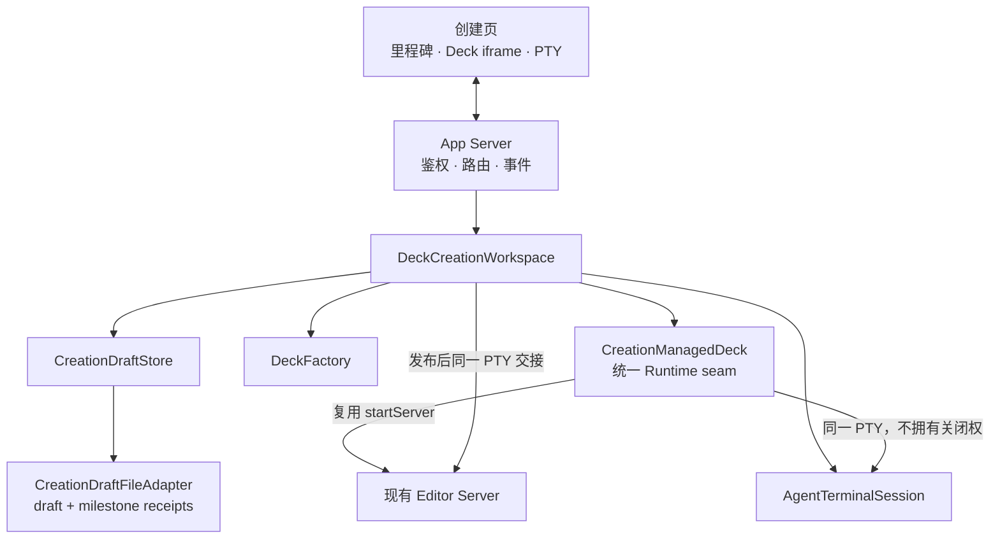

# Huawei Deck Editor 新建 Deck 对话工作区设计

> 状态：已实施（2026-08-12，Managed Workspace 统一完成）
> 日期：2026-08-11，2026-08-12 修订
> 范围：新建 Deck 入口、Agent 对话工作区、文件驱动里程碑、Deck 自动预览与现有编辑器交接

## 0. 结论

新建 Deck 页面只有两种布局状态：

1. **Deck 出现前**：左侧只读里程碑 + 占据主区域的真实 Agent PTY；
2. **Deck 出现后**：左侧只读里程碑 + 中间 Deck 画布 + 右侧同款 Agent PTY。

页面不再把需求、提纲和页面规划拆成可点击阶段，也不提供中间表单、章节卡片、页面卡片或确认按钮。前三段全部通过自然对话完成。

后台仍保存结构化 Brief、Outline 和 PagePlan，并保留 revision、确认与失效规则，但这些是 Agent 的受控执行协议，不是用户必须操作的页面向导。

左侧流程不是导航。每一个节点对应一个真实文件；服务检测到合法文件后自动点亮。自然语言终端输出不能直接改变里程碑或触发布局切换。

## 1. 核心原则

1. **对话优先**：Deck 出现前，用户只需要和 Agent 对话；
2. **文件是真实进度**：里程碑由持久化文件驱动，不解析终端文本；
3. **结构化状态仍然存在**：Agent 通过受控 CLI 写入 Draft，不能把“我已经完成”当作提交；
4. **无页面阶段操作**：左侧节点不可点击，前三段没有页面表单和确认按钮；
5. **Deck 自动触发布局变化**：检测到可渲染的独立 Deck 后，中间画布自动出现，终端自动停靠右侧；
6. **终端完全复用**：新建与修改 Deck 使用同一个 `AgentTerminalPanel`、xterm 配置和视觉样式；
7. **模板只读、Managed Workspace 制作、发布不覆盖**：staging 是临时 source，初版制作只修改 Editor 托管工作副本，固化和验证通过后再发布；
8. **同一会话延续**：进入微调编辑器后复用当前 PTY runtime、provider 和项目目录。

## 2. 页面状态

### 2.1 状态 A：只有对话

```text
┌──────────────┬────────────────────────────────────────────────────┐
│ 只读里程碑     │ Agent 真实 PTY                                      │
│ ● 需求已收敛   │ Agent 询问主题、听众、时长、目标、素材……               │
│ ○ 大纲已形成   │ 用户直接在这里回答                                   │
│ ○ 页面已规划   │ Agent 在达成共识后通过 CLI 写入结构化文件               │
│ ○ Deck 已出现  │                                                    │
│ 这里无需操作   │                                                    │
└──────────────┴────────────────────────────────────────────────────┘
```

行为：

- 终端是主工作区，不是窄侧栏；
- 终端进入页面时自动启动并获得焦点；
- 终端的字体、颜色、光标、行高、滚动和输入位置与“修改 Deck”页面一致；
- 左侧只显示进度，不允许点击切换；
- 页面不存在 Brief 表单、大纲卡片、页面规划卡片和“开始生成”按钮。

### 2.2 状态 B：Deck 已出现

```text
┌──────────────┬──────────────────────────────┬─────────────────────┐
│ 只读里程碑     │ Deck 实时画布                  │ Agent 真实 PTY         │
│ ✓ 需求已收敛   │ Editor Managed Workspace     │ 继续讨论和修改 Deck     │
│ ✓ 大纲已形成   │ 自动刷新                      │ 与修改页相同终端样式      │
│ ✓ 页面已规划   │                              │                     │
│ ✓ Deck 已出现  │                              │                     │
└──────────────┴──────────────────────────────┴─────────────────────┘
```

切换条件不是 Agent 的一句话，而是 `deck-ready.json` 已写入，并且其中指向的 HTML：

- 是项目范围内的可信普通文件；
- 不是符号链接；
- 包含完整 HTML；
- 同时包含 `__bundler/manifest` 与 `__bundler/template`，可作为独立 Huawei Deck 打开。

Deck 首次出现时页面自动切换，不需要用户点击。生成失败但 staging Deck 仍可渲染时，画布继续保留，方便用户和 Agent 对照修复。

当最终发布完成后，中间画布才显示“进入微调编辑器”入口。交接后使用现有 Deck 编辑器。

## 3. 对话与执行流程


Brief、Outline、PagePlan 仍然是顺序依赖，但它们不表现为三个页面阶段。Agent 可以在一段连续对话中反复讨论，直到用户明确同意某一层共识，再提交对应确认命令。

用户不需要知道 CLI。Agent 初始化提示必须明确：

- 不要求用户填写网页表单；
- 不要求用户点击阶段按钮；
- 用户在对话中的明确同意是 Agent 执行 confirm 命令的依据；
- 每次 mutation 前读取最新 revision；
- 完成 PagePlan 后由 Agent执行输出设置和 `start-generation`；
- 只有受控命令和文件回执能改变页面状态。

## 4. 文件驱动里程碑

Draft 目录：

```text
<project-root>/.huawei-deck-editor/
  drafts/
    <draft-id>/
      draft.json
      brief.json
      outline.json
      page-plan.json
      deck-ready.json
      agent-capability.json
      materials/
      staging/
      diagnostics/
```

| UI 节点 | 文件 | 写入条件 | 失效条件 |
|---|---|---|---|
| 需求已收敛 | `brief.json` | Brief 校验通过并确认 | 已确认 Brief 被修改 |
| 大纲已形成 | `outline.json` | Outline 校验通过并确认 | Brief 变化或 Outline 失效 |
| 页面已规划 | `page-plan.json` | PagePlan 校验通过并确认 | Brief / Outline 变化或 PagePlan 失效 |
| Deck 已出现 | `deck-ready.json` | staging 或 published Deck 通过基础可信检查 | generation 清空、重试未创建新 staging，或路径失效 |

`draft.json` 是完整状态的权威记录；四个里程碑文件是供 UI 与恢复流程读取的耐久回执。所有文件都使用同目录临时文件、fsync 和 rename 原子写入。

上游变化时，服务删除已失效的下游回执，但不删除用户素材、终端历史或已经存在的 staging 诊断。

节点状态包括 `pending`、`active`、`working`、`complete`、`stale` 和 `failed`。它们全部由 Draft 与里程碑文件派生，浏览器不维护第二套业务状态机。

## 5. 后台闸门

后台沿用内部 phase：

```ts
type CreationPhase =
  | 'brief'
  | 'outline'
  | 'page-plan'
  | 'generating'
  | 'ready'
  | 'failed';
```

phase 只用于验证命令顺序、锁定生成和恢复失败，不映射为页面 tab 或路由。

核心命令：

```text
update-brief        confirm-brief
propose-outline     confirm-outline
propose-page-plan   confirm-page-plan
set-output          start-generation
generation-ready    retry-generation
cancel-generation
```

每个 mutation 都携带 `expectedRevision`。陈旧 revision 返回 `REVISION_CONFLICT`，调用方读取最新快照后重试。

| 变化 | 自动失效 |
|---|---|
| 已确认 Brief 被修改 | Brief、Outline、PagePlan 和 generation |
| 已确认 Outline 被修改 | Outline、PagePlan 和 generation |
| PagePlan 重新提交 | PagePlan 确认和 generation |
| generating 期间修改结构 | 拒绝，必须先取消或完成当前 generation |

用户看不到这些闸门的表单表达，但 Agent 必须遵守。

## 6. Deck 创建与 Managed Workspace 实时画布

`TemplateCatalog` 先直接解码模板 bundle，自动把全部 34 / 37 / 46 个实际页面组成可选页型目录，再叠加语义 ID 与 `cover` / `toc` / `thanks` 固定角色。需求确认时选定模板；页面规划只能引用该模板中的真实 `pageTypeId`，并且必须让封面第一、目录第二、感谢页最后。

`DeckFactory` 负责解析允许的模板、创建 staging 副本、写入 `plan.md`、`toc-contract.json` 与逐页模板来源。封面和感谢页额外写入忽略文案、但覆盖 DOM 层级 / class / 布局属性的结构锁；目录页只锁定第二页位置与模板身份，内部条目、layer、章名和逐章动画则必须按已确认大纲重建。发布前依次执行固定页与页型契约、目录动画契约、bundle verify、全页 overflow，再不覆盖发布最终文件。这样模板完整性和目录语义都是代码闸门，不依赖 Agent 是否记住 Prompt。

合法 staging Deck 出现后，`CreationManagedDeck` 立即用现有 `server.mjs` 启动临时 Editor Runtime。该 Runtime 把 staging 当作只读 source，并创建自己的 `working/deck.html`、session revision、ActionMutation / SourceMutation 和诊断基线。创建流程因此不再实现独立 watcher、补丁或刷新协议。

创建页 iframe 加载完整 Editor parent，但使用 `embedded=creation&mode=preview`：保留 editor capability WebSocket、frame bridge、诊断和 `working-deck-changed` 自动重载，只隐藏重复的顶栏、页栏、属性、任务和终端。它与 App 页是不同 loopback 端口；sandbox 只为 Editor 自身保留 `allow-scripts allow-same-origin`，不能读取创建页父文档。

Agent 收到显式的 Managed working path、Editor URL 和短期 token：已有元素的文字 / 样式 / 几何 / 显隐走 Editor CLI action；结构、模板升级与页序走 `edit-bundle.py` 修改 working Deck。保存工作副本后，Editor watcher 把变化记录为 SourceMutation 并自动刷新内层画布，不依赖 Draft revision，也不要求用户刷新。

`generation-ready` 固定执行：flush 最近一次文件保存 → 等待 Editor / diagnostics ready → 固化 active 历史到 staging source → `DeckFactory.verify()` → 不覆盖发布。发布后初版历史成为正式 Deck 基线；用户进入常规编辑器时关闭临时 Runtime，但不关闭共享 PTY，再在最终 Deck 上启动常规 Runtime。`GET /creation-deck-preview` 只保留给没有 Managed Runtime 的兼容 / 失败回退，不是主实时链路。

## 7. 终端复用

新建页和修改页都使用：

- `scripts/editor/public/agent-terminal-panel.mjs`
- `scripts/editor/public/agent-terminal-panel.css`
- 相同 xterm.js 版本与主题；
- 相同 `SFMono-Regular` 12px 字体；
- 相同光标、ANSI 色板、行高和滚动策略；
- 相同 PTY WebSocket 协议。

App 页 CSP 允许 xterm DOM renderer 注入运行时样式：

```text
style-src 'self' 'unsafe-inline'
```

状态 A 只改变终端所在网格列和宽度，不改变终端内部样式。状态 B 使用与修改页相同的右侧停靠宽度。布局变化后由共享组件重新 fit，保证底部输入行仍在窗口内。

## 8. HTTP 与模块边界

浏览器接口：

| 方法 | 路径 | 用途 |
|---|---|---|
| `POST` | `/api/choose-creation-project` | 通过系统选择器确定项目目录 |
| `POST` | `/api/creation-drafts` | 创建 Draft 并启动 Agent |
| `GET` | `/api/creation-draft` | 读取 Draft、里程碑与预览信息 |
| `POST` | `/api/creation-draft/commands` | Agent 受控更新 |
| `GET` | `/creation-deck-preview` | Managed Runtime 不可用时的只读兼容预览 |
| `POST` | `/api/creation-draft/open-editor` | 发布后交接到微调编辑器 |



- UI 只渲染快照和布局；
- Store 负责 revision、命令校验和失效；
- FileAdapter 负责原子持久化、里程碑回执和可信 Deck 检测；
- Workspace 编排生成、Agent 提示、验证与发布；
- DeckFactory 隐藏模板、staging、verify 和 publish；
- CreationManagedDeck 只暴露 open / waitUntilReady / preparePublish / close，隐藏 Editor token、working watcher、历史与固化细节；
- Terminal 组件只负责真实 PTY，不承担业务状态。

## 9. 安全边界

1. 服务只监听 loopback，并要求随机 browser token；
2. Agent capability 与 browser token 分离；
3. 项目目录必须由系统选择器返回并校验 identity；
4. staging 和里程碑文件拒绝符号链接与路径逃逸；
5. `deck-ready.json` 不能由浏览器直接提交，只能由服务根据真实文件生成；
6. 兼容预览路由不接受路径参数；临时 Editor capability 只存在内存快照，不写入 Draft 文件；
7. 内嵌 Editor 与创建页跨端口隔离；sandbox 的同源权限只用于 Editor 自己的 parent / preview frame；
8. 最终发布默认不覆盖；
9. 终端文本、ANSI 和提示符均不参与状态判断。

## 10. 测试验收

1. 未确认内容不产生完成回执；
2. confirm 后写入对应 JSON；
3. 上游变化删除失效回执；
4. 非法、逃逸或缺少 bundle 标记的 HTML 不产生 `deck-ready.json`；
5. 创建 Draft 后不存在中间表单、阶段按钮和页面卡片；
6. 对话态终端占据除左侧里程碑外的主区域；
7. Deck 出现前中间画布隐藏；
8. `deck-ready.json` 出现后画布自动显示且终端停靠右侧；
9. 终端字体、颜色、光标、圆角和底部输入可见性与修改页一致；
10. 发布完成后可交接同一 PTY 到现有编辑器；
11. working Deck 经 `edit-bundle.py` 保存后无需刷新即可在创建页出现，Managed revision 单调增加；
12. `generation-ready` 先固化 ActionMutation / SourceMutation，发布文件包含实时画布中的最终结果；
13. 打开已有 Deck 流程保持不变。

## 11. 已确认决策记录

1. 前三段不需要中间操作界面；
2. 前三段不划分页面阶段，不添加按钮，合并为连续对话；
3. Deck 出现前，终端是主工作区；
4. Deck 出现后，终端右推，中间显示 Deck；
5. 左侧流程路径保留，但只是被动里程碑；
6. 每个里程碑落到独立文件，检测到有效文件后点亮；
7. 不解析 Agent 自然语言来判断完成；
8. 新建与修改 Deck 必须使用完全相同的终端组件与视觉样式；
9. 生成与发布仍遵守 staging、独立验证和不覆盖原则；
10. 发布后进入现有微调编辑器，并延续同一 Agent 会话；
11. 新建和修改不维护两套 watcher / 补丁 / 写回逻辑；合法 Deck 出现后统一使用 Managed Workspace。
