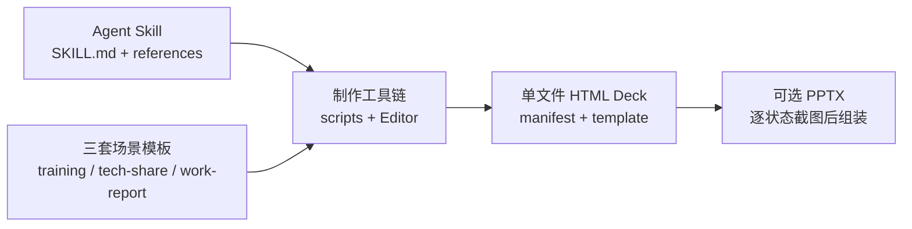

# Huawei Deck 项目调研概览

> 调研日期：2026-08-21  
> 调研范围：`AGENTS.md`、`SKILL.md`、`README.md`、`references/`、`scripts/`、`package.json`、三套模板 HTML 与现有架构文档。  
> 资料原则：只使用仓库内的一手文档与源码；路径均相对仓库根目录，链接中的 `Lx-Ly` 为调研时行号。

## 1. 核心结论

Huawei Deck 的首要身份是一个 **Agent Skill**，而不是以服务部署为中心的普通应用。它把演示制作知识、三套场景模板和一套编辑/验证/导出工具交付给 Codex、Claude Code 等 Agent；桌面 Editor 是可选的第二层产品能力，没有窗口时 Skill 仍能独立工作。最终交付物不是项目源码或云端链接，而是可直接拷走、离线打开的 1920×1080 单文件 HTML Deck，必要时再导出为 PPTX。项目定位见 [AGENTS.md:5-9](../../AGENTS.md#L5-L9) 与 [README.md:1-5](../../README.md#L1-L5)。

项目可以理解为三层：

当前三套模板是平等的场景外壳：授课 34 页、技术分享 37 页、工作汇报 46 页；它们共享设计系统和工具链，但不物理合并，跨模板借页必须经过兼容性目录和受控导入。[references/template-pages.md:1-15](../../references/template-pages.md#L1-L15)

工程上的中心矛盾是：Deck 必须真离线、单文件，因此全部图片、字体和运行时都内联到约 12–14 MB 的 HTML；代价是内容藏在超长 JSON 行中，不能按普通 HTML 直接编辑。围绕这个约束，仓库形成了 `edit-bundle.py`、Managed Workspace、结构验证、真实浏览器截图和安全固化等完整工具链。[docs/architecture.md:27-34](../architecture.md#L27-L34)

## 2. 目录与职责

| 路径 | 主要职责 | 调研判断 |
|---|---|---|
| `SKILL.md` | Skill 触发入口、质量契约、运行模式、设计铁律、文件导航 | Agent 执行任务时的首要规范，不只是 README 的缩写；其 16 条铁律会继续路由到具体 reference。[SKILL.md:166-217](../../SKILL.md#L166-L217) |
| `references/` | 9 份互不重叠的使用文档 | 分别覆盖流程、页型、视觉、动画、片段、工程编辑、配图、品牌和官方风格；分工表见 [docs/architecture.md:440-450](../architecture.md#L440-L450)。 |
| `assets/*-deck.html` | 三套可复制的单文件模板 | 模板既是资产也是“页型画廊”：占位文案直接解释版式怎么用；授课模板另含真实课件示例。[SKILL.md:8-10](../../SKILL.md#L8-L10) |
| `assets/huawei-refs/` | 官方 PPT 提取素材与空白模板 | 供品牌和版式参考，不等同于 MIT 授权素材。[LICENSE:23-40](../../LICENSE#L23-L40) |
| `scripts/edit-bundle.py` | bundle 安全读写、资源嵌入、页面增删移动、身份补齐和结构验证 | 所有结构修改的底层可信通道；保存采用同目录临时文件、`fsync` 和原子替换。[scripts/edit-bundle.py:25-63](../../scripts/edit-bundle.py#L25-L63) |
| `scripts/editor/` | Creation Draft、模板目录、Managed Workspace、真实 PTY、动作时间线、sidecar 与安全写回 | 已经是一个完整的本地编辑运行时，但仍服务于 Skill 的 Deck 交付目标。核心组件表见 [docs/architecture.md:346-374](../architecture.md#L346-L374)。 |
| `scripts/verify/` | 溢出、单页截图、逐拍动画、目录契约等质量检查 | 使用真实 Chrome 渲染，是结构验证之外的视觉验收层。 |
| `scripts/html2pptx/` | HTML 渲染为逐页图片，再组装 16:9 PPTX | PPTX 页面本质是满屏图片；layer 页面会展开为多张。[references/editing-guide.md:417-442](../../references/editing-guide.md#L417-L442) |
| `scripts/install.py` / `check_deps.py` | Skill Developer Link 安装、环境 Profile 体检与修复 | 安装器同时照顾 Codex、Claude Code 和旧 Codex 位置，并把 Editor Core 诊断纳入流程。[scripts/install.py:1-15](../../scripts/install.py#L1-L15) |
| `docs/architecture.md` | 当前架构与不变量 | 描述“现在是什么”；行为冲突时仍以 `SKILL.md` 与 `references/` 为准。[docs/architecture.md:1-4](../architecture.md#L1-L4) |
| `docs/design/`、`docs/adr/`、`docs/superpowers/` | 历史设计规格、架构决策与实现计划 | 适合追溯为什么这样设计，不应代替当前行为规范。 |
| `docs/user-guide/` | Editor 内置帮助中心的 Markdown 来源 | 面向终端用户，与开发者架构文档分层。[README.md:67-103](../../README.md#L67-L103) |

仓库此前没有 `docs/research/` 或同类调研笔记惯例；本文因此作为单一调研文件新增，不改动现有设计规格。

## 3. 核心架构与数据格式

### 3.1 单文件 bundle

三套模板的外层 HTML 约 223 行，关键内容位于两个 script 标记的下一行：

- `__bundler/manifest`：JSON 字典，条目结构为 `{uuid: {mime, compressed, data(base64)}}`，承载字体、图片和运行时资源。
- `__bundler/template`：一个 JSON 字符串，解码后才是完整 Deck HTML，包含所有 `<section data-label>`、`nav[]`、`chapters[]`、页面脚本与内联 React。

格式定义见 [references/editing-guide.md:197-206](../../references/editing-guide.md#L197-L206)；当前三个模板的标记实际都位于外层文件第 212、220 行，例如 [assets/training-deck.html:212-221](../../assets/training-deck.html#L212-L221)。浏览器 loader 会把 manifest 解码为 blob URL、替换 template 内 UUID、移除不适用于 `file://` blob 的 SRI 属性、重建脚本以保证 React/ReactDOM/运行时执行顺序，最后等待挂载完成再移除遮罩。[docs/architecture.md:197-224](../architecture.md#L197-L224)

### 3.2 页面、导航与身份

一个页面同时受多组标识约束：

| 标识 | 作用 | 维护要求 |
|---|---|---|
| `data-label` | 传统验证脚本和 `edit-bundle.py` 的工具侧页名 | 全 Deck 唯一；同名时多数工具只处理第一张。[references/editing-guide.md:330-332](../../references/editing-guide.md#L330-L332) |
| `data-page-id` | Managed Editor 的稳定页面身份 | `page-` + 32 位小写十六进制；移动保留、复制/插页生成新 ID、重复或畸形时拒绝。[scripts/edit-bundle.py:182-220](../../scripts/edit-bundle.py#L182-L220) |
| `data-editor-id` | 可编辑元素的稳定身份 | 移动和层级调整时必须保留；新增元素由工作副本归一化补齐。[docs/architecture.md:409-411](../architecture.md#L409-L411) |
| `nav[]` / `chapters[].start` | 页导航与章节起点 | 增删移页必须和 slide DOM 同步；跨章移动需额外修正章节起点。[scripts/edit-bundle.py:384-470](../../scripts/edit-bundle.py#L384-L470) |

`data-idx` 只是数字型装饰索引，不承担稳定身份，但非数字会造成灰屏或加载异常；页外壳约定见 [references/page-snippets.md:5-13](../../references/page-snippets.md#L5-L13)。

### 3.3 两条编辑路径汇入同一时间线

已有合法 Deck 的默认路径是 Managed Workspace：已有窗口就复用；没有窗口但依赖可用时启动 headless workspace；只有用户明确拒绝后台运行时或环境确实不可用时，才退回经典直改，而且必须告知没有 Mutation、跨轮撤销和 solidify。[references/editing-guide.md:7-25](../../references/editing-guide.md#L7-L25)

Managed Workspace 将修改分成两类：

- `ActionMutation`：文字、样式、移动、缩放和显隐，由受控 action API、revision 与 locator 提交。
- `SourceMutation`：模板、复杂 DOM、动画和页面结构，由 Agent 修改 sidecar 的 `working/deck.html`，保存前后版本并进入同一历史时间线。

两类修改的汇合关系见 [docs/architecture.md:304-322](../architecture.md#L304-L322)。源码修改必须先 `begin-source-edit`，落盘后 `commit-source-edit`，失败则 `cancel-source-edit`；活动源码事务会阻止其他修改，避免文件监视器猜测提交顺序。[docs/architecture.md:398-411](../architecture.md#L398-L411)

真实源 Deck 在会话期间保持只读。sidecar 保存工作副本、内容寻址版本、快照、备份、事务和附件；正式发布必须经过 solidify 预检、一次性令牌、bundle/补丁重放验证和平台原子替换。任何无法证明安全的恢复都会进入 `RECOVERY_REQUIRED`，而不是猜测覆盖。[docs/architecture.md:413-436](../architecture.md#L413-L436)

### 3.4 动画与页内状态协议

项目只允许三类动画机制：

- `build`：按 `data-step` 和当前 `level` 逐步显现。
- `layer`：按钮/面板以同 key、同 `data-layer-group` 配对，用 `data-active` 表示当前状态；目录、标签、阶段视图和方案切换都必须使用它。
- SVG SMIL：只做不占点击节拍的连续示意。

`build` 与 `layer` 共享 level，总拍数为 `max(data-step) + 2`。[references/animation.md:34-68](../../references/animation.md#L34-L68) [references/animation.md:144-146](../../references/animation.md#L144-L146) 页内多画面必须保持固定 DOM，切换只能改变 `data-active`，不能用 `innerHTML` 重建，也不能再发明 `_cur`、`data-mod` 等私有状态机；否则 Editor 状态恢复、逐拍截图和 PPTX layer 展开会失去共同语义。[references/animation.md:70-78](../../references/animation.md#L70-L78)

目录还有独立的自适应契约：实际章数必须同时等于 `chapters[]`、目录按钮、面板、可视容器和 `tocBuilders` 数量，并为每章保存稳定 chapterId、真实章名、目标和专属动画；完成后必须运行 `toc_contract.py` 与目录逐拍截图。[references/animation.md:80-123](../../references/animation.md#L80-L123)

## 4. 主要工作流

### 4.1 从零创建 Deck

流程不是“复制模板后马上改”，而是七阶段协作：主题讨论 → 大纲规划 → 选择模板 → 初版制定 → 初版讨论修改 → 终版制作 → 终版讨论修改。三个讨论节点都是硬闸门，前两阶段未确认前不能碰模板。[references/workflow.md:1-5](../../references/workflow.md#L1-L5) [references/workflow.md:19-27](../../references/workflow.md#L19-L27)

初版先形成逐页规划，明确核心观点、排版逻辑、配图规格和拍数；配图先用 `data-todo="fig"` 类型化占位，终版再抽原图、自绘或制表并清零占位。[references/workflow.md:74-91](../../references/workflow.md#L74-L91) [references/artwork.md:1-14](../../references/artwork.md#L1-L14) 新建流程在合法 staging Deck 出现后立即进入与后期编辑相同的 Managed Workspace，发布前检查 PagePlan、模板来源、固定页、目录契约、bundle 和全页溢出。[references/editing-guide.md:27-35](../../references/editing-guide.md#L27-L35)

### 4.2 修改已有 Deck

结构性修改必须先解码 template，在目标 section 内做唯一性断言和局部替换，再通过 `set_template` 回填；增删移页调用封装函数同步 DOM、导航和章节。[references/editing-guide.md:208-253](../../references/editing-guide.md#L208-L253) 跨模板借页不能复制字符串片段，必须使用 `deck_factory.py import-page` 合并该页实际引用的 manifest 资源并写入来源元数据。[references/editing-guide.md:285-303](../../references/editing-guide.md#L285-L303)

`edit-bundle.py` 的编码入口实际还处理孤立 surrogate，随后才执行 `json.dumps(..., ensure_ascii=False)` 与 `</` 转义，确保中文和普通 URL 斜杠不变、JSON 往返一致。[scripts/edit-bundle.py:80-107](../../scripts/edit-bundle.py#L80-L107)

### 4.3 品牌替换与旧 Deck 升级

品牌图替换默认只预览，只有 `--yes` 才落盘；脚本会解析当前资源 key、嵌入新图、替换全部引用、删除旧 manifest 条目、原子写盘并复核。[scripts/apply_bg.py:1-18](../../scripts/apply_bg.py#L1-L18) [scripts/apply_bg.py:103-142](../../scripts/apply_bg.py#L103-L142)

旧 Deck 升级器同样默认预览。它按公共外壳 hash 和稳定 seam 重组最新版运行时，保留用户页面、导航、章节、资源和扩展槽；未知合并冲突或补丁无法重放时停止写入。[references/editing-guide.md:374-411](../../references/editing-guide.md#L374-L411)

### 4.4 验证与导出

一批修改完成后的最小验证链是：

1. `python3 scripts/edit-bundle.py <deck>`：结构数量、导航连续性、pageId 完整唯一。
2. `measure_overflow.mjs --all`：全页 section 溢出和内层裁切报告。
3. `shot.mjs`：改动页 1920×1080 截图目检。
4. `steps.mjs`：仅动画改动页逐拍核对。
5. 目录结构变化时追加 `toc_contract.py` 与目录逐拍截图。

三件套统一退出码为 0 成功、1 检出问题、2 工具或参数错误；`measure_overflow` 的 nested clip 只报告不判失败，SVG 文本、箭头方向和连线端点仍依赖截图目检。[references/editing-guide.md:359-372](../../references/editing-guide.md#L359-L372)

PPTX 导出由 `convert.py` 调用 Node/Chrome 截图，再由 `python-pptx` 把图片铺满 16:9 幻灯片；因此它保留视觉外观，但生成的 PPTX 不是可逐元素编辑的原生 PowerPoint 结构。[scripts/html2pptx/convert.py:30-63](../../scripts/html2pptx/convert.py#L30-L63) [scripts/html2pptx/build_pptx.py:18-33](../../scripts/html2pptx/build_pptx.py#L18-L33)

## 5. 测试与验证体系

项目没有独立 lint 或传统 build 步骤。质量保障分为三层：[AGENTS.md:39-41](../../AGENTS.md#L39-L41)

| 层级 | 覆盖内容 | 入口 |
|---|---|---|
| 结构层 | bundle 可解码、slide/section/nav 数量一致、nav 连续、pageId 完整唯一 | `eb.verify()`；断言实现见 [scripts/edit-bundle.py:485-508](../../scripts/edit-bundle.py#L485-L508) |
| 真实浏览器层 | 溢出、单页视觉、动画逐拍、patch 重放与目录契约 | `scripts/verify/`；例如 `steps.mjs` 直接复刻运行时规则。[scripts/verify/steps.mjs:1-18](../../scripts/verify/steps.mjs#L1-L18) |
| Editor 回归层 | Node 单元测试、真实 Chrome E2E、Python unittest | `npm run test:editor:unit|e2e|python|test:editor`。[package.json:5-9](../../package.json#L5-L9) |

统一测试调度器按文件名收集 `*.test.mjs`、`*.e2e.mjs` 与 `test_*.py`；E2E 串行，Windows 单元测试也限制并发，每一组使用隔离的临时 Editor 状态目录。[scripts/run-editor-tests.mjs:7-55](../../scripts/run-editor-tests.mjs#L7-L55)

这套体系的边界也很清楚：`eb.verify` 只保证结构账目，不保证页面视觉；overflow 为 0 也不能证明 SVG 工程图正确；而截图/PPTX 是栅格结果，不能验证源 DOM 的长期可编辑性。仓库明确要求自绘图至少通过两轮截图检查文字边界、箭头和颜色。[references/artwork.md:138-146](../../references/artwork.md#L138-L146)

## 6. 依赖与运行环境

依赖按任务拆为 Profile，而不是要求所有能力一次装齐：[scripts/check_deps.py:3-22](../../scripts/check_deps.py#L3-L22)

| Profile | 主要依赖 |
|---|---|
| `editor-core` | Node ≥18；`ws`、`html2canvas`、`busboy`、`node-pty`、`@xterm/xterm`、`three`；至少一个已安装并登录的 Codex / Claude Code / OpenCode CLI |
| `verify` | Node、Google Chrome、`playwright-core` |
| `pptx-export` | `verify` 能力 + `python-pptx` |
| `materials` | vendored PDF skill、`pypdf`、`pdfplumber`、PyMuPDF、LibreOffice；`reportlab` 为可选项 |
| `full` | 上述全部 Profile |

Profile 的实际成员定义见 [scripts/check_deps.py:427-445](../../scripts/check_deps.py#L427-L445)。Editor Node 依赖在 [package.json:11-18](../../package.json#L11-L18) 锁定；Playwright 的加载顺序为环境变量 `PLAYWRIGHT_CORE` → 项目依赖 → OpenClaw 内置路径。[scripts/verify/load-playwright.mjs:1-8](../../scripts/verify/load-playwright.mjs#L1-L8)

基础编辑脚本 `edit-bundle.py` 只使用 Python 标准库；PPTX 和外部 PDF/PPTX 材料处理才引入额外 Python/桌面依赖。[AGENTS.md:39-39](../../AGENTS.md#L39-L39)

## 7. 主要风险与维护注意事项

### 高风险不变量

1. **不得直接编辑 bundle 的两行 JSON。** 任意 `</script>` 转义错误、换行或截断都可能让整个 Deck 无法打开；template 只能经 `dump_template()`，资源只能经 manifest helper。[references/editing-guide.md:208-213](../../references/editing-guide.md#L208-L213)
2. **页面结构是多份账本。** DOM、`nav[]`、`chapters[].start`、pageId 与目录契约任一不同步，都会造成导航错位、章节掉页或历史 locator 漂移。跨章 `move_page` 尤其需要手工修正。[references/editing-guide.md:255-283](../../references/editing-guide.md#L255-L283)
3. **运行时规则存在多份同步点。** 三套模板的导航/缩放/放映运行时必须一致；动画规则还要与 `steps.mjs` 同步。修改公共运行时却只改一份模板，是最典型的回归来源。[AGENTS.md:70-72](../../AGENTS.md#L70-L72)
4. **结构正确不等于视觉正确。** 1080 画布会无声裁切；nested clip、SVG 文本、线条端点和固定 logo 都需要真实截图，不能只依赖结构断言或 overflow 退出码。[references/design-system.md:84-95](../../references/design-system.md#L84-L95)
5. **Managed Workspace 中真实 Deck 不是工作文件。** 绕过 `working/deck.html`、revision、源码事务或 solidify 直接写源文件，会破坏撤销历史、指纹和恢复逻辑；正式写回必须以用户明确的保存/固化意图为边界。[docs/architecture.md:421-432](../architecture.md#L421-L432)

### 一致性与维护成本

- 文档、脚本、三套模板运行时和 Editor 共享同一批概念。改脚本行为、命令、页数、动画或缩放时，必须同步 `SKILL.md`、`README.md`、对应 reference 和相关模板；仓库已有明确同步清单。[docs/architecture.md:452-458](../architecture.md#L452-L458)
- `edit-bundle.py` 顶部说明仍写“约 187 行”和旧索引示例，而当前三套模板约 223 行、标记位于 212/220 行；实现使用标记动态探测，所以功能未受影响，但这是可见的注释漂移，应避免把示例行号当协议。[scripts/edit-bundle.py:3-15](../../scripts/edit-bundle.py#L3-L15) [assets/training-deck.html:212-221](../../assets/training-deck.html#L212-L221)
- `edit-bundle.py` 依赖字符串查找和特定 `nav[]` 文本格式，而不是通用 HTML/JS parser；这保持了未触及字节稳定，却也意味着 label 唯一性、数组格式和完整 `slide-fit` 外壳都是事实上的内部协议。[scripts/edit-bundle.py:144-168](../../scripts/edit-bundle.py#L144-L168)
- 模板体积大且关键数据各占一整行，普通编辑器、diff 和代码审查工具可读性差；应通过脚本输出、解码后的局部 section 和截图审查，而不是展开整行 base64 diff。
- Editor 已包含工作目录绑定、PTY、WebSocket、事务、原子发布和跨平台文件语义，回归面明显大于普通 Skill 文档仓库。改 Editor 代码至少应运行对应 unit/Python/E2E，而模板改动还必须追加 verify 链，二者不能互相替代。

### 授权与发布

原创脚本和文档使用 MIT，但 `.agents/skills/pdf/`、`assets/huawei-refs/` 以及模板采用的华为版式、插画、Logo 和品牌色不在 MIT 范围内；对外复用和发布前需要确认授权，或按品牌替换流程换成自有素材。[LICENSE:23-40](../../LICENSE#L23-L40)

## 8. 建议的项目上手顺序

1. 先读 `SKILL.md` 的“单一质量契约”“运行模式”和设计铁律，建立产品规则。
2. 浏览器打开与目标场景对应的模板，再用 `references/template-pages.md` 查页型；不要从 DOM 猜版式。
3. 阅读 `references/editing-guide.md` 第 1～3、6 节和 `scripts/edit-bundle.py` 的读写/结构/验证实现，理解 bundle 不变量。
4. 若开发 Editor，再读 `docs/architecture.md` 的 4.6 节、两类事务、sidecar 和固化边界；从组件职责表定位模块。
5. 动手前按任务运行 `check_deps.py --profile ... --check-only`；提交前按改动层级组合结构验证、浏览器 verify 和 Editor 回归测试。

## 9. 2026-08-21 当前状态实测

- 分支已在 `main`；执行 `git fetch --prune origin` 后，本地 `main` 与 `origin/main` 同指向 `bd367d9`，远端没有尚未合入 `main` 的分支，因此当前 origin 上 `main` 是最领先主线。
- `python3 scripts/install.py inspect` 显示 Editor Core 已就绪，但用户级 Codex Skill 注册链接 `/root/.agents/skills/huawei-deck` 尚未建立，整体状态为 `repairable`；这不影响从仓库内调研和运行脚本。
- `editor-core` 与 `full` 两个依赖 Profile 均通过；Node、Chrome、Playwright、PTY、PPTX、PDF/PPTX 材料处理和 LibreOffice 能力均可用。
- 三套模板分别通过 `scripts/edit-bundle.py` 结构验证：34 / 37 / 46 页的 slide、section、nav、连续页序和唯一 pageId 均一致。
- Python Editor 回归测试 144/144 通过。Node 单元测试整套运行 646 项，结果为 643 通过、2 跳过、1 失败；失败用例“成功 action 原子完成任务且 undo/redo 同步任务生命周期”单独重跑通过，表现为仅在整套运行中出现的时序/隔离稳定性信号。因此本轮不能宣称 Node 单测全绿，建议后续在相同环境重复全套测试并排查共享状态或消息竞态。
- 本轮没有运行真实 Chrome E2E，也没有对三套模板执行全页 overflow 与逐页截图；这些仍是模板或 Editor 行为变更提交前的必要验证，而不是本次只读调研的完成条件。

## 10. 总体评价

这是一个“内容规范 + 大型离线资产 + 本地安全编辑运行时”三者耦合的工程。它的优势是交付物高度自包含、场景模板成熟、质量契约具体、可视化编辑与 Agent 自动化共用同一历史和发布路径；复杂度则集中在超长单文件 bundle、跨模板/跨文档一致性、真实浏览器视觉验收，以及 Editor 的事务与跨平台文件安全。维护时最重要的不是增加更多自由度，而是守住既有协议：模板不直接改、页面账本同步、身份稳定、动画状态统一、源文件只经受控固化发布。
