# 从一句「我要答辩」到 28 页华为红答辩 deck —— 一次 AI 全程陪跑实录

> 真实案例：用开源 skill **AICO-PPT**，把一份尘封的本科毕业设计《基于图嵌入正则化的降维方法研究》，重做成离线可放映、还能一键导出 PPTX 的答辩演示。
> 全程没打开过 PPT 软件，只是和 AI 对话。仓库 👉 **https://gitcode.com/AICO-Ascend/AICO-PPT**

---

## 成品先看

*↑ 本地 Chrome 实录：顶部**液态玻璃**工具条随讲切章，左上**侧边预览**缩略图跳页，左下角**记笔记**给每页留评审批注，右上**放映 / 滚动**一键切换——放映翻到「03 · 研究过程」后切回滚动，缓慢通览到致谢页。离线单文件、1920×1080 华为红品牌。*

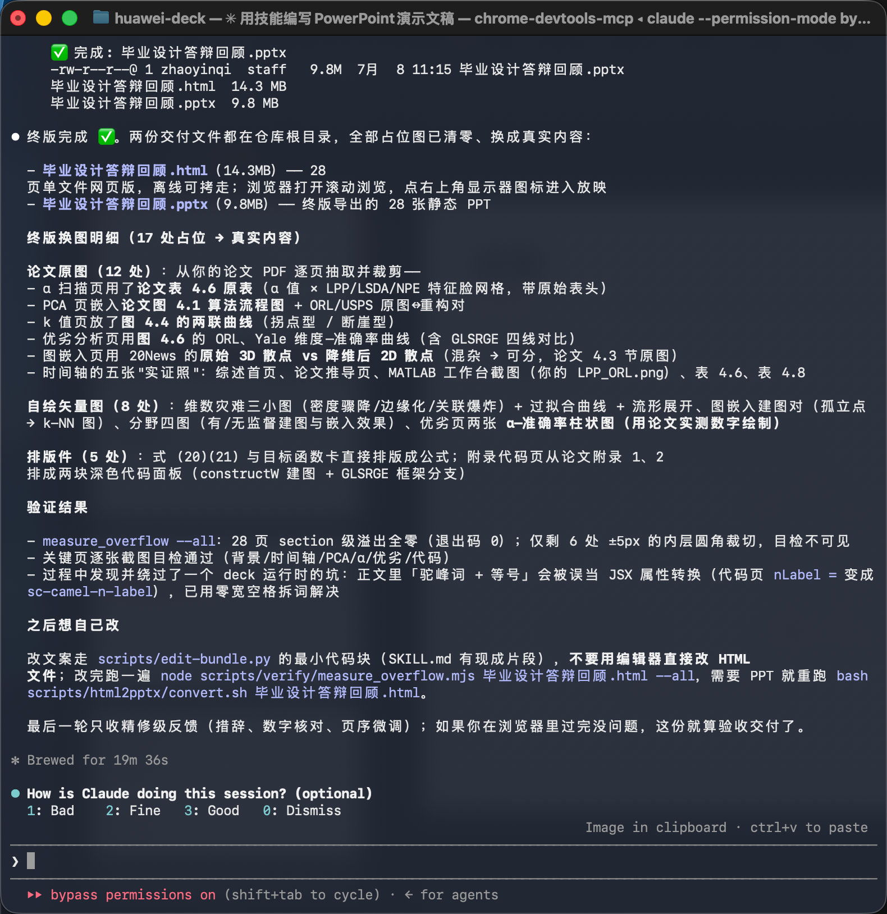

**终版一次交付两个文件**：`毕业设计答辩回顾.html`（14.3 MB，离线单文件、浏览器点击放映）+ `毕业设计答辩回顾.pptx`（9.8 MB，28 页静态 PPT 留档）。全 deck **17 处占位图**已全部换成真实内容——12 处从论文 PDF 逐页抽取裁剪、8 处自绘矢量图、5 处公式/代码排版件；`measure_overflow --all` 28 页溢出全零，关键页逐张截图目检通过。

下面是这份 deck 怎么一步步「聊」出来的。

---

## 第一幕 · 目标讨论：四个问题锁定方向

不急着做页。AICO-PPT 先用四个选择题把需求钉死——**场合、时长、交付、素材**，每个选择直接决定模板与结构。

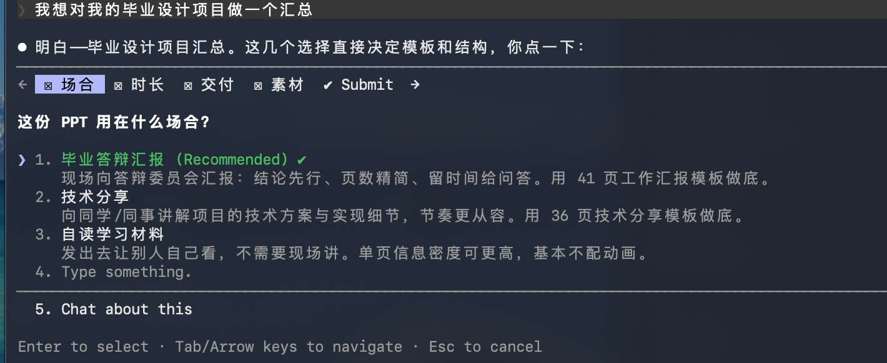
**① 这份 PPT 用在什么场合？** 选「毕业答辩汇报」——于是自动定调：结论先行、页数精简、留时间给问答，用 41 页工作汇报模板做底。

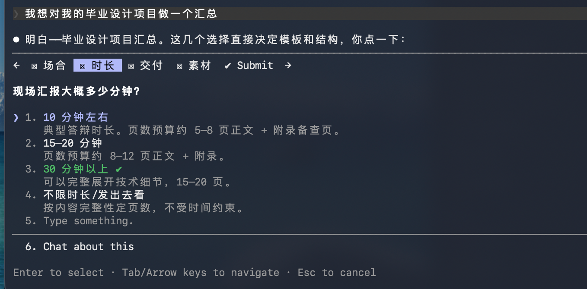
**② 现场汇报多少分钟？** 选「30 分钟以上」——正文预算约 16–18 页 + 附录，页数据此规划。

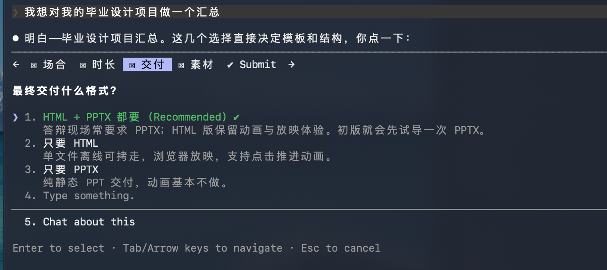
**③ 最终交付什么格式？** 选「都要」——HTML 版保留点击动画与放映体验，PPTX 版满足答辩系统留档，初版就先试导一次 PPTX 验证链路。

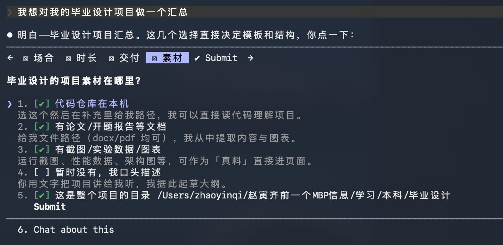
**④ 项目素材在哪？** 一次勾齐：本机代码仓库、论文与开题报告、实验截图，并直接给出整个毕业设计文件夹路径——AI 可以自己去读。

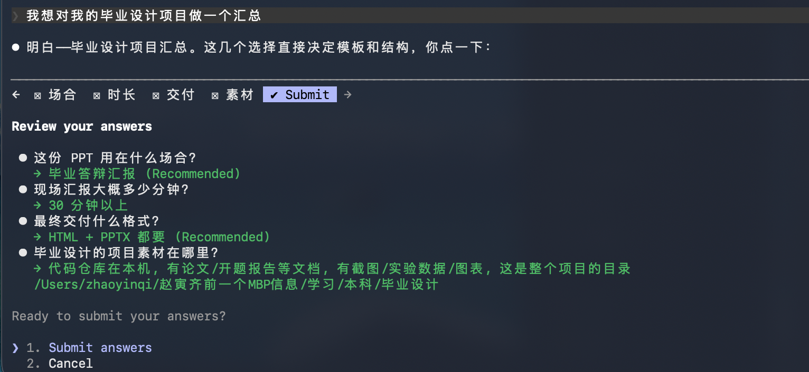
**Review**：四个答案一屏复核，确认无误再提交。需求共识在动手前就达成，避免返工。

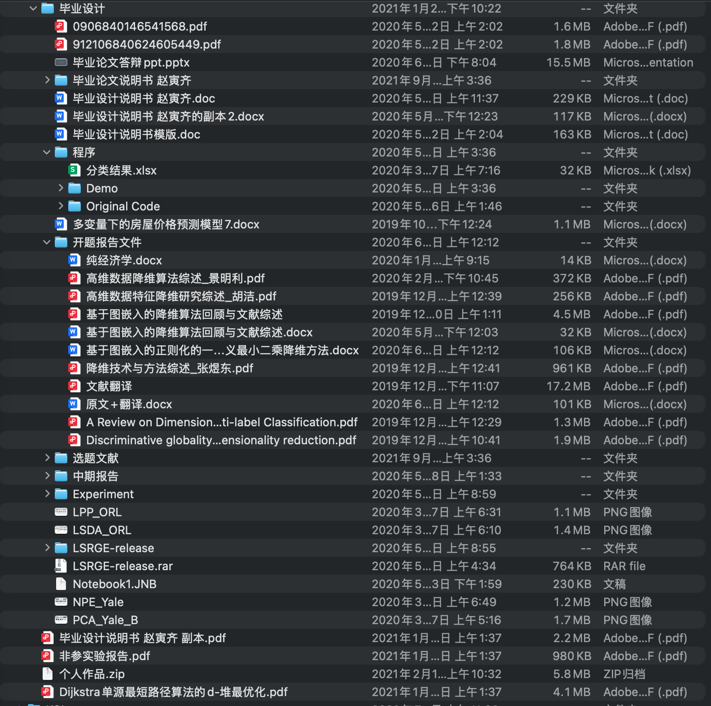
**这就是喂给 AI 的「真料」**——论文答辩 PPT、毕业论文说明书、开题报告里的多篇降维综述、`程序/` 下的 MATLAB 代码（LSRGE-release）、现成实验图（`PCA_Yale_B` / `LPP_ORL` / `LSDA_ORL` / `NPE_Yale`）、`分类结果.xlsx`。有真料，deck 才不是空壳。

---

## 第二幕 · 主题讨论：读透真料，三轮敲定大纲

AI 把论文和代码读完，先把**需求共识**和**大纲提案**摆出来，你点头才动模板。

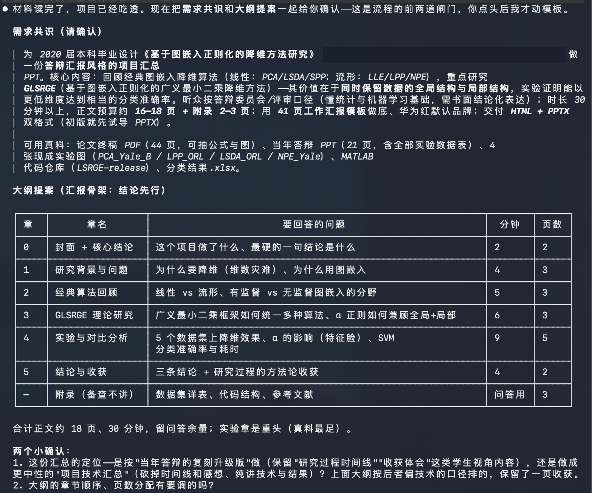
**吃透项目**：认出题目《基于图嵌入正则化的降维方法研究》，核心是回顾经典图嵌入降维算法（线性 PCA/LSDA/SPP、流形 LLE/LPP/NPE）、重点研究 **GLSRGE**（同时保留全局与局部结构）。给出「结论先行」的六章大纲表，连每章分钟数、页数都排好。

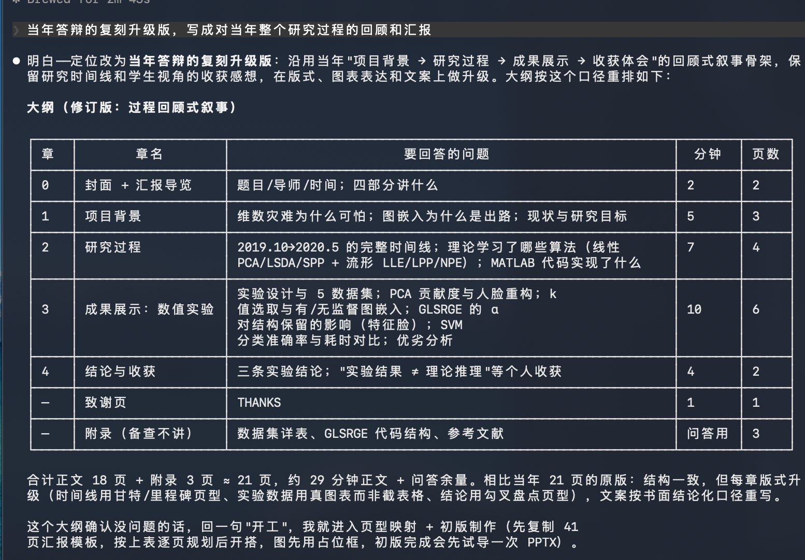
**一句话调方向**：你说要保留「当年答辩」的研究时间线与学生视角收获，AI 立即把定位改成「复刻升级版」，按「项目背景 → 研究过程 → 成果展示 → 收获体会」的回顾式叙事重排大纲。

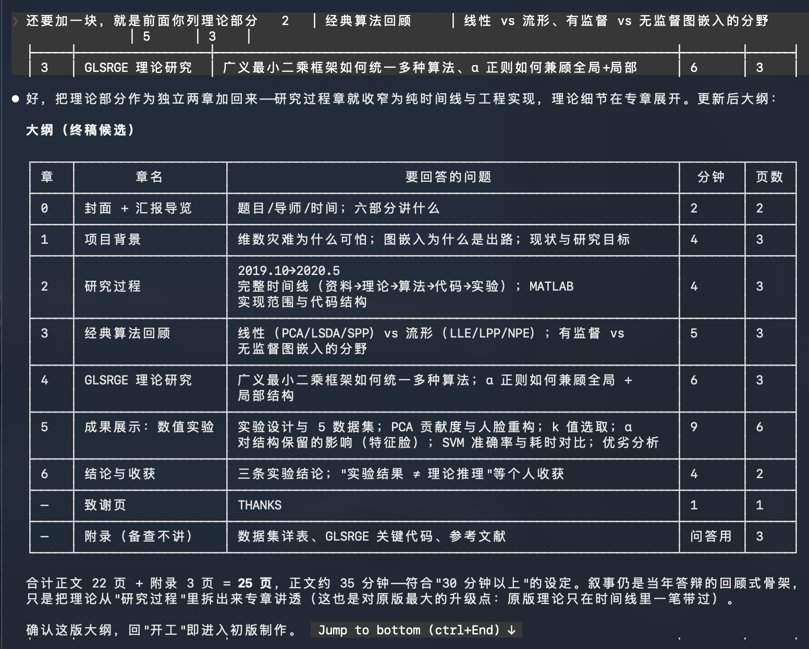
**再细化**：把理论从「研究过程」里拆出来独立成章讲透，合计正文 22 页 + 附录 3 页 = 25 页，约 35 分钟——精准命中「30 分钟以上」。确认后回一句「开工」。

---

## 第三幕 · 初版构建：一次产出 html + ppt，逐页可查

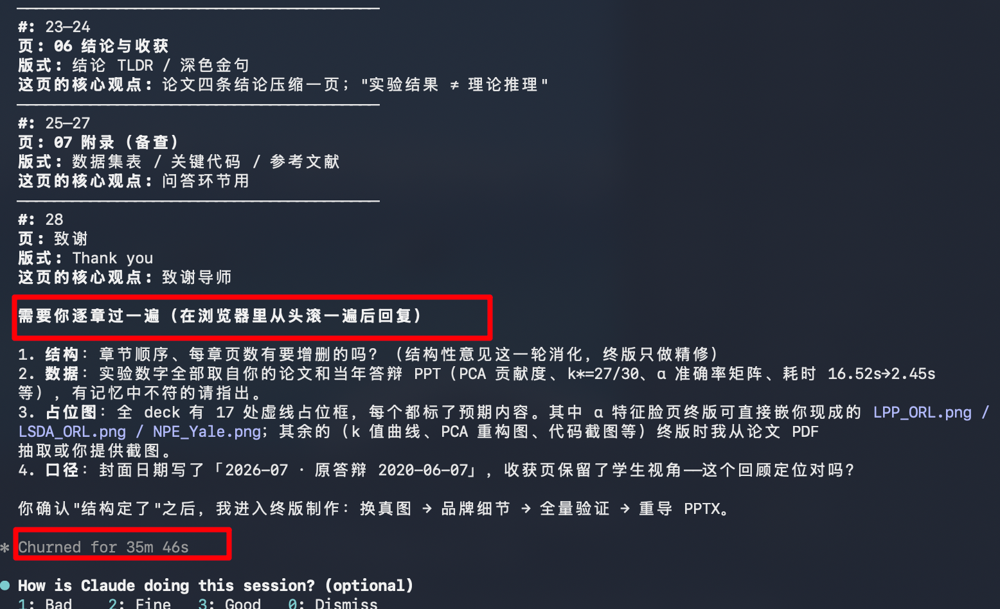
**先规划再开搭**：每一页写清版式、核心观点；全 deck 标好 17 处虚线占位框，每个都注明预期内容；实验数字（PCA 贡献度、k*=27/30、α 准确率矩阵、耗时 16.52s→2.45s）全部取自你的论文与当年答辩 PPT，不编数据。

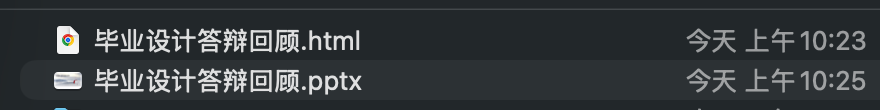
**初版即完成品**：`毕业设计答辩回顾.html` + `.pptx` 两个文件同时产出——初版就能放映、能提交，不是草稿。

初版的几页（此时配图还是占位框，但版式已成型）：

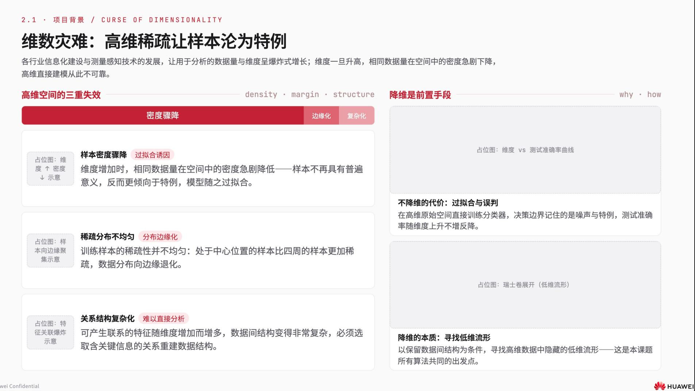
**项目背景**：用「密度骤降 / 分布边缘化 / 关系复杂化」三张卡片讲清维数灾难，右侧留「维度 vs 准确率曲线」占位。

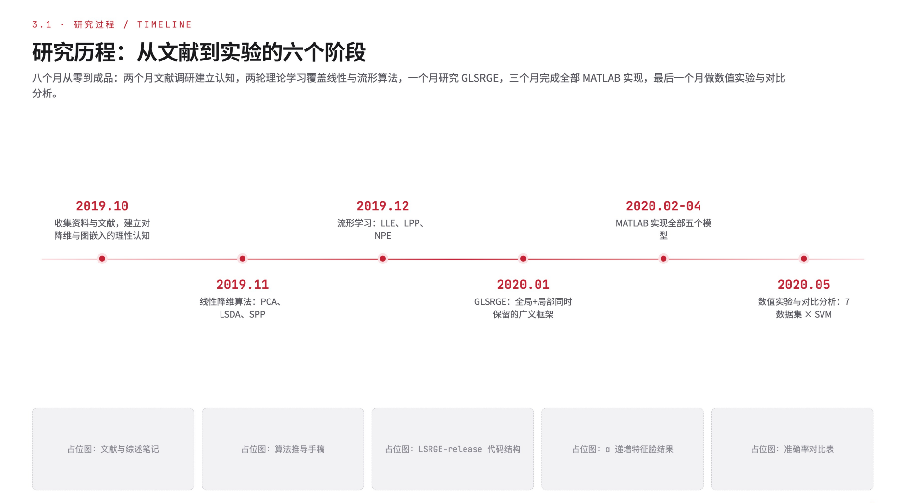
**研究过程**：2019.10 → 2020.05 的六阶段时间轴，文献 → 线性 → 流形 → GLSRGE → 代码 → 实验，一目了然。

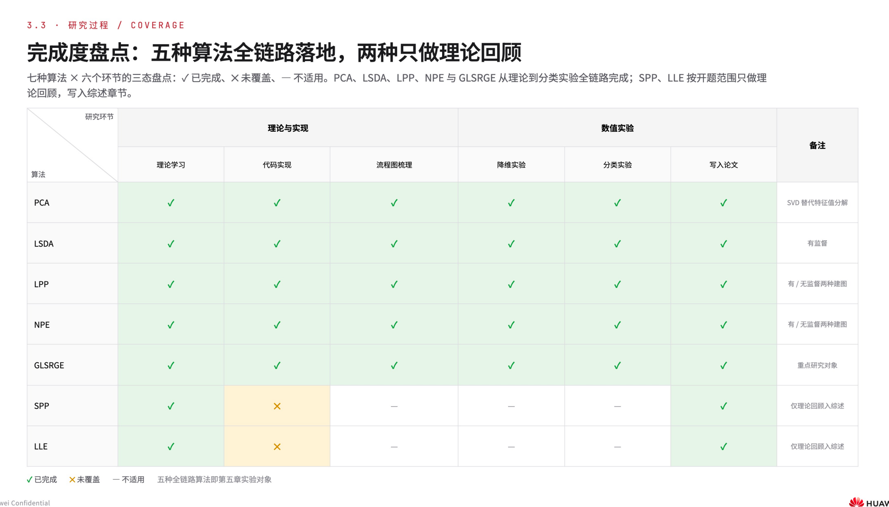
**完成度盘点**：七种算法 × 六个环节的三态表（✓ 已完成 / ✗ 未覆盖 / — 不适用），PCA/LSDA/LPP/NPE/GLSRGE 全链路完成，SPP/LLE 仅理论回顾——严谨到评委挑不出漏洞。

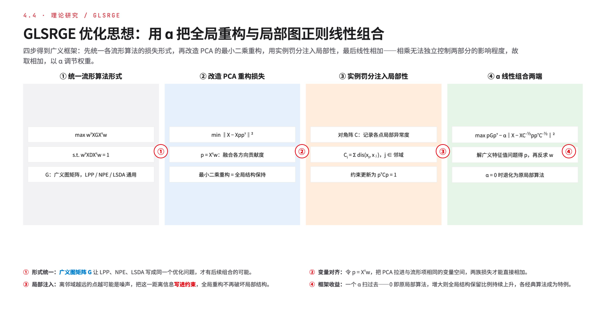
**理论研究**：把 GLSRGE 的推导拆成「统一流形形式 → 改造 PCA 重构 → 注入局部性 → α 线性组合」四步，公式排版成卡片。

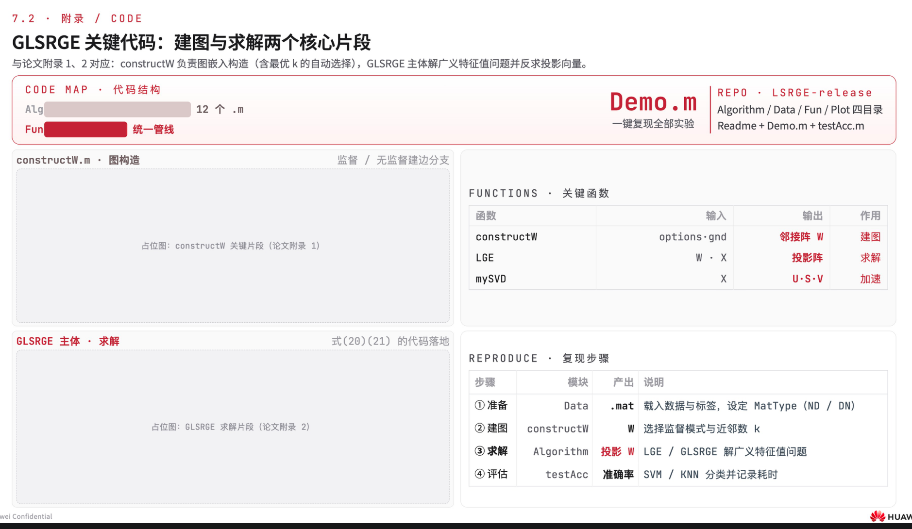
**附录备查**：代码结构页 + 关键函数表（constructW 建图、LGE 求解、mySVD 加速）+ 复现步骤，答辩问答环节随时调出。

**逐章迭代**——你提意见，AI 改，改完自己验：

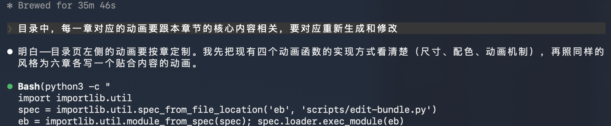
**一句反馈触发精修**：你要求目录页左侧动画按章定制。AI 先看清现有动画的尺寸/配色/机制，再照同样风格为六章各写一个贴合内容的动画——全程走 `scripts/edit-bundle.py` 改单文件，绝不手改 HTML。

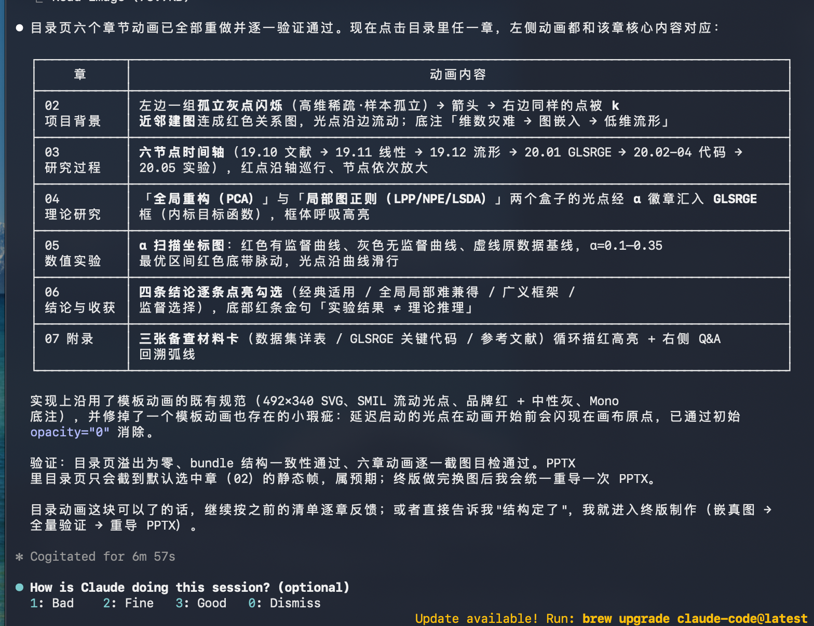
**改完有交代**：六章动画内容逐条列清（灰点闪烁建图、时间轴巡行、α 汇入 GLSRGE 框…），沿用模板动画规范，还顺手修掉一个模板本身的小瑕疵（延迟光点会闪现在画布原点，用初始 `opacity="0"` 消除）；目录页溢出为零、bundle 结构一致、动画逐帧目检通过。

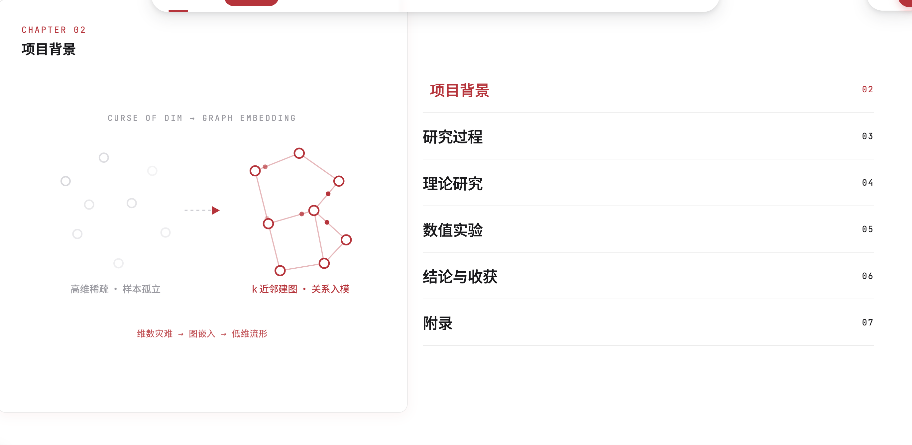
**目录页**：左侧「高维稀疏孤立点 → k 近邻建红色关系图」的动画，右侧六章导航，点哪章动画就换成对应内容。

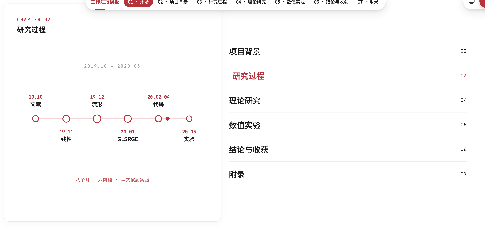
**章扉页**：进入「研究过程」，左侧时间轴动画（19.10→20.05）随章切换，右侧当前章高亮。

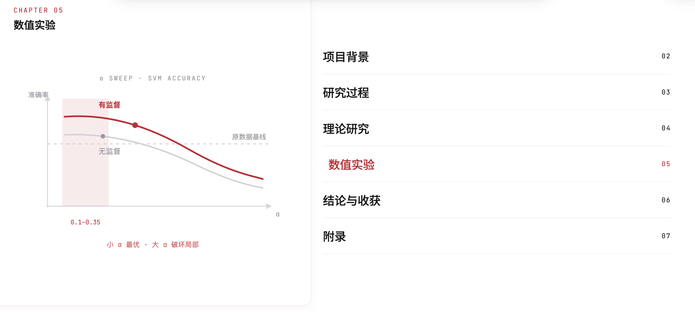
**数值实验章扉**：有监督 / 无监督 / 原数据基线三条 α 扫描曲线，标出 0.1–0.35 最优区间——「小 α 最优、大 α 破坏局部」一图说清。

---

## 第四幕 · 终版细化：占位图换真料，全量验证

终版做三件事：**换真图 → 品牌细节 → 全量验证 → 重导 PPTX**。17 处占位全部落地成真实内容，最后每页目检。

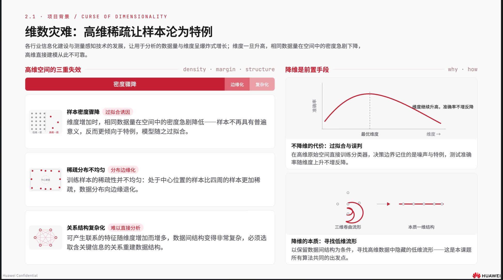
**背景页终版**：三重失效配上真实示意图，右侧补齐「维度—准确率」曲线与「三维卷曲流形 → 一维结构」的降维本质图。

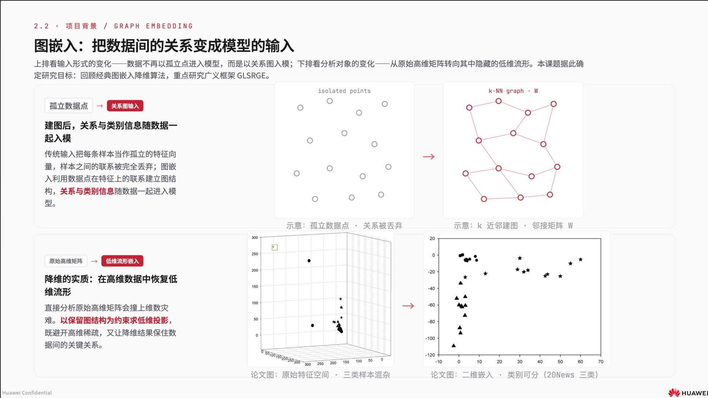
**图嵌入页**：上排「孤立点 → k-NN 关系图」自绘对照，下排直接嵌论文原图——原始高维空间三类混杂的 3D 散点 vs 二维嵌入后类别可分（20News 三类）。

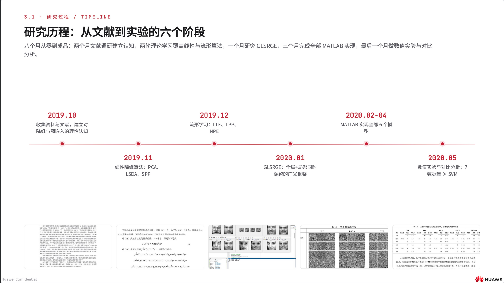
**时间轴终版**：底部换上五张「实证照」——综述笔记、论文推导页、MATLAB 工作台截图、表 4.6 特征脸对照、表 4.8 准确率表，过程可信可查。

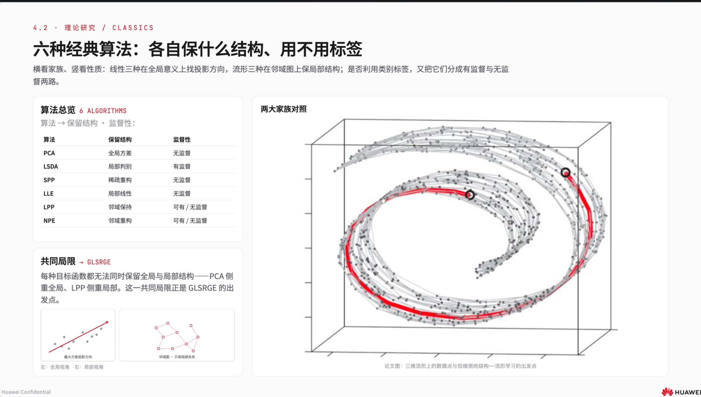
**理论回顾页**：左侧六算法「保留结构 × 监督性」总览表，右侧一张三维瑞士卷流形图点破流形学习的出发点。

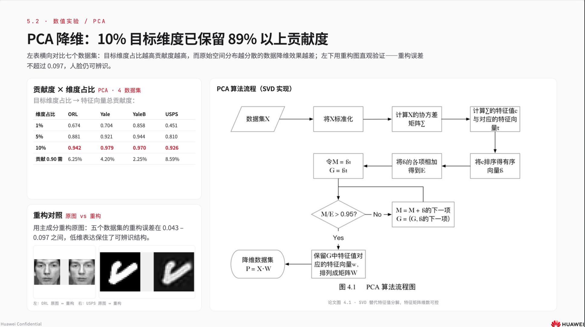
**实验页终版**：贡献度 × 维度表（10% 目标维度已保留 89%+ 贡献度）、原图↔重构人脸对照、以及从论文抽取的 PCA 算法流程图（SVD 实现）——数据、图、公式三位一体。

---

## 这次陪跑，AICO-PPT 强在哪

| 环节 | 它做了什么 |
|---|---|
| 需求对齐 | 四个选择题锁定场合/时长/交付/素材，动手前达成共识，零返工 |
| 吃透真料 | 直接读代码仓库、论文 PDF、实验图，数字全部取自真料不编造 |
| 页型现成 | 34 页页型画廊 + 41 页汇报模板做底，章扉/时间轴/盘点表/代码页即拿即用 |
| 结构化编辑 | 增删页、改动画全走 `edit-bundle.py` 自动记账，改一版不塌一版 |
| 自带质检 | `measure_overflow` 28 页溢出全零 + 逐页截图目检，还揪出一个 deck 运行时的坑 |
| 双版本交付 | `html2pptx` 一键把网页 deck 导成 28 页 PPTX，现场放映 + 系统留档两不误 |
| 离线可靠 | 15 MB 单文件，图片字体全内联，答辩现场双击即开、不联网、不丢字体 |

---

## 结语

一份从「维数灾难」讲到「分类对比」、带 28 页真图真表的答辩 deck，就在四轮对话里交付了——现场点击放映，终稿一键出 PPTX，全程没碰过 PPT 软件。

如果你也要做**答辩 / 述职 / 技术分享 / 培训课件**，试试它 👇

**🔗 https://gitcode.com/AICO-Ascend/AICO-PPT　　开源 · MIT · 欢迎 Star**
